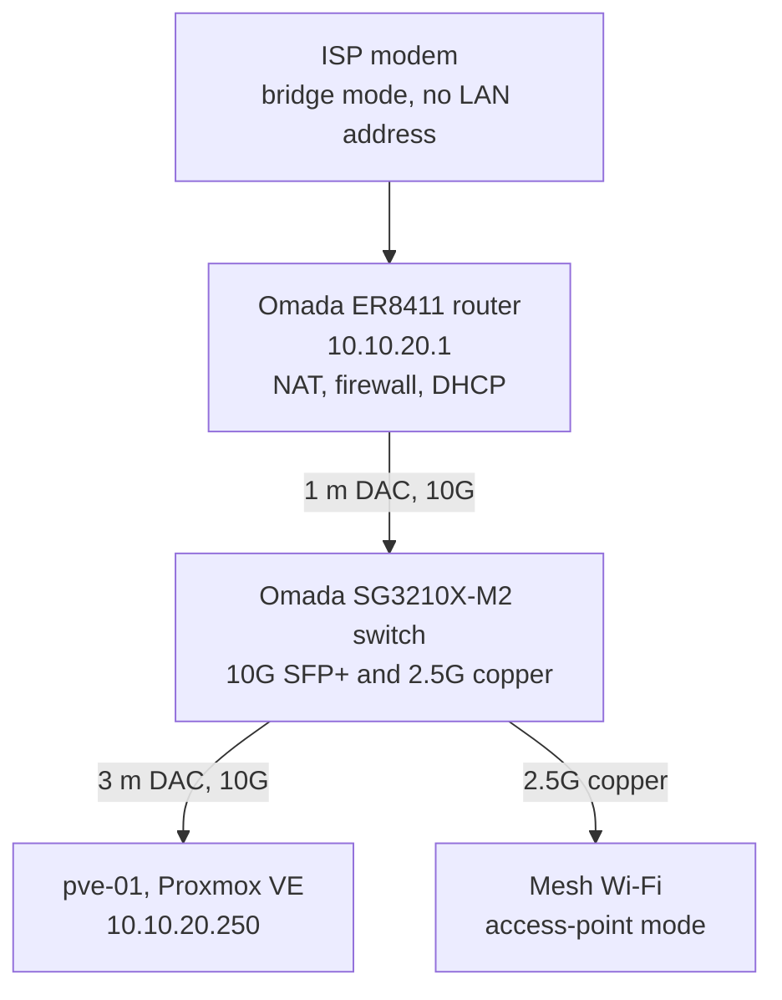
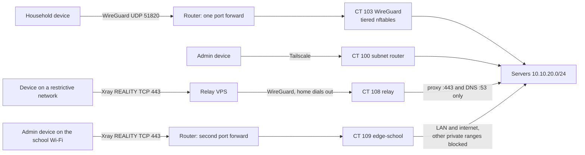

# Architecture

How the lab fits together: the physical path, the addressing plan, every guest, and how traffic gets in from outside.

## Physical topology

The modem only bridges. The router is the single NAT and firewall, and it originates DHCP and IPv6 Router Advertisements, so every client-facing setting is under local control.

## Hardware

| Component | Detail |
|---|---|
| Host | 2x Intel Xeon E5-2696 v4 (88 threads, 2 NUMA nodes), 96 GB ECC DDR4 |
| GPU | NVIDIA RTX 4060 Ti, passed through to the media VM |
| NIC | Intel X520-DA2 10GbE SFP+, the host's only active uplink |
| Boot and guest disks | 1 TB NVMe, LVM-thin |
| NAS disks | 4x 3 TB in RAID10, 3x 10 TB in RAID5, on a separate SATA controller |
| Backup disks | Single-disk ZFS pools |
| Power | APC Back-UPS 2200 VA with NUT-driven graceful shutdown |
| Network | Omada ER8411 router, Omada SG3210X-M2 switch |

## Addressing

All values here are placeholders that preserve the real structure.

| Network | Range | Status |
|---|---|---|
| Servers | `10.10.20.0/24` | Built. Every host lives here today |
| Management | `10.10.11.0/24` | Planned VLAN, work in progress |
| IoT | `10.10.30.0/24` | Planned VLAN, work in progress |
| Guest | `10.10.40.0/24` | Planned VLAN, work in progress |
| WireGuard tunnel | `10.98.0.0/24` | Built |
| Storage bridge, NAS to media | `10.10.50.0/24` | Built. Private L2, no uplink |
| Relay transit tunnel | `10.10.80.0/24` | Built |

The Servers range follows a written allocation plan so new hosts never need guessing:

| Range | Purpose |
|---|---|
| `.1` | Gateway |
| `.2`–`.49` | Network infrastructure |
| `.50`–`.199` | DHCP pool |
| `.200`–`.209` | Infrastructure containers |
| `.210`–`.219` | Application VMs |
| `.220`–`.249` | Reserved |
| `.250`–`.254` | Hypervisor and management |

### VLAN plan

The network is currently flat. The segmented design is decided and being built in stages: Management for the hypervisor and network gear, Servers for guests, IoT for devices that should never reach the servers, and Guest for internet-only access. Inter-VLAN traffic will be routed and filtered on the ER8411. Trunks run switch-to-switch and switch-to-AP only; clients never need a trunk to reach the NAS.

## Guests

| ID | Name | Address | Role | Project |
|---|---|---|---|---|
| CT 100 | tailscale | `10.10.20.201` | Tailscale subnet router, fallback access | [WireGuard](../projects/wireguard-tiered-vpn/) |
| CT 101 | adguard | `10.10.20.204` | DNS filtering and internal names | [DNS, proxy, TLS](../projects/dns-proxy-tls/) |
| CT 103 | wireguard | `10.10.20.203` | Primary VPN, four access tiers | [WireGuard](../projects/wireguard-tiered-vpn/) |
| CT 104 | monitoring | `10.10.20.205` | Prometheus, Grafana, Glance | [Monitoring](../projects/monitoring-alerting/) |
| CT 107 | proxy | `10.10.20.208` | Caddy reverse proxy, wildcard TLS | [DNS, proxy, TLS](../projects/dns-proxy-tls/) |
| CT 108 | relay | `10.10.20.209` | Outbound tunnel to the relay VPS | [Relay](../projects/censorship-resistant-relay/) |
| CT 109 | edge-school | `10.10.20.202` | Xray REALITY on TCP 443 for the admin's devices on a school network | [School edge](../projects/censorship-resistant-relay/school-network-edge.md) |
| VM 201 | omv-nas | `10.10.20.210` | NAS, both RAID arrays, Immich | [NAS](../projects/nas-storage/) |
| VM 202 | docker-media | `10.10.20.211` | Jellyfin and media management, GPU | [Media stack](../projects/vpn-media-stack/) |
| VM 203 | game-server | `10.10.20.212` | Pelican Panel and Wings | [Game server](../projects/game-server-isolation/) |

A few small personal services are omitted from this repository.

## Bridges on the host

| Bridge | Uplink | Purpose |
|---|---|---|
| `vmbr0` | `ens4f0`, 10G DAC | All guests and all host traffic. Carries the default route |
| `br-nasmedia` | none | Private wire between the NAS and media VMs. Bulk NFS traffic never touches the LAN |

## Names and TLS

Every web service is reached by name, `<service>.example.com`. AdGuard answers those names with the reverse proxy's address, and Caddy presents a browser-trusted wildcard certificate issued by DNS-01. No inbound port is opened for certificates. One public DNS record exists: `vpn.example.com`, kept current by a DDNS script on the host.

## Remote access

Four paths, deliberately independent so that breaking one never locks you out.

| Path | Inbound port at home | Who uses it |
|---|---|---|
| WireGuard | One UDP forward | Household and family, by tier |
| Tailscale | None | Admin fallback and out-of-band lifeline |
| Relay | None, home dials out | Travel on networks that block VPN protocols |
| School edge | One TCP 443 forward | The admin's own devices on a school network that blocks WireGuard but does not intercept TLS |

## Firewalling, in two layers

- **Host firewall**: nftables on `pve-01`, input policy drop. Protects the hypervisor only.
- **Per-service rules**: inside the guests that need them, such as the WireGuard tiers and the game server's egress isolation. Bridged guest traffic does not pass through the host's netfilter hooks, so host rules cannot filter guests.
