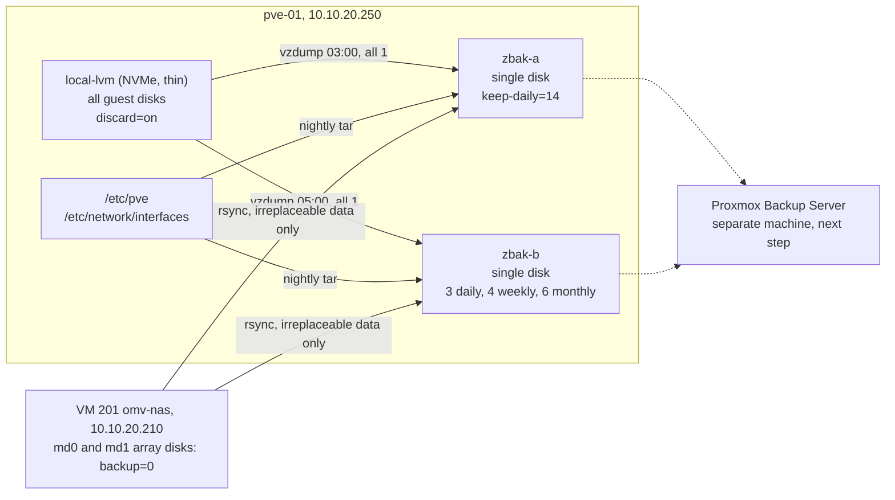

# Backup strategy: vzdump to independent ZFS pools

Every guest on `pve-01` is dumped twice a night to two independent single-disk ZFS pools, not a mirror. Each pool gets its own complete vzdump set, with deliberately different retention: two weeks of nightlies on one, about six months of reach on the other. The RAID arrays stay out of vzdump by design; their irreplaceable contents are copied separately, and the host's own configuration is captured by a nightly tarball.

## What it does

- Two vzdump jobs back up every guest (`all 1`), so a new guest is covered from its first night.
- Each job writes a full set to its own pool. Losing either disk leaves a complete copy on the other.
- Retention is tiered: `zbak-a` keeps 14 nightly restore points (density), and `zbak-b` keeps 3 daily, 4 weekly and 6 monthly (depth).
- A missing or unmounted pool makes the job fail instead of quietly filling the root filesystem.
- Guest disks pass discards through, so freed blocks are never backed up. This cut the largest dump roughly 3x.
- Photos, user shares and the documentation vault on the NAS are copied to both pools as a point-in-time archive.
- `/etc/pve` and the network config are tarred nightly, because vzdump covers guests, not the host.

## Design decisions

| Decision | Why | Rejected alternative |
|---|---|---|
| Two independent single-disk pools | Each holds a complete, separately written set. A pool problem, a bad write or an operator mistake on one never touches the other | A ZFS mirror: protects against a dead disk, but one pool means one set of mistakes, and a corrupt write is mirrored faithfully |
| Asymmetric retention | Identical `keep-daily=14` on both pools paid for the same 14 days twice. Tiering buys about six months of reach for the same disk cost | Same policy on both pools |
| PVE `dir` storage with `is_mountpoint 1` | If the pool is not imported, PVE refuses the write. Without it, vzdump would fill the empty directory on the root disk | Plain `dir` storage on the mount path |
| Leave the RAID arrays out (`backup=0`) | Dumping terabytes nightly is not sensible. Irreplaceable data gets its own copy instead | Back up the array disks with vzdump |
| `discard=on` plus `fstrim` in guests | Freed blocks become zeros, and vzdump skips zero clusters. This is the real space lever | Tuning compression: it has nothing left to squeeze |

## Architecture



### Pool layout

| Item | Value |
|---|---|
| Pools | `zbak-a`, `zbak-b`: one 2 TB disk each, about 1802 GiB usable |
| Properties | `ashift=12`, `compression=zstd`, `atime=off`, `xattr=sa` |
| Datasets and directories | `<pool>/dump` for vzdump; `preserve/` and `host-config/` are never pruned |
| PVE storage | `dir` at `/<pool>`, `is_mountpoint 1`, content `backup` |
| Jobs | `daily-zbak-a` 03:00, `keep-daily=14`; `daily-zbak-b` 05:00, `keep-daily=3,keep-weekly=4,keep-monthly=6` (at most 13 files) |

## Prerequisites

- A Proxmox VE host. ZFS ships with it. See [Proxmox base host](../proxmox-base-host/).
- Two spare disks, one per pool. This lab uses 2 TB each.
- A NAS guest with passed-through array disks, as in [NAS storage](../nas-storage/), and an unprivileged account on it (`svc-readonly`) reachable by SSH key from the host.
- The QEMU guest agent in every VM.

## Build it

### 1. Create the two pools

Use stable disk IDs, never `/dev/sdX`, which can move.

```bash
# On pve-01
zpool create -o ashift=12 -O compression=zstd -O atime=off -O xattr=sa \
  zbak-a /dev/disk/by-id/<backup-disk-a>
zpool create -o ashift=12 -O compression=zstd -O atime=off -O xattr=sa \
  zbak-b /dev/disk/by-id/<backup-disk-b>

zfs create zbak-a/dump
zfs create zbak-b/dump
mkdir -p /zbak-a/preserve /zbak-a/host-config /zbak-b/preserve /zbak-b/host-config
```

### 2. Register them as storage that fails safely

```bash
# On pve-01
pvesm add dir zbak-a --path /zbak-a --content backup --is_mountpoint 1
pvesm add dir zbak-b --path /zbak-b --content backup --is_mountpoint 1
```

`is_mountpoint 1` is the safety catch. If a pool is not imported, `/zbak-b` is just an empty directory on the root disk, and vzdump would fill the host's root filesystem. With the flag, PVE refuses with `directory is expected to be a mount point but is not mounted`.

### 3. Define the two jobs

Create them under Datacenter, Backup, or directly:

```
# /etc/pve/jobs.cfg, on pve-01
vzdump: daily-zbak-a
	schedule 03:00
	all 1
	compress zstd
	enabled 1
	exclude <vmid-list>
	mode snapshot
	prune-backups keep-daily=14
	storage zbak-a

vzdump: daily-zbak-b
	schedule 05:00
	all 1
	compress zstd
	enabled 1
	exclude <vmid-list>
	mode snapshot
	prune-backups keep-daily=3,keep-weekly=4,keep-monthly=6
	storage zbak-b
```

`exclude` lists only deliberately archived guests. Review it whenever a guest's role changes: an archived guest returned to production stays excluded until someone edits the list. Mark an archived guest's final dump as protected (the padlock in the GUI) so pruning never removes it.

### 4. Size the retention before you commit to it


1. **Usable space**: about 1802 GiB on a 2 TB disk.
2. **Fixed area**: `preserve/` never rotates. Here it is 241 GiB plus under 1 GiB of protected dumps, leaving about 1560 GiB for rotation.
3. **Nightly set**: one dump of every guest.

| Guest | Dump size |
|---|---|
| VM 201 omv-nas | 20.28 GiB |
| VM 202 docker-media | 15.01 GiB |
| VM 203 game-server | 3.18 GiB |
| CT 104 monitoring | 1.72 GiB |
| CT 103 wireguard | 0.30 GiB |
| CT 100 tailscale | 0.24 GiB |
| **Total** | **40.74 GiB** |

4. **Steady state** = nightly set × retained copies + fixed area. With 14 dailies: 570 GiB + 242 GiB = 812 GiB, about 45% of the pool.
5. **Ceiling**: stay under 80%, and leave room for one extra set, because **a run writes the new dump before it prunes the old one**. Practical limit: about 28 dailies.
6. **Growth**: about 190 MB per night, mostly the media VM and Prometheus. At 14 copies that is about 2.5 GiB of pool per day, roughly 8 months before the 80% line.

Before the trim fix in step 6, the set was about 75 GiB and the ceiling only about 15 dailies.

### 5. Do not count on ZFS compression

`compression=zstd` reports exactly `1.00x`, correctly: vzdump already zstd-compresses every dump. Nor is vzdump tunable: `compress zstd` is level 1, and the `zstd:` key in `/etc/vzdump.conf` sets the **thread count**, not the level. The real levers are discard and, later, dedup.

### 6. Pass discards through, then trim

On LVM-thin, a guest disk without `discard=on` never releases freed blocks, so the volume ratchets toward 100% allocated and vzdump backs up the garbage too. The media VM had 61.9 GiB allocated for 25 GiB of real data, producing a 49.53 GiB dump per pool per night.

```bash
# On pve-01. Restate each disk's existing options and add discard=on.
qm set 202 --scsi0 local-lvm:vm-202-disk-1,iothread=1,size=64G,discard=on,ssd=1
qm set 201 --scsi0 local-lvm:vm-201-disk-0,iothread=1,size=32G,ssd=1,discard=on
qm set 201 --scsi5 local-lvm:vm-201-disk-1,iothread=1,size=40G,ssd=1,discard=on

# discard is a QEMU device property: a reboot from inside the guest does NOT apply it
qm shutdown 202 && qm start 202
```

```bash
# Inside the guest, after the stop/start
fstrim -av
systemctl enable --now fstrim.timer     # fstrim is one-shot; the timer keeps it trimmed
```

Result on the media VM: 37.2 GiB trimmed, thin allocation from 96.77% to 40.24%, and the next dump reported `backup is sparse: 38.83 GiB (60%) total zero data`. The dump fell from **49.53 GiB to 15.01 GiB**, roughly 3x. Freed blocks read back as zeros, and VMA skips zero clusters. VM 203 already had `discard=on`: 6% allocated, a 3.18 GiB dump.

### 7. Run the guest agent, for consistent snapshots

In snapshot mode, vzdump asks the guest agent to `fs-freeze` the filesystems. If the agent does not answer, the dump is only **crash-consistent**, as if the power had been pulled. For a database guest, such as Immich's Postgres on the NAS, avoid that.

```bash
# Inside each VM
apt install -y qemu-guest-agent && systemctl enable --now qemu-guest-agent

# On pve-01
qm set <vmid> --agent 1
qm agent <vmid> ping            # silence = success; an error means no fs-freeze
```

### 8. Exclude the arrays, deliberately

Mark every passed-through array disk on VM 201 `backup=0`, so vzdump backs up only its `local-lvm` disks:

```bash
# On pve-01, for each md0 and md1 member disk (scsi1-scsi4 are md0 here)
qm set 201 --scsi1 /dev/disk/by-id/<array-disk-1>,backup=0
```

RAID survives a disk dying, not an accidental delete, a bad `rm -rf` or ransomware, and RAID5 `md1` survives one failed disk, not two. Media can be obtained again; photos and personal files cannot, so they get the next step.

### 9. Copy the irreplaceable data

Pull the NAS data over SSH as the unprivileged service account. Exclude the media library and Immich's thumbnails and encoded video, which Immich regenerates from the originals.

```bash
# On pve-01. Repeat with /zbak-b as the destination.
dest=/zbak-a/preserve/nas-irreplaceable-$(date +%Y%m%d)/
rsync -aH --numeric-ids \
  --exclude='/media/' --exclude='/lost+found/' \
  --exclude='/immich/upload/thumbs/' --exclude='/immich/upload/encoded-video/' \
  --exclude='/immich/postgres_HDD_BACKUP/' \
  svc-readonly@10.10.20.210:/srv/dev-disk-by-uuid-<md0-fs-uuid>/ \
  "$dest"
```

This holds photo originals, Immich database dumps, per-user and shared folders, music and the documentation vault. It is point-in-time, not rotating. Take a fresh one before any array rebuild: a rebuild reads every sector of the surviving disks, exactly the workload that exposes a weak one.

### 10. Back up the host itself

vzdump covers guests, not the host. `/etc/pve` holds guest configs, storage, jobs, firewall rules and cluster keys, so keep the tarball root-only.

```sh
#!/bin/sh
# /usr/local/sbin/pve-hostconfig-backup.sh, on pve-01
set -eu
umask 077
stamp=$(date +%Y%m%d-%H%M)
for pool in zbak-a zbak-b; do
  mountpoint -q "/$pool" || continue     # same fail-safe idea as is_mountpoint
  tar -czf "/$pool/host-config/pve-hostconfig-$stamp.tar.gz" \
    /etc/pve /etc/network/interfaces
done
```

```
# /etc/cron.d/pve-hostconfig, on pve-01
30 2 * * * root /usr/local/sbin/pve-hostconfig-backup.sh
```

`chmod 700` the script. The archives are small.

## Verify

```bash
# On pve-01
zpool status && zpool list        # both ONLINE; trust ALLOC, not pvesm
zfs get compressratio zbak-a/dump  # 1.00x is expected
pvesm status                       # both storages active

cat /etc/pve/jobs.cfg
journalctl -u pvescheduler -S today | grep -E 'Starting Backup|finished'

for id in 100 101 103 104 107 108 201 202 203; do     # newest dump per guest
  printf "%-4s %s\n" "$id" "$(ls -1t /zbak-*/dump/vzdump-*-${id}-*.zst 2>/dev/null | head -1)"
done

lvs -o lv_name,data_percent pve    # thin allocation should track real usage
ls -l /zbak-a/host-config/ /zbak-b/host-config/
```

A backup is only proven by a restore. Restore to a spare ID, boot it with the network disconnected, check it, destroy it:

```bash
# On pve-01
qmrestore /zbak-b/dump/vzdump-qemu-203-<timestamp>.vma.zst <spare-vmid> --storage local-lvm --unique 1
umask 0022    # from a hardened shell, see Gotchas
pct restore <spare-ctid> /zbak-a/dump/vzdump-lxc-104-<timestamp>.tar.zst --storage local-lvm
```

## Gotchas

| Symptom | Cause | Fix |
|---|---|---|
| `pvesm status` shows the backup storage almost empty | Storage points at the pool root; dumps live in the child `dump` dataset | Read `zpool list` (ALLOC) or `zfs list` |
| A job fails with "expected to be a mount point" | The pool is not imported, and `is_mountpoint 1` refuses the write | `zpool import <pool>`, or disable the job deliberately. Never remove the flag |
| `compressratio` is `1.00x` | vzdump output is already compressed | Expected |
| Dumps are much larger than the guest's real data | The thin volume never released freed blocks | `discard=on`, stop/start, `fstrim -av`, `fstrim.timer` |
| `discard=on` is set but nothing changes | The guest was only rebooted from inside | `qm shutdown <id>` then `qm start <id>` |
| The set creeps back up after a trim | `fstrim` ran once, never scheduled | Enable `fstrim.timer` in every guest |
| A VM comes back from the discard stop/start with different settings | Other staged changes apply at the same stop/start | Check `qm pending <id>` first |
| A database VM's dumps are only crash-consistent | No guest agent, so no `fs-freeze` | Install the agent; confirm with `qm agent <id> ping` |
| One `du` over several directories under-reports | Hard-linked data is counted once, for the first directory walked | One `du` per directory, or `--count-links` |
| Hand-run unprivileged container creation fails with `Permission denied` on the rootfs | A hardened `umask 027` blocks the mapped uid that extracts it | `umask 0022` for that command; remove the stale directory before retrying |

**A failing job must be loud.** A safe failure every night is still no backup, so watch job results, not only pools, and redo the capacity sum whenever a large guest is added.

## Rollback

```bash
# On pve-01. Removing a job leaves its dumps in place.
pvesh delete /cluster/backup/daily-zbak-b
rm /etc/cron.d/pve-hostconfig                      # stop the host-config tar

# Detach a pool from PVE without touching its data
pvesm remove zbak-b
zpool export zbak-b
```

`zpool destroy` deletes every dump on that pool. Run it only after copying anything you still need to the other pool.

## What's next

- **Proxmox Backup Server on its own machine.** The retention ceiling on single 2 TB pools is physical. PBS adds chunk-level dedup and dirty-bitmap incrementals against a set that changes about 190 MB a night, realistically a 5 to 10x reduction, making 30 to 60 days of history easy. It **must not run on `pve-01`**: a backup server on the host it protects dies with that host. A small N100 or N305-class mini PC is preferred over a Raspberry Pi 5, whose USB3 storage is weak for constant verify passes. The ZFS pools stay as the local tier.
- Put the irreplaceable-data copy on a schedule instead of refreshing it by hand.
- Surface backup job results and pool usage in [monitoring](../monitoring-alerting/), so a failed night is visible the next morning.

## Rebuild with AI

Copy everything in the block below into an AI assistant.

```text
You are helping me build a backup strategy for a single Proxmox VE host. Before
writing any command or config, ask me for these values and wait for my answers:

1. My host name, IP and LAN subnet.
2. The two backup disks: /dev/disk/by-id names and sizes, and pool names.
3. My guests: ID, name, role, dump size if known, and which are archived.
4. Which guests hold databases.
5. Any NAS guest with passed-through RAID disks: its IP, SSH service account,
   data path, and which folders are irreplaceable versus regenerable.
6. How far back I need to restore, and when backups may run.

Then build it with these rules:

- Create two independent single-disk ZFS pools, never a mirror, each with
  ashift=12, compression=zstd, atime=off, xattr=sa and a <pool>/dump dataset.
- Register each pool as a Proxmox dir storage at the pool root with
  is_mountpoint 1, so a missing pool fails instead of filling the root disk.
- Create one vzdump job per pool with `all 1`, an explicit exclude list for
  archived guests only, snapshot mode and zstd. Stagger the start times.
- Make retention asymmetric: one pool dense (recent dailies), the other deep
  (a few dailies, weeklies and monthlies). Do not copy the same policy twice.
- Show the capacity math: fixed non-rotating area + nightly set x retained
  copies + one extra set (a run writes before it prunes), kept under 80%.
- Tell me ZFS compression will show about 1.00x on vzdump output.
- On LVM-thin, add discard=on to every guest disk, apply it with a full
  stop/start (not a reboot), run fstrim -av in the guest and enable
  fstrim.timer. Tell me to check `qm pending` before stopping any VM.
- Require the QEMU guest agent in VMs for fs-freeze, and explain that without
  it the dumps are only crash-consistent.
- Mark RAID member disks backup=0 and state clearly that RAID is redundancy,
  not backup. Copy irreplaceable data to both pools with rsync as an
  unprivileged account, excluding regenerable data.
- Add a nightly root-only tar of /etc/pve and /etc/network/interfaces to both
  pools, skipped if a pool is not mounted. Warn that it contains cluster keys.
- Never invent keys, passwords or tokens. If SSH keys are needed, give me the
  commands to generate them locally.
- Give me verification steps, including a test restore to a spare ID.
- Finish with a rollback section; warn before destructive commands.
- Suggest Proxmox Backup Server on separate hardware as the next step.
```
