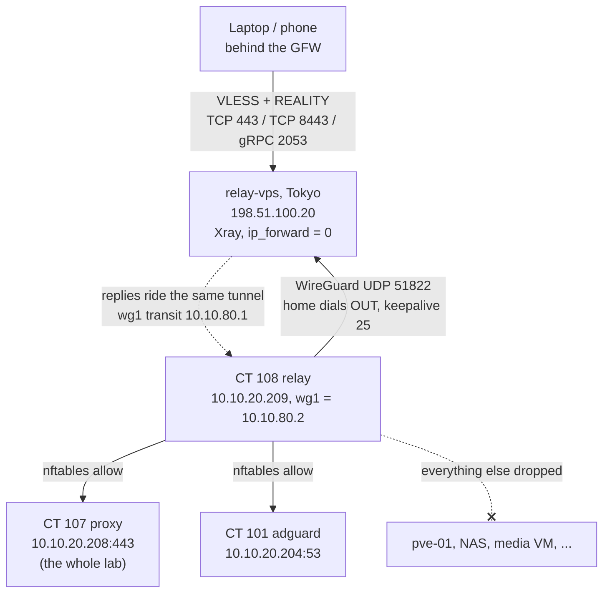

# Censorship-resistant relay: outbound WireGuard to an Xray REALITY VPS

A way back into the homelab from behind China's Great Firewall (GFW), which identifies and blocks ordinary VPN protocols. Clients connect to an hourly-billed cloud VPS in Tokyo with VLESS + REALITY, which looks like a normal TLS session to a real website. The VPS reaches home through a WireGuard tunnel that home dials **out**, so no inbound port is opened. The VPS is untrusted: it may reach exactly two LAN addresses, enforced twice.

> **Sibling path:** for a network that blocks VPN protocols but does not intercept TLS, such as a school, the same REALITY technique runs from a container at home with no VPS. See [School network edge](school-network-edge.md).

## What it does

- Gives a traveller every web service in the lab, by name, from networks that block WireGuard and Tailscale.
- Opens no port at home. CT 108 `relay` keeps a WireGuard tunnel open to the VPS, so a dynamic home IP does not matter.
- Offers three independent entries: REALITY over TCP 443, TCP 8443 and gRPC 2053, each borrowing a different real website.
- Limits the VPS to the reverse proxy (`10.10.20.208:443`) and DNS (`10.10.20.204:53`).
- Restarts the tunnel by itself if it dies while nobody is home.
- Costs almost nothing: the VPS is parked when not needed, and it cost about USD 4 for two weeks of use.

## Design decisions

| Decision | Why | Rejected alternative |
|---|---|---|
| Xray VLESS + REALITY as the entry | The session borrows a real site's TLS handshake, so it carries no VPN fingerprint | Plain WireGuard: the GFW fingerprints its handshake by **shape** (a fixed 148-byte init with a distinctive type byte), so changing the port does nothing |
| A new path instead of fixing the old ones | Tailscale's login and DERP relays are routinely blocked, and it falls back to the same WireGuard datagrams | AmneziaWG: field reports put detection at seconds. The router's VPNs: no obfuscation at all |
| Home dials out to the VPS | No port forward, nothing exposed, and the home IP can change freely | VPS dials home: needs an inbound forward and breaks on every address change |
| VPS in Tokyo | Reachability was **measured** from inside China, not assumed | Singapore or Hong Kong, the original plan |
| Three inbounds: 443, 8443, gRPC 2053 | One inbound is one point of failure. Different ports, sites and transports fail independently | 443 only. Xray warns that non-443 ports raise the risk of an IP block; the redundancy was kept deliberately |
| VPS reaches only the proxy and DNS | One reverse proxy on one port fronts every web service | A dozen `IP:port` pairs, or the whole LAN |
| Enforce that limit twice | `AllowedIPs` restricts routing; nftables on CT 108 still holds if WireGuard is widened by mistake | A single layer |
| `ip_forward = 0` on the VPS | Xray is an **application** proxy that opens each connection itself, so a compromised Xray cannot route packets into the LAN | Forwarding "just in case" |
| Own container, interface (`wg1`), subnet and keys | Nothing shared with the household VPN on CT 103 | A peer on CT 103's `wg0` |
| Hourly-billed VPS, parked when idle | A blocked IP is fixed by redeploying in minutes, and idle weeks cost nothing | A long-term contract |

## Architecture



| Component | Value |
|---|---|
| Home container | CT 108 `relay`, `10.10.20.209`, unprivileged, start on boot |
| Home interface | `wg1`, no listen port, MTU 1420, keepalive 25 |
| VPS | `relay-vps`, an hourly-billed cloud VPS in Tokyo, `198.51.100.20`, Debian 13 |
| Transit | `10.10.80.0/24`, VPS `.1`, home `.2`, UDP 51822 |

### Entry points on the VPS

| Port | Transport | Borrowed site (`dest`) |
|---|---|---|
| 443 | TCP | `<borrowed-site-1>` |
| 8443 | TCP | `<borrowed-site-2>` |
| 2053 | gRPC | `<borrowed-site-3>` |

### What the VPS can reach

| Destination | Why |
|---|---|
| `10.10.20.208:443` | Reverse proxy, which fronts every web service |
| `10.10.20.204:53` | DNS, so names such as `jellyfin.example.com` resolve |
| Anything else | Dropped, by VPS-side `AllowedIPs` and by CT 108 nftables |

## Prerequisites

- A Proxmox VE host with the `wireguard` kernel module loaded and persisted, as in [Tiered WireGuard VPN](../wireguard-tiered-vpn/).
- A reverse proxy fronting all web services on one port, and an internal DNS server. See [DNS, reverse proxy and TLS](../dns-proxy-tls/).
- An hourly-billed cloud VPS with a static public IPv4 address, running Debian 13 and Xray-core.
- Time: build two to three weeks before travelling, so a VPS on a blocked IP can be re-rented.

## Build it

### 1. Create the home container

```bash
# On pve-01. umask 0022 matters: a hardened umask makes unprivileged container creation fail.
umask 0022
pct create 108 local:vztmpl/debian-13-standard_amd64.tar.zst \
  --hostname relay --unprivileged 1 --features nesting=1 \
  --net0 name=eth0,bridge=vmbr0,ip=10.10.20.209/24,gw=10.10.20.1 \
  --onboot 1
pct start 108 && pct enter 108
```

```bash
# Inside CT 108
apt install -y wireguard-tools nftables
echo 'net.ipv4.ip_forward = 1' > /etc/sysctl.d/99-relay.conf && sysctl --system
```

### 2. Generate keys on both ends

```bash
# Inside CT 108, and again on relay-vps
mkdir -p /etc/wireguard && cd /etc/wireguard
umask 077
wg genkey | tee wg1.key | wg pubkey > wg1.pub
```

### 3. VPS side of the tunnel

The VPS-side `AllowedIPs` is the first enforcement layer: only the transit address and the two permitted hosts are routed into the tunnel.

```ini
# /etc/wireguard/wg1.conf, on relay-vps
[Interface]
Address    = 10.10.80.1/24
ListenPort = 51822
PrivateKey = <contents of the VPS wg1.key>
MTU        = 1420

[Peer]
# home, CT 108 relay. No Endpoint: home dials in.
PublicKey  = <contents of the CT 108 wg1.pub>
AllowedIPs = 10.10.80.2/32, 10.10.20.208/32, 10.10.20.204/32
```

```bash
# On relay-vps
echo 'net.ipv4.ip_forward = 0' > /etc/sysctl.d/99-no-forward.conf && sysctl --system
systemctl enable --now wg-quick@wg1
```

Keep the VPS `forward` policy at drop. Open only SSH, TCP 443, 8443, 2053 and UDP 51822.

### 4. Home side of the tunnel

No `ListenPort`: the keepalive holds the router's outbound NAT mapping open.

```ini
# /etc/wireguard/wg1.conf, inside CT 108
[Interface]
Address    = 10.10.80.2/24
PrivateKey = <contents of the CT 108 wg1.key>
MTU        = 1420
PostUp     = nft -f /etc/wireguard/wg1-relay.nft
PostDown   = nft delete table inet relay

[Peer]
PublicKey           = <contents of the VPS wg1.pub>
Endpoint            = 198.51.100.20:51822
AllowedIPs          = 10.10.80.1/32
PersistentKeepalive = 25
```

### 5. The two-destination ruleset

The second enforcement layer, and the security core.

```
# /etc/wireguard/wg1-relay.nft, inside CT 108
table inet relay {
  chain forward {
    type filter hook forward priority 0; policy accept;

    iifname "wg1" ct state established,related accept
    iifname "wg1" ip daddr 10.10.20.208 tcp dport 443 counter accept
    iifname "wg1" ip daddr 10.10.20.204 udp dport 53 counter accept
    iifname "wg1" ip daddr 10.10.20.204 tcp dport 53 counter accept
    iifname "wg1" counter drop
  }
  chain postrouting {
    type nat hook postrouting priority srcnat; policy accept;
    # LAN hosts reply to CT 108 instead of needing a route to the transit subnet
    ip saddr 10.10.80.0/24 oifname "eth0" masquerade
  }
}
```

```bash
# Inside CT 108
systemctl enable --now wg-quick@wg1
```

### 6. Xray REALITY inbounds on the VPS

This is a **reference skeleton** of a standard VLESS + REALITY setup, not the live config. Generate the secrets on the VPS:

```bash
# On relay-vps
xray uuid          # one per client -> <client-uuid>
xray x25519        # prints the private key (server) and public key (clients)
openssl rand -hex 8   # -> <short-id>
```

```json
// /usr/local/etc/xray/config.json, on relay-vps (reference skeleton, chmod 600)
{
  "log": { "loglevel": "warning" },
  "dns": { "servers": ["10.10.20.204"] },
  "inbounds": [
    {
      "tag": "reality-443", "port": 443, "protocol": "vless",
      "settings": { "clients": [{ "id": "<client-uuid>", "flow": "xtls-rprx-vision" }], "decryption": "none" },
      "streamSettings": {
        "network": "tcp", "security": "reality",
        "realitySettings": {
          "dest": "<borrowed-site-1>:443", "serverNames": ["<borrowed-site-1>"],
          "privateKey": "<reality-private-key>", "shortIds": ["<short-id>"]
        }
      }
    }
  ],
  "outbounds": [{ "protocol": "freedom", "settings": { "domainStrategy": "UseIP" } }]
}
```

Copy the inbound for 8443 (`<borrowed-site-2>`) and for 2053 (`<borrowed-site-3>`, `"network": "grpc"` with a `grpcSettings.serviceName`, no `flow`). Drop the comment line when saving. Xray opens each onward connection itself; requests to `.208` and `.204` follow the `wg1` route.

```bash
# On relay-vps
systemctl enable --now xray
```

### 7. Watchdog

Every two minutes, CT 108 pings the VPS across the transit and restarts `wg1` on failure.

```bash
# /usr/local/sbin/wg1-watchdog.sh, inside CT 108
#!/bin/sh
ping -c 3 -W 5 10.10.80.1 >/dev/null 2>&1 || systemctl restart wg-quick@wg1
```

Pair it with a `Type=oneshot` `wg1-watchdog.service` that runs the script, and this timer:

```ini
# /etc/systemd/system/wg1-watchdog.timer, inside CT 108
[Timer]
OnBootSec=2min
OnUnitActiveSec=2min

[Install]
WantedBy=timers.target
```

```bash
chmod 755 /usr/local/sbin/wg1-watchdog.sh
systemctl daemon-reload && systemctl enable --now wg1-watchdog.timer
```

### 8. Client apps, installed before you travel

Google Play is blocked in China and a China-region App Store has no VPN clients, so install and test at home.

| Platform | Apps |
|---|---|
| Android | v2rayNG, NekoBox or Hiddify. Keep the APK files locally as well |
| iOS | Shadowrocket or Stash. Paid, and needs a non-China Apple ID |
| Windows | v2rayN or Hiddify |
| Linux / macOS | sing-box or Xray-core |

Each client gets three profiles, one per inbound: the REALITY **public** key, UUID, short ID and borrowed site as SNI. Carry them redundantly (QR codes, a password manager, a USB copy) and keep the NAS archive under `docs/wireguard-configs/` admin-only, because each file is a credential.

## Verify

```bash
# On pve-01, home side
pct exec 108 -- wg show wg1                       # handshake age under ~2 minutes
pct exec 108 -- nft list table inet relay         # the allow rules and their counters
pct exec 108 -- ping -c2 10.10.80.1               # the VPS across the transit
pct exec 108 -- journalctl -u wg1-watchdog -n 30  # has the watchdog had to act

# On relay-vps: what it SHOULD reach
curl -skI https://10.10.20.208 | head -1          # reverse proxy answers
dig +short jellyfin.example.com @10.10.20.204     # DNS answers

# On relay-vps: what it MUST NOT reach. All of these should fail
ping -c1 -W2 10.10.20.250                         # the hypervisor
curl -m5 -k https://10.10.20.250:8006             # Proxmox UI
curl -m5 http://10.10.20.211:8096                 # Jellyfin directly, bypassing the proxy
cat /proc/sys/net/ipv4/ip_forward                 # expect 0
```

Then test each inbound separately from a network that is not your home. Measured throughput was about **49–51 Mbit/s** on all three, so the ceiling is the path, not the transport: plenty for panels, SSH and photos, not a media pipe.

**Reachability from inside China.** Before travelling, TCP 443 on the VPS was tested from 282 in-country checkpoints across China Telecom, China Unicom and China Mobile, many on residential lines. All 282 connected (39–280 ms), and a second tool reached 11 of 12 Chinese nodes. The IP is not blacklisted, which rules out the most common failure.

**What that does not prove.** Reachability shows that packets arrive and TCP completes. It says nothing about whether deep packet inspection flags the REALITY session and resets it once real traffic flows. Only a real client on a real Chinese connection answers that, which is why the fallback ladder exists.

## Gotchas

| Symptom | Cause | Fix |
|---|---|---|
| WireGuard or Tailscale dies on arrival, whatever the port | The GFW fingerprints the WireGuard handshake by size and type byte | Use the REALITY path, or a roaming eSIM that egresses outside the firewall |
| No handshake on `wg1`, `0 B received` at home | The VPS is parked or stopped; home is dialling out fine | Start the VPS |
| None of the three inbounds connect | The VPS IP is blocked, not the protocol | Redeploy on a fresh address; update each client profile and the `Endpoint` in CT 108's `wg1.conf` |
| No internal name resolves | DNS missing from one layer | Add `10.10.20.204:53` to both |
| A service is unreachable over the relay | It is not behind the reverse proxy | Put it behind the proxy, never widen the allow list |
| Clients cannot be installed after landing | App stores are blocked in-country | Install and test every client before departure |
| An "unlimited" roaming eSIM crawls at 1 Mbps | Daily allowance, then throttling | Buy fixed-GB plans |

Two habits matter more than any single fix:

- **Treat the VPS as hostile.** Everything it can reach is decided at home, twice. Widen nothing on the VPS side alone.
- **Revoke travel credentials when the trip ends.** Remove trip-only client profiles from Xray on return.

### Fallback ladder

Kept on the phone, tried in this order:

1. **Roaming eSIM, then plain WireGuard** to [CT 103](../wireguard-tiered-vpn/). A foreign eSIM usually egresses outside the firewall, so there is nothing to obfuscate. Test first: Wi-Fi off, load a site blocked in China.
2. **REALITY on TCP 443**, the primary path, for unmetered hotel Wi-Fi.
3. **REALITY on TCP 8443**, another port and borrowed site.
4. **REALITY on gRPC 2053**, another transport.
5. **A second eSIM** from a different provider.
6. **A commercial VPN with obfuscated servers**, logged into before departure.

Use the metered eSIM to fix things, REALITY over Wi-Fi for volume.

## Rollback

```bash
# On pve-01: stop the tunnel, keep the container
pct exec 108 -- systemctl stop wg1-watchdog.timer wg-quick@wg1

# Remove the home half entirely
pct stop 108 && pct destroy 108
```

Then park the VPS, or destroy it at the provider (also the right move if its IP is blocked). Nothing else on the LAN depends on the relay.

## What's next

- Prove reboot persistence of CT 108 with a real host reboot.
- An external dead-man's switch, so a home outage is visible from abroad.
- Export the `wg1` handshake age to [monitoring](../monitoring-alerting/).

## Rebuild with AI

Copy everything in the block below into an AI assistant.

```text
You are helping me build a censorship-resistant path back into my homelab:
clients reach a cloud VPS over Xray VLESS + REALITY, and a container at home
keeps a WireGuard tunnel open OUTBOUND to that VPS. Before writing any config,
ask me for these values and wait for my answers:

1. Hypervisor, and the home container's ID, hostname, LAN IP and gateway.
2. My LAN subnet, reverse proxy IP and HTTPS port, and internal DNS server IP.
3. The VPS's public IP, OS, region and hostname.
4. A transit /24 for the tunnel (must not collide with my LAN, my other VPN
   subnets or common 192.168.x ranges) and the VPS's UDP listen port.
5. Which Xray inbounds I want (suggest TCP 443, a second TCP port, gRPC on a
   third) and the real, unrelated TLS site each one borrows.
6. My client platforms.

Then build it with these rules:

- Explain why plain WireGuard and Tailscale fail behind deep packet inspection.
- HOME dials out: no ListenPort at home, Endpoint = VPS IP:port,
  PersistentKeepalive = 25, MTU 1420, no port forward. Separate interface
  name, subnet and keys from any existing VPN.
- The VPS is untrusted and may reach ONLY the proxy port and DNS port 53.
  Enforce it twice: VPS-side AllowedIPs = home transit /32 + those two /32s,
  and nftables on the home container accepting only those destination:port
  pairs (plus established) from the tunnel, then drop. Masquerade to the LAN.
- ip_forward = 1 on the home container, 0 on the VPS with forward policy
  drop. Explain that Xray is an application proxy, so no L3 forwarding.
- Give a reference Xray config skeleton with placeholders only.
- NEVER invent keys, UUIDs, short IDs or passwords. Give me the commands to
  generate them locally (wg genkey/pubkey with umask 077, xray uuid,
  xray x25519, openssl rand -hex 8) and say which half goes where.
- Add a systemd timer that pings the VPS transit IP every 2 minutes and
  restarts the tunnel on failure.
- List client apps per platform; install and test them before travelling.
- Verification: handshake age, nft counters, what the VPS must reach and
  must NOT reach (hypervisor, management UI, a backend by direct IP),
  ip_forward = 0 on the VPS, and a per-inbound test from outside my network.
  Note that in-country reachability tests do not prove DPI resistance.
- Finish with a fallback ladder, a gotchas table, and a rollback section for
  both the home container and the VPS.
```
