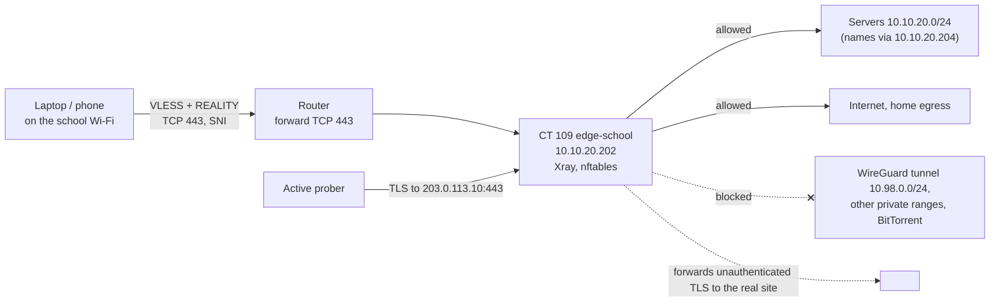

# School network edge: Xray REALITY on TCP 443, hosted at home

A sibling of the [censorship-resistant relay](README.md) for a simpler adversary: a school network that blocks WireGuard and Tailscale but does not intercept TLS. There is no VPS here. A small container at home runs Xray VLESS + REALITY on TCP 443 behind one port forward, so a laptop or phone on the school Wi-Fi gets the whole lab back with home-level latency.

It is a separate path for the admin's own devices. The household WireGuard server, its peers, DNS and every other client are untouched.

## What it does

- Restores access to every LAN service, by IP or by internal name, from a network that drops WireGuard.
- Looks like ordinary HTTPS to a well-known university website (`<borrowed-site-4>`). An active probe gets that site's real certificate and homepage.
- Uses one identity per device, so a lost phone is revoked without touching the laptop.
- Allows the home LAN and the internet. Blocks every other private range (including the WireGuard tunnel subnet) and BitTorrent.
- Adds exactly one inbound port forward, and can be removed in two commands.

## Diagnose before building

The fix depends on how the network blocks the VPN. These four tests take ten minutes on site and decide everything.

| Test on the restrictive network | If it fails | If it works |
|---|---|---|
| WireGuard with the endpoint as an **IP**, not a name | The block is on the flow, not DNS | Only DNS is filtered: use the IP, done |
| Handshake on mobile data, then switch to the school Wi-Fi | The firewall kills an established WireGuard flow | Probably a DNS or new-domain filter |
| `nslookup -type=txt debug.opendns.com <school-dns>` | No debug TXT: the resolver is not Cisco Umbrella | TXT lines: Umbrella DNS-layer filtering is in play |
| Certificate issuer on `https://www.google.com` | The school's firewall: TLS is intercepted, REALITY will **not** work | Google Trust Services: no interception, REALITY will work |

Result here: WireGuard failed by IP and died when moved onto the school Wi-Fi. The resolver was not Umbrella, and there was no TLS interception. A firewall blocking the protocol itself, which is the case REALITY on TCP 443 solves.

## Design decisions

| Decision | Why | Rejected alternative |
|---|---|---|
| REALITY on TCP 443 | Looks like normal TLS. TCP 443 is the one port a school cannot block | WireGuard on UDP 443: the block followed the flow, not the port |
| Hosted at home, not on a VPS | One country, ~40 ms instead of ~250 ms, no VPS bill. The home IP is not hiding from a school | Reusing the Tokyo relay: slow, and it was parked |
| Connect by IP or by name | REALITY needs no DNS on the client side, so a domain filter cannot break it | A name-only link: fails if the school filters new domains |
| Borrowed site: a university website | Returned 200, HTTP/2, TLS 1.3 with X25519MLKEM768, 42 ms, on the university's own network rather than a CDN. A student visiting a university site is unremarkable | Large CDN sites that answered 403 or redirected |
| Server-side routing allows `10.10.20.0/24`, blocks other private ranges | Access is enforced where a client cannot edit it | Trusting client routing rules |
| Own container, port and credentials | Nothing shared with the household VPN | A new peer on the WireGuard server: same blocked protocol |
| Xray as a dedicated `xray` user | The installer's unit runs as `nobody`, which cannot read a `0600` config | `chmod 644`, which world-reads the private key |

## Architecture



| Component | Value |
|---|---|
| Container | CT 109 `edge-school`, `10.10.20.202/24`, unprivileged Debian 13, 1 core, 512 MB, 4 GB |
| Software | Xray-core 26.x, VLESS, flow `xtls-rprx-vision`, REALITY |
| Router | One forward: WAN TCP 443 → `10.10.20.202:443`, on the WAN that holds the public address |
| Endpoint | `vpn.example.com:443` (DDNS), with an IP-only fallback link `203.0.113.10:443` |

## Prerequisites

- A Proxmox VE host and a Debian 13 container template.
- An internal DNS server (here AdGuard at `10.10.20.204`) if you want internal names to work through the tunnel. See [DNS, reverse proxy and TLS](../dns-proxy-tls/).
- A public IPv4 address with TCP 443 free on the router. Check the router's own remote-management page is not on WAN 443 first.
- The diagnosis above showing **no TLS interception**.

## Build it

### 1. Container

```bash
# On pve-01. umask 0022 matters: a hardened 0027 umask makes the unprivileged extract fail.
umask 0022
pct create 109 local:vztmpl/debian-13-standard_amd64.tar.zst \
  --hostname edge-school --unprivileged 1 --features nesting=1 \
  --cores 1 --memory 512 --swap 256 --rootfs local-lvm:4 \
  --net0 name=eth0,bridge=vmbr0,firewall=0,ip=10.10.20.202/24,gw=10.10.20.1 \
  --nameserver 10.10.20.204 --onboot 1
pct start 109
```

`pct exec` passes the host environment into the container. If the host has an unusual `TMPDIR`, dpkg fails with "unable to create temporary directory", so run commands with a clean environment:

```bash
pct exec 109 -- env -i PATH=/usr/local/bin:/usr/sbin:/usr/bin:/sbin:/bin TMPDIR=/tmp LANG=C.UTF-8 bash
apt update && apt full-upgrade -y
apt install -y curl ca-certificates nftables unattended-upgrades openssl qrencode jq
bash -c "$(curl -fsSL https://github.com/XTLS/Xray-install/raw/main/install-release.sh)" @ install
```

### 2. Choose the borrowed site

Test candidates **from the container**, because latency and reachability from your own line are what matter:

```bash
for h in <candidate-1> <candidate-2> <candidate-3>; do
  curl -s -o /dev/null -m8 --http2 --tlsv1.3 -w "$h %{http_code} h%{http_version} %{time_connect}s\n" https://$h/
  echo | openssl s_client -connect $h:443 -servername $h -tls1_3 -alpn h2 2>/dev/null \
    | grep -E "Negotiated TLS1.3 group|ALPN protocol"
done
```

Keep a site that returns **200** (a redirect or 403 weakens the probe fallback), speaks h2 and TLS 1.3 with X25519 or X25519MLKEM768, and is fast. Prefer one that is plausible for the network you are on and not behind a large CDN. Note two spares.

### 3. Secrets

```bash
# Inside CT 109. Never paste these anywhere public.
xray x25519            # PrivateKey -> server only; Password (PublicKey) -> clients
xray uuid              # one per device
openssl rand -hex 8    # short ID
```

### 4. Server config

```json
// /usr/local/etc/xray/config.json, inside CT 109 (chmod 600, owned by xray). Drop this comment line when saving.
{
  "log": { "loglevel": "warning", "access": "none" },
  "inbounds": [{
    "tag": "reality-in", "listen": "0.0.0.0", "port": 443, "protocol": "vless",
    "settings": {
      "clients": [
        { "id": "<uuid-laptop>", "flow": "xtls-rprx-vision", "email": "admin-laptop" },
        { "id": "<uuid-phone>",  "flow": "xtls-rprx-vision", "email": "admin-phone" }
      ],
      "decryption": "none"
    },
    "streamSettings": {
      "network": "tcp", "security": "reality",
      "realitySettings": {
        "dest": "<borrowed-site-4>:443", "serverNames": ["<borrowed-site-4>"],
        "privateKey": "<reality-private-key>", "shortIds": ["<short-id>"]
      }
    },
    "sniffing": { "enabled": true, "destOverride": ["http", "tls", "quic"], "routeOnly": true }
  }],
  "outbounds": [
    { "tag": "direct", "protocol": "freedom", "settings": { "domainStrategy": "UseIPv4" } },
    { "tag": "block",  "protocol": "blackhole" }
  ],
  "routing": {
    "domainStrategy": "IPIfNonMatch",
    "rules": [
      { "type": "field", "protocol": ["bittorrent"], "outboundTag": "block" },
      { "type": "field", "ip": ["10.10.20.0/24"],   "outboundTag": "direct" },
      { "type": "field", "ip": ["geoip:private"],   "outboundTag": "block" }
    ]
  }
}
```

- `IPIfNonMatch` lets the container resolve names through the internal DNS server, so `mon.example.com` works when the client sends the name.
- `UseIPv4` avoids slow failures when the LAN has no IPv6.

### 5. Service user

```ini
# /etc/systemd/system/xray.service.d/10-user.conf, inside CT 109
[Service]
User=xray
Group=xray
```

```bash
useradd --system --no-create-home --shell /usr/sbin/nologin xray
chown -R xray:xray /usr/local/etc/xray && chmod 700 /usr/local/etc/xray
# Gate on the test output; "| tail -1 && ..." would not stop on a failure
xray run -test -config /usr/local/etc/xray/config.json | grep -q "Configuration OK" \
  && systemctl daemon-reload && systemctl restart xray
```

### 6. Container firewall and SSH

```
# /etc/nftables.conf, inside CT 109
table inet filter {
  chain input {
    type filter hook input priority 0; policy drop;
    ct state established,related accept
    ct state invalid drop
    iif lo accept
    ip protocol icmp accept
    meta l4proto ipv6-icmp accept
    tcp dport 443 accept
    ip saddr 10.10.20.0/24 tcp dport 22 accept
    counter comment "dropped"
  }
  chain forward { type filter hook forward priority 0; policy drop; }
  chain output  { type filter hook output priority 0; policy accept; }
}
```

```bash
nft -c -f /etc/nftables.conf && systemctl enable --now nftables
printf 'PasswordAuthentication no\nKbdInteractiveAuthentication no\nPermitRootLogin prohibit-password\n' \
  > /etc/ssh/sshd_config.d/10-hardening.conf && sshd -t && systemctl restart ssh
```

### 7. Port forward

On the router: WAN TCP 443 → `10.10.20.202:443`. Bind it to the WAN interface that actually holds the public address. On some routers, forwards are tied to one WAN and silently stop working if the uplink moves.

### 8. Client links

```text
vless://<uuid>@vpn.example.com:443?encryption=none&flow=xtls-rprx-vision&security=reality&sni=<borrowed-site-4>&fp=chrome&pbk=<public-key>&sid=<short-id>&type=tcp#school-laptop
```

Make a second copy with `203.0.113.10` as the address, for networks that filter the domain. Give phones a PNG QR code (`qrencode -o phone.png '<link>'`, check with `zbarimg --raw phone.png`). Store the links admin-only (`docs/reality-configs/`, mode 600), because each is a credential.

## Client settings that matter

| Client | Setting | Why |
|---|---|---|
| Hiddify (Windows, Android) | Import with **Add from clipboard**, not "Add from URL" | The URL field only accepts `http(s)://` |
| Hiddify | **Remote DNS = `udp://10.10.20.204`** | The default public resolver returns NXDOMAIN for internal-only names |
| Hiddify | **Bypass LAN off** | The home LAN is a private range, so "bypass LAN" sends it direct |
| Hiddify on Windows | **VPN (TUN) mode**, run as admin, for SSH | System-proxy mode only carries proxy-aware apps such as browsers |
| MobaXterm (alternative to TUN) | Session → Network settings → SOCKS5 `127.0.0.1:<mixed-port>` (Hiddify default `12334`), target by IP | Sends just that SSH session through the tunnel |
| v2rayN | Routing rule at the top: `10.10.20.0/24` and `domain:example.com` → proxy; DNS for `domain:example.com` → `10.10.20.204` | Its default rules send `geoip:private` direct. Untested here; Hiddify was enough |
| Any client | Turn the old WireGuard tunnel **off** on the restrictive network | A dead tunnel that still owns DNS breaks all name resolution |

## Verify

```bash
# On pve-01
pct exec 109 -- systemctl is-active xray
pct exec 109 -- ss -tn state established '( sport = :443 )'    # real sessions; a green app toggle is not proof

# What a prober sees: must be the borrowed site's genuine certificate
echo | openssl s_client -connect 203.0.113.10:443 -servername <borrowed-site-4> 2>/dev/null | grep -E '^subject=|^issuer='
```

Then, in order:

1. **On the LAN:** a throwaway Xray client on the host, using the real link. Fetch an internal page by name (expect 200) and `https://1.1.1.1/cdn-cgi/trace` (expect the home IP). Fetch the WireGuard tunnel IP and an old private range (both must fail).
2. **From outside:** a phone on mobile data with Wi-Fi off, and a public TCP port checker, while `tcpdump -ni eth0 'tcp port 443'` runs in the container.
3. **On the school network.**

To debug a client, set `"access": ""` and `"loglevel": "info"` for a few minutes and watch `journalctl -u xray -f`. Every destination is logged per client: no port-22 entries means SSH never entered the tunnel. Turn it back off, because it records browsing.

Measured here: the laptop worked from the school Wi-Fi (Grafana and the Proxmox UI by IP), and the phone over 4G.

## Gotchas

| Symptom | Cause | Fix |
|---|---|---|
| Connected, internal names fail even at home | Client DNS goes to a public resolver | Remote DNS = internal DNS server |
| Browser works, SSH does not | Client in system-proxy mode | TUN mode, or a SOCKS5 proxy in the SSH client |
| Internet works, home LAN does not | Client "bypass LAN" or `geoip:private → direct` | Turn it off, or a proxy rule for the home subnet above it |
| Works on mobile data, not at school | The school filters the domain | IP fallback link |
| Slow, log full of IPv6 dial failures | No IPv6 at home | `domainStrategy: UseIPv4` on the direct outbound |
| `xray.service` fails with permission denied | Installer unit runs as `nobody` | Dedicated `xray` user (step 5) |
| `pct create` fails at the tar step | umask `0027` | `umask 0022` |
| `sshd: Cannot bind any address` right after the first upgrade | Restart race during the openssh upgrade | `systemctl restart ssh` |
| Stops working one day | The school started TLS interception, or the borrowed site stopped returning 200 | Re-check the certificate issuer. Switch to a spare site |

## Rollback

```bash
# First remove the router forward (WAN TCP 443), then on pve-01:
pct stop 109
pct destroy 109
```

Delete the stored links. Nothing else depends on the container.

## Rebuild with AI

Copy everything in the block below into an AI assistant.

```text
You are helping me get back into my homelab from a school (or work) network
that blocks WireGuard and Tailscale. The plan is Xray VLESS + XTLS-Vision +
REALITY on TCP 443, running in a small container AT HOME behind one router
port forward. It must be a separate path for my own devices: do not change my
existing VPN, its peers, my DNS server or any other client.

Step 1 - diagnose first. Before proposing any build, give me these tests to
run ON the restrictive network and wait for my results:
  a) my current WireGuard config with the Endpoint set to my public IP
     instead of a hostname;
  b) connect on mobile data, then switch to the school Wi-Fi: does the
     tunnel survive?
  c) nslookup -type=txt debug.opendns.com <school DNS server from ipconfig>
     (text lines = Cisco Umbrella DNS);
  d) open https://www.google.com and tell you the certificate's "Issued by".
Explain what each result means. If (d) shows the school or a firewall vendor
as issuer, TLS is intercepted: stop and tell me REALITY will not work. If (a)
works, only DNS is filtered: the fix is just the IP endpoint.

Step 2 - then ask me for these values and wait for my answers:
  1. Hypervisor (e.g. Proxmox), a free container ID, a free LAN IP, my LAN
     subnet and gateway.
  2. My internal DNS server IP, and my internal domain, if any.
  3. My public IP or DDNS hostname, and my router model (to check that its
     admin UI does not already use WAN port 443).
  4. The devices and client OSes (e.g. Windows laptop, Android phone).
  5. Whether only my home LAN should go through the tunnel, or all traffic.
  6. Any other private ranges at home that must stay unreachable (e.g. my
     WireGuard tunnel subnet).

Step 3 - build it with these rules:
- Unprivileged Debian container, nesting=1, start on boot. Warn me that a
  0027 umask breaks pct create, and that `pct exec` can leak the host
  TMPDIR into the container (use env -i).
- Install Xray with the official XTLS installer. Run it as a dedicated
  "xray" system user via a systemd drop-in; config mode 600 owned by xray.
  Never chmod 644 the config.
- Help me choose the REALITY borrowed site by TESTING candidates from the
  container: HTTP 200, HTTP/2, TLS 1.3 with X25519/X25519MLKEM768, low
  latency, plausible for the network I am on, preferably not a big CDN.
  Give me the curl/openssl loop and keep two spares.
- NEVER invent keys, UUIDs or short IDs. Give me the commands (xray x25519,
  xray uuid, openssl rand -hex 8) and say which half goes where. One UUID
  per device so each can be revoked alone.
- Server routing, first match wins: block BitTorrent; allow my LAN subnet;
  block geoip:private (so other private ranges stay unreachable); allow the
  internet. domainStrategy IPIfNonMatch so internal names resolve on the
  server; freedom outbound UseIPv4 if my LAN has no IPv6.
- nftables in the container: input policy drop; allow established, lo,
  ICMP, TCP 443 from anywhere, SSH only from my LAN. SSH key-only.
  Enable unattended-upgrades.
- Always gate a config change on `xray run -test` printing
  "Configuration OK" (grep -q), never on `| tail -1 &&`.
- Router: one forward, WAN TCP 443 to the container, bound to the WAN
  interface that really holds the public IP.
- Produce vless:// share links (by hostname, plus an IP fallback) and a PNG
  QR code for phones, verified with zbarimg. Tell me to store them as
  credentials (admin-only).
- Client setup for my OSes. For Hiddify: import with "Add from clipboard",
  set Remote DNS to my internal DNS server, keep "Bypass LAN" off, and use
  VPN/TUN mode (as admin) for SSH, or a SOCKS5 proxy in the SSH client on
  Hiddify's mixed port. For v2rayN: put a proxy rule for my LAN and domain
  above its default private-IP direct rule. Remind me to turn the old
  WireGuard off on the school network.
- Verification in this order: a throwaway client on the LAN (internal page
  200, egress = home IP, forbidden ranges fail); an openssl s_client probe
  that must return the borrowed site's genuine certificate; from outside on
  mobile data with tcpdump on the container; finally on the school network.
  Show me how to temporarily enable the Xray access log to debug a client,
  and remind me to turn it off afterwards.
- Finish with a gotchas table, how to add or revoke a device, and a rollback
  (remove the forward, stop and destroy the container).
- Mention once that bypassing a school filter may break its network rules,
  and that this must never be done on a school-managed device.
```
