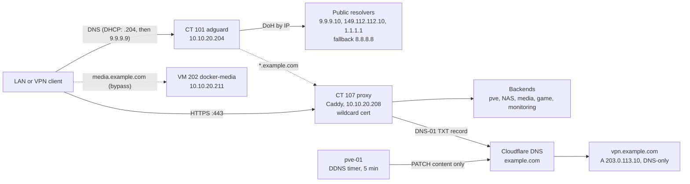

# DNS, reverse proxy and TLS

Every web service in the lab is reached by name over HTTPS with a browser-trusted certificate. AdGuard Home filters DNS for the network and answers every `*.example.com` service name with the address of a Caddy reverse proxy. Caddy gets a wildcard certificate by DNS-01, so no inbound port is opened for TLS. A DDNS script on the host keeps the one public record, the VPN endpoint, current.

## What it does

- Blocks ad and tracking domains for every device that uses the DHCP-advertised resolvers.
- Resolves internal names such as `jellyfin.example.com` to the reverse proxy, instead of `IP:port`.
- Serves every service over HTTPS with a Let's Encrypt wildcard certificate (`*.example.com` plus the apex `example.com`), renewed by Caddy itself.
- Sends upstream queries encrypted (DoH) and fails over to a public resolver if AdGuard is down.
- Keeps `vpn.example.com` pointed at the current public IP, without ever being able to break it.

## Design decisions

| Decision | Why | Rejected alternative |
|---|---|---|
| Upstreams specified by IP (DoH to `9.9.9.10`, `149.112.112.10`, `1.1.1.1`, fallback `8.8.8.8`) | A hostname upstream must first be resolved over plain port 53. If port 53 is intercepted, AdGuard loses every upstream on its next restart. These certificates carry IP SANs | `https://dns.quad9.net/...`-style hostname upstreams |
| DHCP hands out AdGuard first, then `9.9.9.9` | Clients try the primary and fall back only on failure. Measured: 0% of queries bypassed AdGuard while it was healthy | Router DNS Override with two entries: the router round-robins them, and about 49% of queries skipped AdGuard |
| Every service name points at the proxy | One place for TLS and one certificate | A DNS name per backend IP |
| No internal record for `vpn.example.com`, DNS-only at Cloudflare | It must resolve to the public IP, and Cloudflare's proxy does not carry UDP | Proxied (orange cloud) record or an internal rewrite |
| Wildcard certificate by DNS-01 | Let's Encrypt never connects to the lab, so no port 80/443 forward is needed | HTTP-01 with an inbound port forward |
| Caddy built with `xcaddy` and `caddy-dns/cloudflare` | DNS provider modules are compiled in, not loaded at runtime. The stock image cannot do DNS-01 against Cloudflare | Stock `caddy` image |
| DDNS script on the host | The router's custom DDNS is a GET-only URL template. Cloudflare needs `PATCH`, a JSON body and a Bearer header | Router built-in DDNS |
| `PATCH` only the `content` field | A `PUT` replaces the whole record, and one missing `proxied: false` would silently turn it orange | `PUT` the full record |

## Architecture



### Guests

| Guest | Address | Role |
|---|---|---|
| CT 101 adguard | `10.10.20.204` | DNS filtering and internal names. Admin UI at `dns.example.com` |
| CT 107 proxy | `10.10.20.208` | Caddy in Docker Compose, TCP 80/443 on the LAN only |
| pve-01 | `10.10.20.250` | Runs the DDNS script and timer |

### Names

| Name | Resolves to | Backend |
|---|---|---|
| `pve` / `router` / `switch` | `10.10.20.208` | `10.10.20.250:8006` / `10.10.20.1` / `10.10.20.54` (all self-signed) |
| `nas` / `immich` | `10.10.20.208` | `10.10.20.210:80` / `:2283` |
| `jellyfin` / `requests` / `sonarr` / `radarr` / `qbit` | `10.10.20.208` | `10.10.20.211:8096` / `:5055` / `:8989` / `:7878` / `:8080` |
| `game.example.com` | `10.10.20.208` | `10.10.20.212:80` |
| `mon` / `grafana` / `prom` | `10.10.20.208` | `10.10.20.205:8080` / `:3000` / `:9090` |
| `dns.example.com` | `10.10.20.208` | `10.10.20.204:3000` |
| `media.example.com` | `10.10.20.211` | Direct, deliberately bypasses the proxy |
| `vpn.example.com` | `203.0.113.10` | No internal record. Public, DNS-only, TTL 60 |

## Prerequisites

- A Proxmox VE host (see [Proxmox base host](../proxmox-base-host/)) with two unprivileged Debian 13 containers.
- A domain on Cloudflare (the free plan is enough).
- A router whose DHCP server you control. An ISP modem that pushes its own DNS servers over DHCPv4 and IPv6 Router Advertisements (RDNSS) will defeat network-wide filtering. In this lab that only became possible once the modem was put in bridge mode; see [Network edge](../network-edge/).
- Two Cloudflare API tokens you create yourself, one for Caddy and one for DDNS, each scoped Zone → DNS → Edit on the one zone.

## Build it

### 1. AdGuard Home in CT 101

Install AdGuard Home in an unprivileged container at `10.10.20.204` (2 cores, 1 GB RAM, 8 GB disk). Set the upstreams in the web UI; the equivalent YAML is below.

```yaml
# /opt/AdGuardHome/AdGuardHome.yaml, inside CT 101 (dns section, relevant keys)
dns:
  upstream_dns:
    - https://9.9.9.10/dns-query
    - https://149.112.112.10/dns-query
    - https://1.1.1.1/dns-query
  fallback_dns:
    - https://8.8.8.8/dns-query
  bootstrap_dns:          # IPv4 only: the container has no IPv6 route
    - 9.9.9.10
    - 149.112.112.10
  upstream_mode: load_balance
  fastest_timeout: 1s
  enable_dnssec: true
```

The Quad9 `.10` addresses are the unfiltered variants; AdGuard does the filtering.

### 2. Internal names

Add rewrites **through the web UI**: `<name>.example.com → 10.10.20.208` per service, plus `media.example.com → 10.10.20.211`. Never add one for `vpn.example.com`: it is the endpoint in every [WireGuard](../wireguard-tiered-vpn/) client config, and a rewrite breaks every peer at once.

### 3. Hand out the resolvers by DHCP

On the router's LAN DHCP server, set DNS to `10.10.20.204` then `9.9.9.9`, and leave **DNS Override off**.

Why not Override: it intercepts all outbound port 53, so the secondary `9.9.9.9` lands on the router, whose only upstream is AdGuard. With AdGuard down, the LAN has no DNS at all. A second Override entry gives failover, but the router round-robins: 34 of 70 probes (about 49%) skipped a healthy AdGuard. The same pair as a client-side resolver list gave 20 of 20 through AdGuard.

The accepted trade-off: a device with a hardcoded resolver (some TVs and IoT gear) bypasses filtering. During an AdGuard outage, lookups stall for about 2.5 to 5 seconds before falling back.

### 4. Build Caddy with the Cloudflare plugin in CT 107

```dockerfile
# /opt/caddy/Dockerfile, inside CT 107
FROM caddy:2-builder AS builder
RUN xcaddy build --with github.com/caddy-dns/cloudflare

FROM caddy:2
COPY --from=builder /usr/bin/caddy /usr/bin/caddy
```

```yaml
# /opt/caddy/compose.yaml, inside CT 107
services:
  caddy:
    build: .
    restart: unless-stopped
    ports:
      - "80:80"
      - "443:443"
    env_file: cloudflare.env
    volumes:
      - ./conf:/etc/caddy        # the directory, never the single file
      - caddy_data:/data
      - caddy_config:/config
volumes:
  caddy_data:
  caddy_config:
```

```bash
# /opt/caddy/cloudflare.env, inside CT 107. Create it with mode 600.
install -m 600 /dev/null /opt/caddy/cloudflare.env
echo 'CF_API_TOKEN=<your-caddy-api-token>' > /opt/caddy/cloudflare.env
```

Give Caddy its own token, separate from the DDNS one, so rotating either never breaks the other.

### 5. The Caddyfile

```caddyfile
# /opt/caddy/conf/Caddyfile, inside CT 107
{
	email admin@example.com          # ACME contact: expiry warnings if renewal ever fails
}

*.example.com, example.com {
	tls {
		dns cloudflare {env.CF_API_TOKEN}
	}

	@jellyfin host jellyfin.example.com
	handle @jellyfin {
		reverse_proxy 10.10.20.211:8096
	}

	@immich host immich.example.com
	handle @immich {
		# no request body limit on this route: large uploads must not be cut off
		reverse_proxy 10.10.20.210:2283
	}

	@pve host pve.example.com
	handle @pve {
		reverse_proxy https://10.10.20.250:8006 {
			transport http {
				tls_insecure_skip_verify   # self-signed backend only
			}
		}
	}

	# ...one block per service, same pattern
}
```

`tls_insecure_skip_verify` is used only for `pve`, `router` and `switch`, which serve self-signed certificates. The browser-to-Caddy hop stays trusted; only the hop from Caddy to the device is unverified.

Set the ACME contact email. Without it, a failed renewal is silent until every browser shows a certificate error on the expiry date.

```bash
cd /opt/caddy && docker compose up -d --build
```

### 6. Changing a route

1. Edit `/opt/caddy/conf/Caddyfile` in place. If you generated it elsewhere, use `cat new > /opt/caddy/conf/Caddyfile`, never `cp` or `mv`.
2. `docker compose -f /opt/caddy/compose.yaml exec caddy caddy validate --config /etc/caddy/Caddyfile`
3. `docker compose -f /opt/caddy/compose.yaml exec caddy caddy reload --config /etc/caddy/Caddyfile`
4. Add the matching AdGuard rewrite. A route with no rewrite resolves to nothing.
5. Test from a different client, so DNS is tested too.
6. If VPN users need it, confirm their tier allows `10.10.20.208`.

After changing `cloudflare.env`, recreate the container: `docker compose up -d --force-recreate caddy`. A plain restart does not re-read `env_file`.

### 7. DDNS on the host

Create a second token: Zone → DNS → Edit on `example.com`, with **Client IP Address Filtering "Is in" your ISP's block** (`203.0.113.0/24` here), not the current address. A token pinned to one IP is refused on exactly the event DDNS exists to handle.

```bash
#!/bin/bash
# /root/cf-ddns.sh, on pve-01
set -u
ZONE="<zone-id>"; RECORD="<record-id>"; NAME="vpn.example.com"
TOKEN=$(cat /root/.cf-ddns-token)               # mode 600
STATE=/var/lib/cf-ddns.state
PROM=<textfile-collector-dir>/cf_ddns.prom
API="https://api.cloudflare.com/client/v4/zones/$ZONE/dns_records/$RECORD"
log() { logger -t cf-ddns "$*"; }

# 1. Check the token every run with a real call. Do not use curl -f: it hides Cloudflare's error code.
resp=$(curl -sS -H "Authorization: Bearer $TOKEN" "$API")
if echo "$resp" | grep -q '"success":true'; then tok=1; else tok=0; log "token refused: $resp"; fi
dns_ip=$(echo "$resp" | grep -oE '"content":"[^"]+"' | cut -d'"' -f4)

# 2. Current WAN address, compared with the cached state: no API write when unchanged
wan=$(curl -sS <your-ip-echo-url>)
last=$(cat "$STATE" 2>/dev/null)
if [ "$wan" != "$last" ] || [ "$wan" != "$dns_ip" ]; then
  # 3. PATCH only the content field, so the record can never flip to proxied
  out=$(curl -sS -X PATCH -H "Authorization: Bearer $TOKEN" -H "Content-Type: application/json" \
        --data "{\"content\":\"$wan\"}" "$API")
  if echo "$out" | grep -q '"success":true'; then echo "$wan" > "$STATE"; dns_ip=$wan; log "updated to $wan"
  else log "update failed for $wan: $out"; fi
else
  log "unchanged ($wan), skipped"
fi

# 4. Metrics for the monitoring stack
{ echo "cf_ddns_token_ok $tok"
  echo "cf_ddns_record_matches_wan $([ "$dns_ip" = "$wan" ] && echo 1 || echo 0)"
  } > "$PROM.tmp" && mv "$PROM.tmp" "$PROM"
```

Run it from `cf-ddns.timer` every 5 minutes; the state cache keeps that well inside Cloudflare's rate limits. The [monitoring stack](../monitoring-alerting/) alerts when the token is refused, long before the IP changes, and when the record no longer matches the WAN.

## Verify

```bash
# From any LAN client
dig +short jellyfin.example.com @10.10.20.204    # 10.10.20.208
dig +short media.example.com @10.10.20.204       # 10.10.20.211, the deliberate exception
dig +short vpn.example.com @10.10.20.204         # the public address, NOT 10.10.20.208
dig +short doubleclick.net @10.10.20.204         # 0.0.0.0
dig +short @9.9.9.9 id.server ch txt             # a real Quad9 node name. If the router's name comes back, Override is on again

echo | openssl s_client -connect jellyfin.example.com:443 -servername jellyfin.example.com 2>/dev/null \
  | openssl x509 -noout -subject -issuer -dates   # Let's Encrypt, wildcard, valid dates
curl -sI https://pve.example.com | head -1       # 2xx or 3xx, no certificate error

# WebSocket: expect "HTTP/1.1 101 Switching Protocols"
curl -sI -o /dev/null -D - -H "Connection: Upgrade" -H "Upgrade: websocket" \
  -H "Sec-WebSocket-Version: 13" -H "Sec-WebSocket-Key: <random-base64-key>" \
  https://jellyfin.example.com/socket | head -1

# Inside CT 101: no rewrite silently disabled
grep -n 'enabled: false' /opt/AdGuardHome/AdGuardHome.yaml

# On pve-01
systemctl list-timers cf-ddns.timer
journalctl -t cf-ddns -n 20
dig +short vpn.example.com @1.1.1.1              # equals the current WAN address
```

## Gotchas

| Symptom | Cause | Fix |
|---|---|---|
| DNS "half works" after a restart: rewrites and blocks answer, everything else fails; logs show `no addresses` and `bootstrapping` | Hostname upstreams cannot bootstrap because port 53 is intercepted. It only worked before because the bootstrap result was cached in the running process | Specify every upstream by IP |
| A rewrite is in the YAML and does nothing | AdGuard appended `enabled: false` to a hand-edited rewrite | Add rewrites through the web UI |
| YAML edits vanish | The service writes its in-memory config over the file on shutdown | `systemctl stop AdGuardHome`, edit, then start |
| A Docker container says `no such host` while its host resolves fine | Containers keep the resolver they had at start | Restart the container's stack after a resolver change |
| Caddy edit had no effect, yet validate and reload succeeded | Single-file bind mount: `sed -i`, `cp` or an editor replaced the inode | Mount the `conf` directory |
| `systemctl status caddy`: unit not found | Caddy runs as a container; `docker-proxy` holds 80/443 | `pct exec 107 -- docker ps`, and curl a real hostname |
| Tailscale client reaches IPs but no names | A subnet router pushes routes, not DNS | Set the tailnet nameserver to `10.10.20.204` |
| DDNS logs a bare `401` | `curl -f` swallowed Cloudflare's error body (for example "cannot use the access token from location") | Drop `-f` and log the response |
| New token verifies as active but every call fails with an authentication error | TTL start and end dates set in the future | Leave the token's TTL fields empty |

**Habits:** treat CT 101 as critical, keep it in the [backup jobs](../backup-strategy/), and never re-enable Override with one filtering and one public entry.

## Rollback

```bash
# Proxy: additive. Every backend still answers on its own IP:port.
pct exec 107 -- docker compose -f /opt/caddy/compose.yaml down
pct stop 107 && pct destroy 107      # full removal; then delete the proxy rewrites in AdGuard,
                                     # or every name resolves to an address with nothing on it

# DNS: clients fall back to 9.9.9.9 after a per-lookup stall, but internal names stop resolving
pct stop 101
pct start 101

systemctl disable --now cf-ddns.timer   # DDNS, on pve-01
```

## What's next

- A second filtering resolver that does not run on pve-01, such as a small always-on box with the same AdGuard rewrites. Two identical filtering resolvers make round-robin harmless and give real high availability.

## Rebuild with AI

Copy everything in the block below into an AI assistant.

```text
You are helping me build internal DNS, a reverse proxy with trusted TLS, and
DDNS for my homelab. Before writing any config, ask me for these values and
wait for my answers:

1. My hypervisor and whether DNS and the proxy run in containers or VMs.
2. My LAN subnet, gateway, and the static IPs for the DNS server and the proxy.
3. My domain, and confirm it is hosted on Cloudflare (or name my DNS provider).
4. The list of services: name, backend IP:port, and whether the backend uses a
   self-signed certificate.
5. Any name that should bypass the proxy, and the name used as my VPN endpoint.
6. My router model, and whether I control its DHCP server and IPv6 RAs.
7. My ISP's public address block, for the API token's client-IP filter.
8. An email address for ACME expiry notices.

Then build it with these rules:

- Use AdGuard Home. Specify every DoH upstream by IP address, never by
  hostname, and explain why: hostname upstreams need bootstrap over port 53,
  which fails after a restart if port 53 is intercepted. Keep bootstrap DNS
  IPv4-only if the host has no IPv6 route. Use load_balance and DNSSEC.
- Add DNS rewrites through the web UI. If I must edit the YAML, stop the
  service first and check for "enabled: false" afterwards.
- Point every service name at the proxy. Never create an internal record for
  the VPN endpoint name, and keep it DNS-only at Cloudflare (no UDP proxying).
- Advertise resolvers by DHCP as [filtering resolver, public resolver]. Do not
  use router DNS interception with two entries: routers round-robin them and
  bypass the filter. Warn me if my modem pushes ISP DNS via DHCP or IPv6 RDNSS.
- Build Caddy with xcaddy and the caddy-dns/cloudflare module. Issue a
  wildcard plus apex certificate by DNS-01 so no inbound port is needed. Set
  the ACME contact email. Bind-mount the config directory, never the single
  Caddyfile. Use tls_insecure_skip_verify only for self-signed backends.
- Give me a route-change checklist: edit in place, validate, reload, add the
  DNS rewrite, test from a second client.
- DDNS script on the host, run by a systemd timer: cache the last IP and skip
  the API when unchanged; PATCH only "content", never PUT; no curl -f; check
  the token with a real call every run; export metrics.
- Use separate API tokens for Caddy and DDNS, each Zone > DNS > Edit on one
  zone, with a client-IP filter on my ISP's block, not one address.
- Never invent tokens, keys or passwords. Tell me where to create them and how
  to store them with mode 600.
- Give me verification steps: dig checks for a proxied name, the bypass name,
  the VPN name and a blocked domain; `dig +short @9.9.9.9 id.server ch txt` to
  detect interception; openssl certificate check; a WebSocket 101 test; DDNS
  timer and log checks.
- Finish with a rollback section.
```
