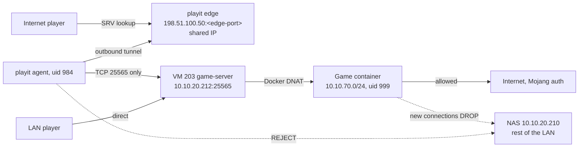

# Isolated game server: Pelican Panel, container egress isolation and a tunnel instead of a port forward

A modded Minecraft server (All the Mods 10) shared with friends outside the house, with no port open on the router and no way for the game server to reach the rest of the lab. Pelican Panel runs natively on a Debian 13 VM, Wings runs the game in Docker, in-VM firewall rules keep the container out of the LAN, and a UID-restricted playit.gg agent brings players in through an outbound tunnel.

## What it does

- Serves a web panel at `https://game.example.com` for power, console, files and updates.
- Lets friends join by typing one hostname, `<tunnel-name>.joinmc.link`. No port, and the home IP stays private.
- Needs no router port forward. The agent dials out and players arrive down the tunnel.
- Blocks the game container from opening new connections into `10.10.20.0/24`, while LAN players still connect directly and internet egress (needed for Mojang authentication) keeps working.
- Confines the tunnel agent to TCP 25565 on the LAN, so a hijacked playit account cannot repoint a tunnel at the NAS.

## Design decisions

| Decision | Why | Rejected alternative |
|---|---|---|
| Pelican installed natively (nginx, PHP 8.4 FPM, MariaDB), game servers in Docker via Wings | Debian 13 ships PHP 8.4, so no extra repository. Every panel part is a plain systemd unit | Containerising the panel too: another layer to debug, no isolation gain |
| Egress isolation with `DOCKER-USER` rules inside the VM | Covers the realistic threat (code execution as the container user, which cannot touch the VM's iptables) with no lockout risk | Proxmox datacenter firewall: stronger, but a wrong management rule locks the host out of its web UI and SSH |
| playit.gg outbound tunnel | No forward, works behind CGNAT, hides the home IP, adds the edge's DDoS protection | Forwarding TCP 25565: everyone who joins learns the home IP, and a ban can turn into a DDoS against the house |
| Restrict the agent by UID in `OUTPUT` | Tunnels are defined server-side in the playit web UI, so whoever holds the account decides where the agent connects | Trusting the account |

## Architecture



**Why isolation matters more than reachability.** The network is still flat, so the game server shares a `/24` with the NAS and its photo library. A server with hundreds of mods is a large remote code execution surface: Java parsing untrusted packets and NBT data, the same shape as Log4Shell. Without egress filtering, one compromise reaches everything else.

| VM 203 | Value |
|---|---|
| Address | `10.10.20.212/24`, gateway `10.10.20.1`, netplan in the guest |
| Resources | 8 cores, 16 GB RAM, 128 GB on `local-lvm`, SeaBIOS, serial console |
| Panel | nginx `:80`, published as `https://game.example.com` via the [reverse proxy](../dns-proxy-tls/) |
| Wings | node `pve-01-wings`, API `:8080`, SFTP `:2022` |
| Volumes | `/var/lib/pelican/volumes/<server-uuid>/`, owned by `999:986` |

### server.properties

Apply with the server stopped and re-check after a start, because Minecraft rewrites the file itself. Keep `ops.json` to the admin only.

| Enabled | Why |
|---|---|
| `white-list=true` | Only listed accounts join; names are checked against Mojang, so they cannot be spoofed |
| `online-mode=true` | Mojang authentication. Never turn it off |
| `enable-query=false` | GameSpy query is a discovery and amplification vector |
| `enable-rcon=false` | Use the Wings command API instead |
| `enforce-secure-profile=true` | Signed player profiles |

| Deliberately not done | Why |
|---|---|
| `enforce-whitelist=true` | Login already enforces the whitelist; this only kicks online players when the list reloads |
| `enable-status=false` | Blanks the MOTD and player count, which reads as "server down" |
| `prevent-proxy-connections=true` | Silently breaks proxies such as playit.gg |

## Prerequisites

- A Proxmox VE host. See [the base host](../proxmox-base-host/).
- A static IP for the VM and a DNS name for the panel. See [DNS, reverse proxy and TLS](../dns-proxy-tls/).
- A playit.gg account.
- The VM in the nightly backups. See [backup strategy](../backup-strategy/).

## Build it

### 1. Create the VM

```bash
# On pve-01
qm create 203 --name game-server --cores 8 --memory 16384 \
  --scsi0 local-lvm:128 --bios seabios --serial0 socket --vga serial0 \
  --net0 virtio,bridge=vmbr0 --onboot 1 --startup order=3
```

Set `--onboot`, or a host reboot leaves the game down. Configure the address in the guest's netplan: without cloud-init in the guest, `ipconfig0` is silently ignored.

### 2. Install the panel headless

Install nginx, PHP 8.4 FPM, MariaDB, Docker and cron from Debian, and unpack Pelican into `/var/www/pelican`. Pelican has no `p:user:make`; the first admin normally comes from the browser installer. Replicate it on the CLI:

```ini
# /var/www/pelican/.env, on VM 203
APP_ENV=production
APP_DEBUG=false
APP_URL=https://game.example.com
APP_INSTALLED=true
DB_CONNECTION=mariadb
DB_HOST=127.0.0.1
DB_DATABASE=panel
DB_USERNAME=pelican
DB_PASSWORD=<DB_PASSWORD>
```

```bash
# On VM 203, in /var/www/pelican
sudo -u www-data php artisan key:generate --force
sudo -u www-data php artisan migrate --force --seed
sudo -u www-data php artisan tinker --execute="app(\App\Services\Users\UserCreationService::class)->handle([
  'email' => 'admin@example.com', 'username' => 'admin',
  'password' => '<your-admin-password>', 'root_admin' => true]);"
sudo -u www-data php artisan tinker --execute="app(\App\Services\Eggs\Sharing\EggImporterService::class)->fromUrl('<raw-egg-json-url>');"
```

`APP_INSTALLED=true` makes `/installer` return 404. `root_admin => true` assigns the root admin role. Eggs are not seeded by `migrate`, hence the explicit import.

### 3. Scheduler in www-data's crontab

```bash
# On VM 203
echo '* * * * * php /var/www/pelican/artisan schedule:run >> /dev/null 2>&1' > /tmp/pelican.cron
crontab -u www-data /tmp/pelican.cron && rm /tmp/pelican.cron
crontab -u www-data -l     # must show the line
crontab -l                 # root's must NOT
```

Then enable `pelican-queue` (the queue worker, as `www-data`).

### 4. Wings and the game server

Create node `pve-01-wings` in the panel, copy its config to `/etc/pelican/config.yml`, and `systemctl enable --now wings`. Create the server from the NeoForge egg, Java 21 yolk, 10 GB RAM, allocation `10.10.20.212:25565`. Note the subnet of the Docker network Wings creates (`docker network inspect`); here it is `10.10.70.0/24`. Anything copied into a volume by hand needs `chown -R 999:986`.

### 5. Container and agent egress isolation

This is the security core.

```bash
#!/bin/sh
# /usr/local/sbin/atm10-lan-isolation.sh, on VM 203
LAN=10.10.20.0/24
CT_NET=10.10.70.0/24
PLAYIT_UID=984        # id -u playit

add() {
  # Container: the conntrack accept MUST be first. Replies to LAN players are container -> LAN.
  iptables -I DOCKER-USER 1 -m conntrack --ctstate RELATED,ESTABLISHED -j ACCEPT
  iptables -I DOCKER-USER 2 -s $CT_NET -d $LAN -j DROP
  # Agent: the game port on the LAN, nothing else on the LAN.
  iptables -I OUTPUT 1 -d $LAN -p tcp --dport 25565 -m owner --uid-owner $PLAYIT_UID -j ACCEPT
  iptables -I OUTPUT 2 -d $LAN -m owner --uid-owner $PLAYIT_UID -j REJECT
}
del() {
  iptables -D DOCKER-USER -m conntrack --ctstate RELATED,ESTABLISHED -j ACCEPT
  iptables -D DOCKER-USER -s $CT_NET -d $LAN -j DROP
  iptables -D OUTPUT -d $LAN -p tcp --dport 25565 -m owner --uid-owner $PLAYIT_UID -j ACCEPT
  iptables -D OUTPUT -d $LAN -m owner --uid-owner $PLAYIT_UID -j REJECT
}
case "$1" in
  start) del 2>/dev/null; add ;;
  stop)  del 2>/dev/null; true ;;
esac
```

```ini
# /etc/systemd/system/atm10-lan-isolation.service, on VM 203
[Unit]
Description=Block game containers and the playit agent from the LAN
After=docker.service
PartOf=docker.service

[Service]
Type=oneshot
RemainAfterExit=yes
ExecStart=/usr/local/sbin/atm10-lan-isolation.sh start
ExecStop=/usr/local/sbin/atm10-lan-isolation.sh stop

[Install]
WantedBy=docker.service
```

Enable it with `systemctl enable --now atm10-lan-isolation`. Two things to notice:

- **The conntrack accept keeps LAN players working.** Inbound play is DNAT'd to the container, so its replies would match the drop. Without rule 1, LAN players lose the game while internet players are fine.
- **Only new connections into the LAN are dropped.** Internet egress stays open for Mojang auth. `PartOf=docker.service` re-applies the rules whenever Docker rebuilds its chains.

### 6. Install and harden the playit agent

Install `playit` from its official apt repo (keyring via `signed-by`), so the internet-facing agent rides `apt upgrade`. The shipped unit already runs as the `playit` user; add:

```ini
# /etc/systemd/system/playit.service.d/hardening.conf, on VM 203
[Service]
ProtectSystem=strict
ReadWritePaths=/etc/playit
CapabilityBoundingSet=
AmbientCapabilities=
NoNewPrivileges=yes
SystemCallFilter=@system-service
RestrictAddressFamilies=AF_INET AF_INET6 AF_UNIX
PrivateTmp=yes
ProtectHome=yes
ProtectKernelTunables=yes
ProtectKernelModules=yes
ProtectControlGroups=yes
RestrictNamespaces=yes
```

### 7. Claim the agent headless and create the tunnel

`playit setup` is interactive; otherwise the daemon logs `Waiting for frontend secret provisioning over IPC` forever.

```bash
# On VM 203
CODE=$(playit claim generate)
playit claim url --name 'game-tunnel' --type self-managed "$CODE"    # open in a browser
setsid playit claim exchange --wait 0 "$CODE" > exchange.out 2>&1 &  # setsid: nohup hangs SSH
```

After you approve, the page says "Agent is offline". That is expected: the secret went to the exchange process, not the daemon.

```bash
SECRET=$(grep -oE '^[0-9a-f]{64}$' exchange.out | head -1)
umask 077
printf 'secret_key = "%s"\n' "$SECRET" > /etc/playit/playit.toml
chown playit:playit /etc/playit/playit.toml && chmod 600 /etc/playit/playit.toml
shred -u exchange.out
systemctl restart playit     # log: "playit connected; tunnels loaded agent_id=<agent-id>"
```

In the playit web UI, create a **`minecraft-java`** tunnel (it publishes an SRV record, so players type no port) to **`10.10.20.212:25565`**, not `127.0.0.1`: Pelican binds the port to the VM's address. Hand out only `<tunnel-name>.joinmc.link`. If a `25565` forward exists on the router, delete it; it republishes the home IP and bypasses the tunnel.

### 8. Operate through the Wings API

```bash
# On VM 203
U=<server-uuid>
T=$(grep -oP '^token:\s*\K\S+' /etc/pelican/config.yml)    # node token
curl -s -X POST "http://127.0.0.1:8080/api/servers/$U/power" \
  -H "Authorization: Bearer $T" -H 'Content-Type: application/json' \
  -d '{"action":"stop"}'                                     # start|stop|restart|kill
curl -s -X POST "http://127.0.0.1:8080/api/servers/$U/commands" \
  -H "Authorization: Bearer $T" -H 'Content-Type: application/json' \
  -d '{"commands":["whitelist add player2"]}'
```

`202`/`204` mean accepted, not finished. After a stop, poll `docker inspect -f '{{.State.Status}}' $U`; after a start, wait for `Done (` in `logs/latest.log`. `Exited (0)` with a matching `action=stop` in `journalctl -u wings` is a clean stop.

### 9. Update the modpack

Server stopped, working in the volume:

1. **Back up the volume** with `tar cf` to a path outside it.
2. **Replace, do not merge:** delete `mods`, `config`, `defaultconfigs`, `kubejs`, `datapacks` and generated caches, then unzip the new server files.
3. **Keep** `world/`, `server.properties`, `ops.json`, `whitelist.json`, `banned-*.json`, `eula.txt`.
4. **`chown -R 999:986`** before anything else touches the volume.
5. **Install the loader inside the Java yolk as the container user** (the VM has no Java):

   ```bash
   docker run --rm -u 999:986 -v "$PWD":/home/container -w /home/container \
     --entrypoint java ghcr.io/pelican-eggs/yolks:java_21 \
     -jar neoforge-<version>-installer.jar --installServer
   ```

6. **Repoint `unix_args.txt`.** The startup command reads `@unix_args.txt`, a symlink into the old loader's directory that the installer does not touch:

   ```bash
   ln -sfn libraries/net/neoforged/neoforge/<version>/unix_args.txt unix_args.txt
   chown -h 999:986 unix_args.txt
   ```

7. **Update the panel's pinned `NEOFORGE_VERSION`** variable, or a reinstall reverts the loader.
8. Start through the API and wait for `Done (`. Keep old loaders in `libraries/` for an easy rollback.

### 10. Reset the world

Stop cleanly, `tar cf` the `world` directory, then `rm -rf world local/ftbchunks dynamic-data-pack-cache .mixin.out` (chunk claims and generated packs live outside `world/`). Keep everything else. An empty `level-seed` rolls a new seed.

## Verify

```bash
# On VM 203
systemctl is-active nginx php8.4-fpm mariadb pelican-queue wings docker cron playit atm10-lan-isolation
curl -s -o /dev/null -w '%{http_code}\n' http://10.10.20.212/     # 302 to login
iptables -L DOCKER-USER -v -n --line-numbers                      # conntrack accept is rule 1
# As the agent: connect, refused, connect
setpriv --reuid=playit --regid=playit --clear-groups bash -c 'echo > /dev/tcp/10.10.20.212/25565' && echo OK
setpriv --reuid=playit --regid=playit --clear-groups bash -c 'echo > /dev/tcp/10.10.20.1/80' || echo REJECTED
setpriv --reuid=playit --regid=playit --clear-groups bash -c 'echo > /dev/tcp/1.1.1.1/443' && echo OK
# From the container: the NAS must be unreachable
docker exec <server-uuid> timeout 3 bash -c 'echo > /dev/tcp/10.10.20.210/445' || echo BLOCKED
```

Then, from a network outside your own, add `<tunnel-name>.joinmc.link` to a client's server list and confirm the MOTD and player count appear. Use the hostname, never the edge IP: playit routes by it. Finally join from the LAN at `10.10.20.212` to prove the conntrack rule.

## Gotchas

| Symptom | Cause | Fix |
|---|---|---|
| Panel HTTP 500 and `pelican-queue` restart-looping after `umask 027` | The scheduler ran from root's crontab and left root-owned files in `storage/`. Readable at 022, not at 027 | Move it to `www-data`'s crontab, `chown -R www-data:www-data storage bootstrap/cache`, clear caches, restart PHP-FPM and the queue |
| Installer fails with `Unable to access jarfile` | Root-owned files in the volume | `chown -R 999:986` |
| Old loader still boots after an update | `unix_args.txt` symlink | `ln -sfn` to the new version |
| Client rejected with a mod payload version error | The loader is checked before any mod channel, and the payload error names the wrong side | Look for `Incompatible client! Please use NeoForge ...` in the server log. Match the whole pack version |
| About 130 errors on every boot | Known pack noise: invalid items, unknown registry keys | Diff against an older log before chasing anything |
| LAN players time out, internet players fine | Conntrack accept missing or below the drop | Restore it as rule 1 |
| Tunnel up, players time out | Tunnel points at `127.0.0.1` | Point it at `10.10.20.212:25565` |
| IP bans hit strangers | Everyone arrives from the shared edge | Ban by username; sound with `online-mode=true` |

Habits: **never `docker start` a game container**, because Wings owns the lifecycle. **Never forward the panel (`80`), Wings (`8080`) or SFTP (`2022`)**; keep them on the LAN or behind the [VPN](../wireguard-tiered-vpn/).

## Rollback

```bash
# On VM 203
systemctl disable --now atm10-lan-isolation    # removes its rules on stop
systemctl disable --now playit                 # then delete the tunnel in the web UI
# Pack update: stop, then in /var/lib/pelican/volumes
rm -rf <server-uuid>/* && tar xf <pre-update-backup>.tar   # and restore NEOFORGE_VERSION

# On pve-01, full teardown
qm stop 203 && qm destroy 203
```

## What's next

- Move VM 203 onto the planned Servers VLAN with inter-VLAN filtering on the router.
- Revisit the Proxmox datacenter firewall once management rules can be tested safely.
- Alert on game container restarts in [monitoring](../monitoring-alerting/) and keep the VM on the [hardening](../host-hardening/) baseline.

## Rebuild with AI

Copy everything in the block below into an AI assistant.

```text
You are helping me build an isolated game server with Pelican Panel and Wings,
reachable through an outbound tunnel. Before writing any config, ask me for
these values and wait for my answers:

1. Hypervisor, VM ID, name and resources.
2. LAN subnet, gateway, the VM's static IP, cloud-init or netplan.
3. The panel's DNS name and reverse proxy, if any.
4. Game, modpack, loader and game port.
5. The Docker subnet Wings uses for game containers.
6. Which LAN hosts are sensitive (NAS, backups, hypervisor).
7. Tunnel service or router forward.

Build it with these rules:

- Panel native (nginx, PHP-FPM, MariaDB); only game servers in Docker.
- Headless install: .env with APP_INSTALLED=true, migrate --seed as
  www-data, admin via UserCreationService (root_admin => true), eggs via
  EggImporterService.
- schedule:run goes in www-data's crontab, never root's; install from a
  file and read it back.
- A systemd oneshot unit (After= and PartOf=docker.service) inserting in
  DOCKER-USER: first ctstate RELATED,ESTABLISHED ACCEPT, then DROP container
  subnet -> LAN. Explain why order matters. Remove rules on stop. Keep
  internet egress open.
- Confine the tunnel agent by UID in OUTPUT: ACCEPT TCP game port to the LAN,
  REJECT the rest of the LAN, because a compromised tunnel account could
  repoint a tunnel at my NAS. Add a systemd hardening drop-in for it.
- Write the agent secret with umask 077 and mode 600; shred any file that
  held it.
- Tunnel target = VM LAN IP and game port, not 127.0.0.1. Game-aware tunnel
  with SRV. Ban by username on a shared edge. No router forward for the game;
  never forward panel, Wings API or SFTP ports.
- Harden server.properties (white-list, online-mode, query off, rcon off,
  enforce-secure-profile) and explain what you leave off and why.
- Power and commands via the Wings API with the node token; 202/204 means
  accepted, not finished.
- Pack updates: back up the volume, replace (not merge) mods/config, keep
  the world and server settings, chown to the container UID:GID, run the
  loader installer in the Java image, repoint unix_args.txt, update the
  panel's pinned loader variable.
- Never invent passwords, tokens or keys; use placeholders and tell me how to
  generate or retrieve each one locally.
- Verification: services active, panel answers, crontab owner, rule order
  with counters, agent UID reaching only the game port, container failing to
  reach my NAS, and an end-to-end join from outside using the hostname.
- Finish with a rollback section.
```
