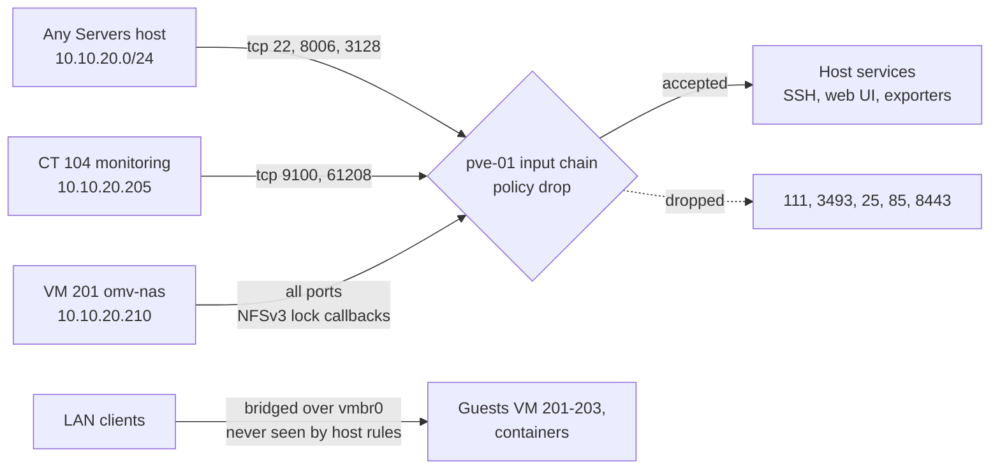

# Host hardening: Lynis-driven baseline and an nftables host firewall

A repeatable hardening pass for a Proxmox host and its three Debian VMs, driven by Lynis audits. Each finding was fixed, documented as a false positive, or deliberately left alone with a written reason. The hypervisor also runs a small nftables ruleset with `input` policy drop that closes every port nothing needs. Every machine ended at a hardening index of 76 or higher.

## What it does

- Applies six groups of changes (A to F) to all four machines, with documented exceptions.
- Keeps unattended patching from prompting or restarting services.
- Enforces key-only root SSH through a drop-in, checked against the effective config.
- Adds bounded accounting (auditd, sysstat, acct), file integrity checks (AIDE) and rootkit scans (rkhunter) scoped to stay fast and quiet.
- Protects the hypervisor with a default-drop input chain, leaving guest networking untouched.
- Wraps every remote firewall change in an automatic undo.

## Design decisions

| Decision | Why | Rejected alternative |
|---|---|---|
| Let Lynis drive the work | Every change maps to a test ID, so the next audit shows what moved | A hand-picked checklist |
| `needrestart` list-only | Reports needed restarts, never prompts or restarts | Interactive default, which stalls unattended `apt` |
| SSH drop-in `99-hardening.conf` | Survives package updates; one reviewable file | Editing `sshd_config` |
| `UMASK 027` except on the NAS | NAS shares need predictable `664` modes; not worth one Lynis point | Applying it everywhere |
| Scope AIDE before the first build | Unscoped, it walks arrays and NFS for hours and flags every normal change | Default config |
| Plain nftables, `pve-firewall` off | Several guests carry `firewall=1` with no rules; enabling the datacenter firewall would drop their input and disconnect them all at once | `pve-firewall` |
| `forward` and `output` accept | Bridged guest traffic never reaches these hooks, and the host must patch, mount the NAS and send metrics. The boundary is `input` | Drop on every chain |
| Timed rollback before firewall changes | A lockout fixes itself in ten minutes | Hoping it is correct |

### Deliberately not done

| Finding | Why not |
|---|---|
| `BOOT-5122` GRUB password | Blocks the unattended reboot that [UPS shutdown](../ups-nut-shutdown/) depends on. Safe on the VMs |
| `AUTH-9282` account expiry | Affects family accounts on the NAS; needs a deliberate decision |
| `SSH-7408` `AllowTcpForwarding no` | SSH tunnelling and port forwarding are used in this lab |
| `SSH-7408` non-standard SSH port | Obscurity; buys nothing against real scanning |
| `AUTH-9328` umask on VM 201 | OMV's shares rely on predictable file modes |

HTTPS for the NAS and game panels (`HTTP-6710`) was originally deferred and is now handled by the wildcard certificate on the [reverse proxy](../dns-proxy-tls/).

## Architecture



### Machines and results

| Machine | Address | Lynis index before | After |
|---|---|---|---|
| pve-01, Proxmox host | `10.10.20.250` | 67 | 76 |
| VM 201 omv-nas | `10.10.20.210` | 67 | 76 |
| VM 202 docker-media | `10.10.20.211` | 62 | 76 |
| VM 203 game-server | `10.10.20.212` | not audited before | 78 |

rkhunter reports 0 rootkits and 0 suspect files on all four.

### Host firewall: what is allowed in

| Source | Destination | Why |
|---|---|---|
| any | established/related, loopback, ICMP and ICMPv6 | Return traffic, local services, ping and path-MTU discovery |
| `10.10.20.0/24` | tcp 22, 8006, 3128 | SSH, the Proxmox web UI, the Proxmox SPICE proxy |
| `10.10.20.205` | tcp 9100, 61208 | node_exporter and the Glances API, scraped by [monitoring](../monitoring-alerting/) |
| `10.10.20.210` | all | NFSv3 lock callbacks from the NAS |

### Host firewall: what is closed

| Port | Service | Why it is closed |
|---|---|---|
| 8443 | Unmanaged socat relay | Nothing owned or used it |
| 3493 | `upsd` (NUT) | Only the host consumes it ([UPS shutdown](../ups-nut-shutdown/)) |
| 111 | `rpcbind` | The host is an NFS client, not a server |
| 25 | `postfix` | Local mail delivery only |
| 85 | `pvedaemon` | The web UI reaches it over loopback |

## Prerequisites

- A Proxmox VE host and Debian 13 guests, built as in [Proxmox base host](../proxmox-base-host/).
- Root access plus an out-of-band path into each guest (`qm guest exec <vmid>` or the Proxmox console).
- A working SSH key login on every machine, tested from a second session.
- Lynis installed everywhere. It is read-only and safe on live services.

## Build it

Unless a step says otherwise, run it on every machine, with `DEBIAN_FRONTEND=noninteractive` exported for unattended `apt`.

### 1. Take a baseline audit

```bash
# On each machine
lynis audit system -Q --no-colors      # -Q: non-interactive, runs every test
grep -E '^(hardening_index|warning\[\]|suggestion\[\])=' /var/log/lynis-report.dat
```

Anchor single-finding greps; a bare test ID also matches the `tests_executed=` line:

```bash
grep -E '^(warning|suggestion)\[\]=BANN-7126' /var/log/lynis-report.dat
```

### 2. Group A: patch hygiene

```bash
# On each machine
apt-get install -y libpam-tmpdir apt-listbugs needrestart debsums apt-show-versions
```

```perl
# /etc/needrestart/conf.d/90-noninteractive.conf, on each machine
$nrconf{restart} = 'l';    # list only: never prompt, never restart
```

```bash
# /etc/default/debsums, on each machine (PKGS-7370 wants the weekly check)
CRON_CHECK=weekly
```

### 3. Group B: legal banners

Write the same warning text to `/etc/issue` (console) and `/etc/issue.net` (pre-auth SSH banner, referenced in step 5). Clears `BANN-7126` and `BANN-7130`.

### 4. Group C: password policy and umask

```
# /etc/login.defs, on each machine (UMASK line: skip on VM 201)
PASS_MAX_DAYS	365
PASS_MIN_DAYS	1
PASS_WARN_AGE	7
UMASK	027
SHA_CRYPT_MIN_ROUNDS	640000
```

These affect only new accounts and new passwords. The umask also reaches cron through `pam_umask`, so first check `crontab -l`, `crontab -u <user> -l` and `/etc/cron.d/` for any job that writes into a tree owned by another user, and move it to the owning user.

### 5. Group D: SSH

```
# /etc/ssh/sshd_config.d/99-hardening.conf, on each machine
MaxAuthTries 3
MaxSessions 2
LogLevel VERBOSE
X11Forwarding no
AllowAgentForwarding no
ClientAliveCountMax 2
TCPKeepAlive no
Banner /etc/issue.net
```

Root login is key-only everywhere (`prohibit-password` with `PasswordAuthentication no`; OMV's stricter `PermitRootLogin no` on the NAS). Validate, then reload; never restart blind:

```bash
# On each machine
sshd -t && systemctl reload ssh            # -t aborts on a syntax error; the old config keeps running
sshd -T | grep -Ei '^(permitrootlogin|passwordauthentication|maxauthtries|banner)'   # EFFECTIVE config
```

sshd keeps the **first** value it sees, so the `Include` position decides whether drop-ins win. On the host, media and game VMs it sits near the top. OMV puts it **last** on purpose, so on the NAS a drop-in can only add directives OMV does not set, and `LogLevel`, `X11Forwarding` and `TCPKeepAlive` stay at OMV's values.

Also fix any stale `PermitRootLogin yes` in the main `sshd_config`: rkhunter reads that file and ignores drop-ins.

### 6. Group E: accounting

```bash
# On each machine
apt-get install -y auditd audispd-plugins sysstat acct
```

```
# /etc/audit/auditd.conf, on each machine: 5 x 20 MB = 100 MB ceiling
max_log_file = 20
num_logs = 5
max_log_file_action = ROTATE
space_left_action = SYSLOG
admin_space_left_action = SYSLOG
disk_full_action = SYSLOG
```

Set `ENABLED="true"` in `/etc/default/sysstat`. This clears `ACCT-9622`, `ACCT-9626` and `ACCT-9628`.

### 7. Group F: AIDE, scoped first

Put `!`-prefixed paths in `/etc/aide/aide.conf.d/99_local_excludes` **before** building the database:

| Machine | Excluded | Resulting DB |
|---|---|---|
| pve-01 | `/var/lib/vz`, both ZFS backup pools, `/etc/pve` (pmxcfs FUSE), `/var/lib/lxcfs`, NFS mounts | 24 MB |
| VM 201 | the array mount `/srv/dev-disk-by-uuid-*`, `/export`, the Immich SSD mount, `/var/lib/docker` | 91 MB |
| VM 202 | `/mnt/nas/media` (NFS), `/var/lib/docker`, `/var/lib/containerd` | 30 MB |
| VM 203 | `/var/lib/pelican` (world data), `/var/lib/docker`, `/var/lib/mysql`, `/var/www/pelican/storage` | 28 MB |

```bash
# On each machine
aideinit -y -f
# while it runs, bulk storage must not be open (expect 0)
p=$(pgrep -x aide); ls -l /proc/$p/fd | grep -c dev-disk-by-uuid
```

### 8. Group F: rkhunter

Debian's `WEB_CMD="/bin/false"` silently breaks updates:

```
# /etc/rkhunter.conf, on each machine
WEB_CMD=""
UPDATE_MIRRORS=1
MIRRORS_MODE=0
```

```bash
# On each machine
rkhunter --update
rkhunter --propupd                     # baseline file properties; repeat after every upgrade
# /etc/default/rkhunter: CRON_DAILY_RUN="true"
```

Whitelist only files that `dpkg -S <path>` proves a package owns: here `lwp-request`, `ifupdown2`'s `__main__.py`, systemd `.updated` markers, a containers man-page symlink, a systemd-resolved backup, and libqb IPC segments under `/dev/shm/qb-*` on the host.

On **pve-01 only**, add `promisc` to `DISABLE_TESTS`: VM tap interfaces are promiscuous by design and come and go, so a static allow list never stays correct.

### 9. Write the host firewall

```
# /etc/nftables.conf, on pve-01
#!/usr/sbin/nft -f
flush ruleset

table inet filter {
  chain input {
    type filter hook input priority filter; policy drop;
    ct state established,related accept
    iifname "lo" accept
    meta l4proto { icmp, ipv6-icmp } accept
    ip saddr 10.10.20.0/24 tcp dport { 22, 8006, 3128 } accept   # SSH, web UI, SPICE proxy
    ip saddr 10.10.20.205 tcp dport { 9100, 61208 } accept       # monitoring scrapes
    ip saddr 10.10.20.210 accept                                 # NAS: NFSv3 lock callbacks
  }
  chain forward {
    type filter hook forward priority filter; policy accept;     # bridged guests never reach this
  }
  chain output {
    type filter hook output priority filter; policy accept;      # host must patch, mount, report
  }
}
```

The NAS gets a blanket allow because `rpc.statd` and `lockd` call **back** on portmapper-negotiated ports. See [NAS storage](../nas-storage/).

These rules protect the host only. `br_netfilter` is not loaded, so frames crossing `vmbr0` never reach netfilter's IP hooks. Guest filtering lives inside guests, as in the [WireGuard tiers](../wireguard-tiered-vpn/) and the [game server](../game-server-isolation/).

### 10. Apply it with a timed rollback

```bash
# On pve-01
# 1. ARM the undo first: in 10 minutes, flush the ruleset no matter what
systemd-run --on-active=10min --unit=fw-rollback /usr/sbin/nft flush ruleset

# 2. Make the change (this is the step that can lock you out)
nft -f /etc/nftables.conf

# 3. Verify from a NEW connection on ANOTHER machine (see Verify)

# 4. Only after step 3 passes, disarm and persist
systemctl stop fw-rollback.timer
systemctl enable nftables
```

The `established,related` rule keeps your current session alive even if new connections fail, so it proves nothing. If step 3 fails, wait: the timer restores access.

## Verify

```bash
# On each machine: re-audit (step 1), then
grep -E '^(hardening_index|warning\[\])=' /var/log/lynis-report.dat
systemctl is-active auditd sysstat acct
grep -E '^(max_log_file|num_logs)' /etc/audit/auditd.conf
ls -lh /var/lib/aide/aide.db                     # tens of MB, never tens of GB
rkhunter --check --sk --nocolors | grep -E '\[ Warning \]|Suspect files|Possible rootkits'
sshd -T | grep -Ei '^(permitrootlogin|passwordauthentication|maxauthtries|banner)'
```

```bash
# On pve-01
nft list ruleset
systemctl is-enabled nftables && systemctl is-active nftables
lsmod | grep br_netfilter                        # expect no output
```

```bash
# From another Servers host: these succeed
nc -zv 10.10.20.250 22
curl -sk -o /dev/null -w '%{http_code}\n' https://10.10.20.250:8006
# ...and these time out
for p in 111 3493 8443 25; do nc -zv -w3 10.10.20.250 $p; done
```

```bash
# On pve-01: monitoring can still scrape from CT 104
pct exec 104 -- curl -s -o /dev/null -w '%{http_code}\n' http://10.10.20.250:9100/metrics
```

## Gotchas

| Symptom | Cause | Fix |
|---|---|---|
| `PKGS-7390` apt-get check failed | Something held the dpkg lock during the audit | False positive if `apt-get check` exits 0 and `dpkg --audit` is empty |
| `PKGS-7388` no security repository | Lynis cannot parse deb822 sources | Confirm with `apt-cache policy`, then ignore |
| `NETW-3015` / `FIRE-4512` on the host | Promiscuous taps; `pve-firewall` intentionally off | Ignore: choices, not defects |
| `apt-get -y` hangs and holds the dpkg lock | `-y` does not answer debconf | Export `DEBIAN_FRONTEND=noninteractive`; recover with `dpkg --configure -a` under it |
| A web app returns HTTP 500 after `UMASK 027` | A cron job running as the wrong user now writes `640` files | Move it to the owner's crontab, `chown` the tree, confirm with `crontab -u <user> -l` |
| `pct create` fails, "Permission denied" on rootfs | `umask 027` makes the CT directory `0750`; the mapped uid cannot traverse it | `umask 0022 && pct create ...`; clean up the leftover directory first |
| A drop-in has no effect on the NAS | OMV puts `Include` last | Use OMV's UI; never hand-edit its `sshd_config` |
| rkhunter warns of changed files after upgrades | Stale baseline | `rkhunter --propupd` |
| NFS mounts on the host hang | NAS lock callbacks dropped | Confirm the blanket `10.10.20.210` rule is present |
| A host rule for a guest never matches | No `br_netfilter` | Filter inside the guest |

**Verify a new SSH key from a second session before closing the first.** Root SSH is key-only everywhere, so there is no password fallback.

## Rollback

```bash
# Host firewall, on pve-01
nft flush ruleset                     # immediate: no filtering, host fully open
systemctl disable --now nftables      # persistent across reboots
```

```bash
# SSH, on any machine
rm /etc/ssh/sshd_config.d/99-hardening.conf
sshd -t && systemctl reload ssh
```

Revert `login.defs`, disable `auditd sysstat acct`, or purge packages as needed. If SSH is lost on a VM, use `qm guest exec <vmid>` or the console.

## What's next

- **Narrow the management rule.** Create DHCP reservations for admin machines first (clients use randomised MACs), then restrict the rule to them. The other order locks you out when an address rotates.
- **Narrow the NAS rule** by pinning the NFS lock ports or moving the host's mount to NFSv4.
- **Clear the empty `firewall=1` flags** on guests, so `pve-firewall` becomes an option.
- **Move management onto the planned VLAN** (`10.10.11.0/24`), described in [network edge](../network-edge/).

## Rebuild with AI

Copy everything in the block below into an AI assistant.

```text
You are helping me harden a Proxmox VE host and its Debian guests using Lynis,
and add an nftables firewall to the host. Before writing anything, ask me for
these values and wait for my answers:

1. Each machine's name, role, IP and OS; which one is the hypervisor.
2. My LAN subnet and which hosts may reach the hypervisor's SSH and web UI.
3. My monitoring server's IP and the ports it scrapes on the host.
4. Whether the host mounts NFS from a NAS (IP, NFS version).
5. Any appliance that generates its own sshd_config (e.g. OpenMediaVault).
6. Bulk storage paths per machine to exclude from AIDE.
7. Whether the host must reboot unattended (e.g. UPS shutdown).
8. My out-of-band access to each machine.

Then build it with these rules:

- Baseline with `lynis audit system -Q`; anchor report greps to
  '^(warning|suggestion)\[\]=ID', never a bare test ID.
- Patch hygiene: needrestart with $nrconf{restart} = 'l' (list only), debsums
  with CRON_CHECK=weekly, and DEBIAN_FRONTEND=noninteractive for any unattended
  apt, because -y does not answer debconf.
- Banners in /etc/issue and /etc/issue.net.
- login.defs password aging and SHA rounds. Before UMASK 027, flag cron jobs
  writing into another user's tree; skip it on a NAS needing predictable
  modes; remind me to `umask 0022` before `pct create`.
- SSH via /etc/ssh/sshd_config.d/99-hardening.conf; check the Include
  position (first value wins); `sshd -t` then reload; confirm with `sshd -T`.
  Root key-only; test new keys from a second session.
- auditd capped (max_log_file and num_logs), sysstat enabled, acct installed.
- AIDE: write excludes BEFORE aideinit, then prove bulk storage is not read.
- rkhunter: fix WEB_CMD, --update, --propupd (again after every upgrade).
  Whitelist only files `dpkg -S` shows are package-owned. Disable the promisc
  test on the hypervisor only.
- Host firewall in /etc/nftables.conf: input policy drop; accept
  established/related, loopback, ICMP and ICMPv6, management ports from my
  allowed sources, monitoring ports from the monitoring IP only, and NFSv3
  callbacks from the NAS. forward and output policy accept, and explain why.
  Explain that without br_netfilter these rules cannot filter bridged guest
  traffic. Do not enable pve-firewall without first checking guests for
  firewall=1 with no rules.
- Apply the firewall only after arming a rollback:
  systemd-run --on-active=10min --unit=fw-rollback /usr/sbin/nft flush ruleset
  Verify from a NEW connection on another machine, then stop the timer.
- Never invent passwords, keys or tokens. If one is needed, give me the command
  to generate it locally.
- Give me verification steps (re-audit, open and closed port tests from
  another host, monitoring scrape) and a rollback section for both parts.
- List findings to leave alone and why (e.g. GRUB password vs unattended reboot).
```
