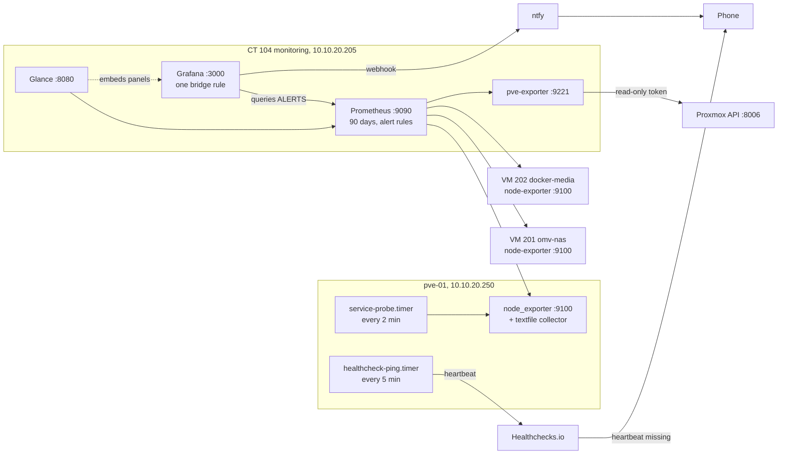

# Monitoring and alerting: Prometheus, Grafana, Glance and a dead-man switch

Metrics, dashboards and phone alerts for the whole lab. Prometheus, Grafana, Glance and pve-exporter run in one unprivileged LXC, fed by node_exporter on the host and VMs. Alerts are defined once in Prometheus and pushed to a phone through one Grafana bridge rule and ntfy. An external Healthchecks.io dead-man switch covers what nothing inside the house can report: the whole site being gone.

## What it does

- Collects host, VM and Proxmox guest metrics and keeps 90 days of history.
- Gives one landing page (Glance) with service status, temperatures, UPS state, firing alerts and embedded Grafana graphs.
- Probes eight core services from the host.
- Pushes a phone notification when the UPS goes on battery, a service dies, a disk fills or memory stays under pressure.
- Alerts from outside the lab if the host, internet or power is gone.
- Keeps reporting when internal DNS is down.

## Design decisions

| Decision | Why | Rejected alternative |
|---|---|---|
| One LXC, Docker Compose, everything provisioned from files | One place to back up, rebuild or tear down | One container or VM per tool |
| Read-only Proxmox token for pve-exporter | Sees everything, changes nothing, revocable alone | Root or a full-privilege user |
| Thresholds only in Prometheus, one Grafana bridge rule over `ALERTS` | Grafana only notifies on its own rules. One rule delivers every Prometheus alert, including future ones | Copying thresholds into Grafana (they drift), or Alertmanager (one more service) |
| ntfy through a webhook | Phone push with no account to manage | Alerts visible only on the dashboard |
| Service probe writes to the node_exporter textfile collector | No new exporter or listening port. Same pattern as the UPS metrics | A dedicated probe exporter |
| TCP connect, not HTTP status | Healthy services answer 200, 302, 307 or 401. Expecting one code means constant false alarms | HTTP status checks |
| External dead-man switch | Nothing inside the lab can report the lab being gone | Trusting the stack to report its own death |
| Glance data tiles use raw `IP:port` | If DNS breaks, the dashboard must still be able to say so | Hostnames everywhere |

## Architecture



Glance is the landing page at `mon.example.com`.

### Alert rules: 16 rules in 4 groups

| Group | Rules | Notifies |
|---|---|---|
| `ups-power` | 3: `UPSOnBattery`, `UPSBatteryCritical`, `UPSBatteryUnhealthy` | Yes |
| `ups-link` | 7: health of the UPS monitoring path itself | Yes |
| `availability` | 4: `HostOutOfDiskSpace`, `HostHighMemory`, `TargetDown`, `TargetMissing` | Yes, except `TargetDown` and `TargetMissing` |
| `services` | 2: `ServiceDown`, `ServiceProbeStale` | Yes |

`TargetDown` and `TargetMissing` still show on Glance but stay off the phone on purpose: in a power cut they fire for every host at once, after the UPS alerts already said it better. UPS rules are in [UPS auto-shutdown](../ups-nut-shutdown/).

## Prerequisites

- A Proxmox VE host. See [Proxmox base host](../proxmox-base-host/).
- An unprivileged Debian 13 LXC with nesting enabled for Docker (here 4 cores, 4 GB RAM, 16 GB disk).
- Optional: internal names behind a reverse proxy, see [DNS, reverse proxy and TLS](../dns-proxy-tls/).
- A Healthchecks.io check and an ntfy topic, both treated as secrets.

## Build it

### 1. Read-only Proxmox token

```bash
# On pve-01
pveum user add pve-exporter@pve --comment "prometheus pve-exporter"
pveum acl modify / --users pve-exporter@pve --roles PVEAuditor
pveum user token add pve-exporter@pve prometheus --privsep 0   # prints the secret once
```

With `--privsep 0` the token inherits the user's rights, so the ACL goes on the user.

```yaml
# /opt/monitoring/prometheus/pve.yml, inside CT 104
default:
  user: pve-exporter@pve
  token_name: prometheus
  token_value: <your-pve-token-secret>
  verify_ssl: false
```

### 2. Exporters

```bash
# On pve-01: node_exporter from the distribution, systemd-managed on :9100
apt install -y prometheus-node-exporter
```

```bash
# /etc/default/prometheus-node-exporter, on pve-01
ARGS="--collector.textfile.directory=/var/lib/prometheus/node-exporter"
```

On Docker VMs, use the host's namespaces so it measures the VM:

```bash
# On VM 201 and VM 202
docker run -d --name node-exporter --restart unless-stopped \
  --net host --pid host \
  -v /proc:/host/proc:ro -v /sys:/host/sys:ro -v /:/rootfs:ro \
  quay.io/prometheus/node-exporter:latest \
  --path.procfs=/host/proc --path.sysfs=/host/sys --path.rootfs=/rootfs
```

Without root SSH, use `qm guest exec`; a detached `docker run -d` will not hang the agent.

### 3. The Compose stack

```yaml
# /opt/monitoring/docker-compose.yml, inside CT 104 (excerpt)
services:
  prometheus:
    image: prom/prometheus:latest            # pin this, see What's next
    command:
      - --config.file=/etc/prometheus/prometheus.yml
      - --storage.tsdb.retention.time=90d
      - --web.enable-lifecycle               # allows POST /-/reload
    volumes:
      - ./prometheus/prometheus.yml:/etc/prometheus/prometheus.yml:ro
      - ./prometheus/alerts.yml:/etc/prometheus/alerts.yml:ro
      - prometheus-data:/prometheus
    ports: ["9090:9090"]
  pve-exporter:
    image: prompve/prometheus-pve-exporter:latest
    volumes: ["./prometheus/pve.yml:/etc/prometheus/pve.yml:ro"]
  grafana:
    image: grafana/grafana:latest
    environment:
      GF_SECURITY_ADMIN_PASSWORD: ${GRAFANA_ADMIN_PASSWORD}   # from .env, never in this file
      GF_AUTH_ANONYMOUS_ENABLED: "true"
      GF_AUTH_ANONYMOUS_ORG_ROLE: Viewer
      GF_SECURITY_ALLOW_EMBEDDING: "true"
      GF_SECURITY_COOKIE_SAMESITE: none
    volumes:
      - ./grafana/datasources:/etc/grafana/provisioning/datasources:ro
      - ./grafana/dashboards:/etc/grafana/provisioning/dashboards:ro
      - ./grafana/provisioning/alerting:/etc/grafana/provisioning/alerting:ro
      - ./grafana/dashjson:/var/lib/grafana/dashboards:ro
    ports: ["3000:3000"]
  glance:
    image: glanceapp/glance:latest
    volumes: ["./glance:/app/config"]
    ports: ["8080:8080"]
volumes: {prometheus-data: {}}
```

Generate the admin password locally (`openssl rand -base64 24`) into `/opt/monitoring/.env`, mode 600.

Anonymous Viewer access lets Glance embed panels, but anyone reaching port 3000 can read every dashboard: keep private data off it.

### 4. Scrape targets with friendly names

```yaml
# /opt/monitoring/prometheus/prometheus.yml, inside CT 104 (excerpt)
rule_files:
  - /etc/prometheus/alerts.yml          # absolute path: a relative one resolves against /prometheus

scrape_configs:
  - job_name: node
    static_configs:
      - targets: ['10.10.20.250:9100']
        labels: {instance: 'pve-01'}
      - targets: ['10.10.20.210:9100']
        labels: {instance: 'omv-nas'}
      - targets: ['10.10.20.211:9100']
        labels: {instance: 'docker-media'}
  - job_name: pve
    metrics_path: /pve
    static_configs:
      - targets: ['10.10.20.250:8006']
    relabel_configs:                    # scrape pve-exporter, keep the PVE host as the target
      - {source_labels: [__address__], target_label: __param_target}
      - {source_labels: [__param_target], target_label: instance}
      - {target_label: __address__, replacement: 'pve-exporter:9221'}
```

### 5. Grafana, provisioned from files

Provision the datasource (`uid: prometheus`, `url: http://prometheus:9090`) in `grafana/datasources/datasource.yml` and a file dashboard provider for `/var/lib/grafana/dashboards` in `grafana/dashboards/dashboards.yml`, so a rebuild comes back identical.

Put dashboard JSON in `grafana/dashjson/`: community *Node Exporter Full* and *Proxmox via Prometheus*, plus a custom thick-line overview for embedding. Rewire community dashboards' `${DS_PROMETHEUS}` to the provisioned uid:

```bash
# Inside CT 104, in /opt/monitoring/grafana/dashjson/
sed -i 's/${DS_PROMETHEUS}/prometheus/g' node-exporter-full.json proxmox.json
```

Provisioning files must be `root:root 0640`. Grafana runs as uid 472 with gid 0 and reads them through the group bit.

### 6. The service probe

```bash
#!/bin/bash
# /usr/local/bin/service-probe.sh, on pve-01
OUT=/var/lib/prometheus/node-exporter/services.prom
SERVICES=(
  "proxy 10.10.20.208 443"
  "jellyfin 10.10.20.211 8096"
  "immich 10.10.20.210 2283"
  "nas-web 10.10.20.210 80"
  "pelican 10.10.20.212 80"
  "grafana 10.10.20.205 3000"
  "prometheus 10.10.20.205 9090"
)

tcp_up() { timeout 3 bash -c "exec 3<>/dev/tcp/$1/$2" 2>/dev/null; }
dns_up() { dig +short +time=3 +tries=1 @"$1" example.com >/dev/null 2>&1; }

check() {   # three attempts, three seconds apart, before calling it down
  for i in 1 2 3; do "$@" && return 0; sleep 3; done
  return 1
}

TMP=$(mktemp)
{
  echo "# TYPE homelab_service_up gauge"
  check dns_up 10.10.20.204 && v=1 || v=0      # a real query: an open port is not a working resolver
  echo "homelab_service_up{service=\"adguard\"} $v"
  for s in "${SERVICES[@]}"; do
    set -- $s
    check tcp_up "$2" "$3" && v=1 || v=0
    echo "homelab_service_up{service=\"$1\"} $v"
  done
} > "$TMP"
chmod 0644 "$TMP"     # node_exporter runs as 'prometheus' and cannot read mktemp's 0600
mv "$TMP" "$OUT"      # atomic: the scraper never sees a half-written file
```

Run it from a oneshot `service-probe.service` and a `service-probe.timer` with `OnCalendar=*:0/2`, then `systemctl enable --now service-probe.timer`.

### 7. Alert rules

```yaml
# /opt/monitoring/prometheus/alerts.yml, inside CT 104 (the services group)
groups:
  - name: services
    rules:
      - alert: ServiceDown
        expr: homelab_service_up == 0
        for: 10m                       # five more failed cycles on top of the retries
        labels: {severity: critical}
        annotations:
          summary: "{{ $labels.service }} is not answering"
      - alert: ServiceProbeStale
        expr: time() - node_textfile_mtime_seconds{file=~".*services.prom"} > 600   # example window
        labels: {severity: warning}
        annotations:
          summary: "the service probe has stopped writing"
```

`ServiceProbeStale` exists because a dead probe leaves its last "all up" file behind.

Content edits need only a reload; a changed mount needs `docker compose up -d prometheus`.

```bash
# Inside CT 104
docker exec prometheus promtool check config /etc/prometheus/prometheus.yml
curl -s -XPOST http://localhost:9090/-/reload
```

### 8. Delivery: one bridge rule, one contact point

```yaml
# /opt/monitoring/grafana/provisioning/alerting/rules.yaml, inside CT 104
apiVersion: 1
groups:
  - orgId: 1
    name: prometheus-bridge
    folder: Homelab
    interval: 1m
    rules:
      - uid: prometheus-bridge
        title: PrometheusAlert
        condition: B
        noDataState: OK              # "nothing firing" returns no data: the good case
        data:
          - refId: A
            datasourceUid: prometheus
            model:
              refId: A
              instant: true
              # alertname is reserved by Grafana, hence label_replace. Not interpolated: $1 as-is.
              expr: label_replace(ALERTS{alertstate="firing", alertname!~"TargetDown|TargetMissing"}, "prom_alert", "$1", "alertname", "(.*)")
          - refId: B
            datasourceUid: __expr__
            model:
              refId: B
              type: threshold
              expression: A
              conditions: [{evaluator: {type: gt, params: [0]}}]
```

```yaml
# /opt/monitoring/grafana/provisioning/alerting/contactpoints.yaml, inside CT 104
# This file IS env-interpolated: every template variable needs $$, or it is silently blanked.
apiVersion: 1
contactPoints:
  - orgId: 1
    name: ntfy
    receivers:
      - uid: ntfy
        type: webhook
        settings:
          url: https://ntfy.sh/<your-ntfy-topic>
          httpMethod: POST
          message: |
            {{ range $$a := .Alerts }}{{ $$a.Labels.prom_alert }}: {{ or $$a.Labels.service $$a.Labels.ups $$a.Labels.instance }} ({{ $$a.Status }})
            {{ end }}
```

```yaml
# /opt/monitoring/grafana/provisioning/alerting/policies.yaml, inside CT 104
apiVersion: 1
policies:
  - orgId: 1
    receiver: ntfy
    group_wait: 30s
    group_interval: 5m
    repeat_interval: 6h
```

Messages name the `service` label before `ups` and `instance`, because eight services share one host. One message on failure, a reminder every six hours, one on recovery. The ntfy topic is a password: anyone holding it can read and fake your alerts.

### 9. Dead-man switch

```bash
#!/bin/sh
# /root/healthcheck-ping.sh, on pve-01. Independent of Docker and CT 104.
URL_FILE=/root/.healthchecks-url        # contains <your-healthchecks-url>, mode 600
if [ ! -r "$URL_FILE" ]; then
  logger -t healthcheck-ping "no URL file, not pinging"; exit 0
fi
curl -fsS -m 10 -o /dev/null "$(cat "$URL_FILE")"
```

Run it from `healthcheck-ping.timer` every five minutes (`OnCalendar=*:0/5`) and match the check's period. The URL is a credential: it can send fake heartbeats.

### 10. Glance

Links use `https://<name>.example.com` for trusted certificates; data tiles use raw addresses. An Alerts tile (`custom-api` over `http://prometheus:9090/api/v1/alerts`) shows firing alerts, red when critical, or one "All clear" line. A bookmarks widget holds direct-IP links:

```yaml
# /opt/monitoring/glance/glance.yml, inside CT 104 (excerpt)
- type: bookmarks
  title: DNS Fallback - Direct IP
  groups:
    - title: Core
      links:
        - {title: Glance, url: "http://10.10.20.205:8080"}
        - {title: Grafana, url: "http://10.10.20.205:3000"}
        - {title: Prometheus, url: "http://10.10.20.205:9090"}
        - {title: Proxmox, url: "https://10.10.20.250:8006"}
```

Glance fetches tiles once per load. A hidden iframe in an HTML widget reloads the visible tab every 30 seconds:

```html
<iframe style="position:absolute;left:-9999px;width:0;height:0"
  srcdoc="<script>setInterval(function(){if(!parent.document.hidden){parent.location.reload();}},30000);</script>"></iframe>
```

During a DNS outage, a client hosts-file block restores every name with valid TLS, since all but one point at the proxy:

```
# /etc/hosts on a client (C:\Windows\System32\drivers\etc\hosts on Windows)
10.10.20.208  mon.example.com grafana.example.com prom.example.com jellyfin.example.com
10.10.20.211  media.example.com
```

List every internal name on the first line. Temperature tiles read the host's Glances API on port 61208; see the `webui_allowed_hosts` gotcha below.

## Verify

```bash
# On pve-01
pct exec 104 -- docker ps --format '{{.Names}}: {{.Status}}'                       # four containers up
curl -s 'http://10.10.20.205:9090/api/v1/targets?state=active' | grep -o '"health":"up"' | wc -l   # 5
curl -s http://10.10.20.205:9090/api/v1/rules  | grep -o '"health":"[a-z]*"' | sort | uniq -c   # 16 ok
curl -s http://10.10.20.205:9090/api/v1/alerts                                     # what is firing now
cat /var/lib/prometheus/node-exporter/services.prom                                # fresh, all 1
systemctl list-timers service-probe.timer healthcheck-ping.timer
curl -s http://10.10.20.205:8080/api/pages/<page>/content/ | grep -ci 'template error'      # 0
curl -s "https://ntfy.sh/<your-ntfy-topic>/json?poll=1&since=30m"                   # what reached the phone
```

Check Glance tiles at `/api/pages/<page>/content/` (trailing slash required); `/` is only an empty shell.

**Prove delivery with an induced failure.** Add a fake `SERVICES` entry on a closed local port, wait for `ServiceDown`, confirm the notification names it, then remove it. Never stop a real service to test. A clean load proves nothing: Grafana renders templates only when it sends.

## Gotchas

| Symptom | Cause | Fix |
|---|---|---|
| Config edited, `promtool` and `/-/reload` succeed, nothing changes | A single-file bind mount pins an inode; `sed -i`, `cp` and `mv` replace it | `cat new.yml > file`, or mount the directory |
| A new Glance tile never appears | Glance watches `glance.yml` by inode | `docker restart glance`. Its log shows `Config file changed` on a real reload |
| Grafana crash-loops after a provisioning edit | Files owned `root:472`. Grafana is uid 472 with gid 0 | `chown root:root`, mode `0640` |
| Alert fires, Grafana logs `Notify for alerts failed` | Contact-point files are env-interpolated, so `$a` became empty | Write `$$a` |
| Glance shows `no such host`, the host resolves fine | Containers keep the resolvers they started with | `docker compose restart` |
| Healthy numbers that never move | The writer stopped; stale looks steady | Publish liveness separately |
| Textfile metrics vanish, `node_textfile_scrape_error` is 1 | `.prom` file left at mktemp's 0600 | `chmod 0644` before the atomic `mv` |
| Every temperature tile returns HTTP 400 | Glances `webui_allowed_hosts` lacks the host's current address | Add it, `systemctl restart glances` |

**Habit:** an alert people learn to swipe away is worse than none.

## Rollback

```bash
# On pve-01: stop probe and heartbeat (pause the Healthchecks.io check first)
systemctl disable --now service-probe.timer healthcheck-ping.timer

# Remove Grafana alert delivery only
pct exec 104 -- sh -c 'rm -rf /opt/monitoring/grafana/provisioning/alerting && docker restart grafana'

# Full teardown
pct exec 104 -- sh -c 'cd /opt/monitoring && docker compose down -v'
pct stop 104 && pct destroy 104
systemctl disable --now prometheus-node-exporter
pveum user token remove pve-exporter@pve prometheus
pveum user delete pve-exporter@pve
```

The stack is self-contained and safe to remove at any time.

## What's next

- **Pin image versions** by tag or `sha256:<digest>`, so one `docker compose pull` cannot move all four images at once. Prometheus and Grafana config formats change across major versions.
- Move every remaining credential, including the service API keys in Glance tiles, into a Compose `.env` or Docker secrets.
- Alerts for certificate expiry, backup success and WireGuard handshakes (see [Tiered WireGuard VPN](../wireguard-tiered-vpn/)), kept few enough that nobody mutes them.
- Add email as a second channel for networks where ntfy is unreachable.

## Rebuild with AI

Copy everything in the block below into an AI assistant.

```text
You are helping me build homelab monitoring and alerting. Before writing any
config, ask me for these values and wait for my answers:

1. My hypervisor, and where the stack runs (suggest an unprivileged LXC with
   nesting, running Docker Compose).
2. My LAN subnet and the IPs of the monitoring container, the hypervisor and
   each VM to monitor (and which run Docker), plus a friendly name for each.
3. The services to probe (name, IP, port), and which one is my DNS server.
4. My internal domain and reverse-proxy IP, if any.
5. Retention, probe interval and heartbeat interval.

Then build it with these rules:

- Prometheus, Grafana, Glance and pve-exporter in one Compose stack, images
  pinned; node_exporter on each measured machine. Friendly instance labels,
  absolute rule_files path.
- pve-exporter uses a read-only PVEAuditor token; with --privsep 0 the ACL goes
  on the user.
- Grafana is provisioned from files owned root:root 0640; anonymous = Viewer.
- Thresholds live only in Prometheus. Deliver them through ONE Grafana rule over
  ALERTS{alertstate="firing"}, label_replace into a new label (alertname is
  reserved), noDataState OK, webhook contact point to ntfy, repeat interval in
  hours. No Alertmanager. In contact-point files write template variables as
  $$var (env interpolation); rules.yaml is not interpolated. Name the service,
  not the host, in messages.
- A host-side probe writes a gauge into node_exporter's textfile collector:
  TCP connect not HTTP status, 3 retries, a real DNS query for the resolver,
  mktemp then chmod 0644 then atomic mv, for: of several cycles, plus a
  staleness alert on the file's mtime.
- A dead-man switch pings Healthchecks.io from the host with no dependency on
  the stack, exiting 0 with a log line if its URL file is missing.
- Secrets (ntfy topic, healthcheck URL, tokens, passwords) live in mode-600
  files or .env. Never invent them; give me commands to generate them locally.
- Glance data tiles use raw IP:port so the page works when DNS is down; add a
  direct-IP bookmarks widget.
- Never edit single-file bind mounts with sed -i, cp or mv; use cat > file.

Give me verification steps and an end-to-end test that adds a FAKE probe entry on a closed port and
confirms the phone notification names it. Never stop a real service to test.
Finish with a rollback section.
```
