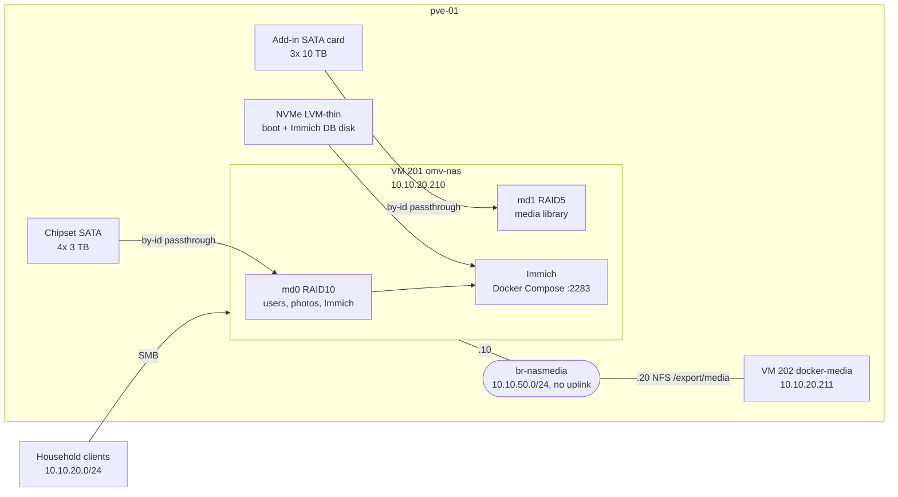

# NAS and storage: OpenMediaVault VM, RAID10 + RAID5, Immich

VM 201 runs OpenMediaVault on Debian 13 with physical disks passed through one by one, and it holds two mdadm arrays: a 4x 3 TB RAID10 for personal data and photos, and a 3x 10 TB RAID5 for the media library. It serves SMB to the household, NFS to the media VM over a private bridge, and runs Immich in Docker with its database on flash.

## What it does

- Gives every household member a private SMB share with `Photos` and `Documents` folders, plus a shared area.
- Exports the media library over NFS to the media VM on a host-internal bridge, so bulk reads never touch the LAN.
- Hosts Immich for photo management. Each user's NAS `Photos` folder also appears in Immich as a read-only external library.
- Pushes RAID events to the phone without reboot false alarms, and scrubs both arrays monthly.
- Moved a multi-terabyte media library between arrays with zero client-side config changes.

## Design decisions

| Decision | Why | Rejected alternative |
|---|---|---|
| Disks passed through individually by `/dev/disk/by-id/`, `backup=0` | Stable paths survive reboots. The host keeps the raw disks, so SMART stays on the hypervisor. vzdump skips the array | Passing the whole controller: SMART moves into the guest. Attaching by `sdX`: letters reshuffle |
| mdadm in the guest, assembled by UUID | Member order does not matter, so reshuffled letters are harmless | Assembling by device name |
| Arrays on different SATA controllers | One controller fault cannot take both arrays at once | All disks on the chipset ports |
| Media array on the NAS, not the media VM | `media` is also an SMB share for the family, and the media VM (GPU passthrough, VPN killswitch, frequent restarts) is too volatile to own storage | Attaching the array to the media VM |
| NFS over private bridge `br-nasmedia` | No NIC, no LAN traffic. It sustained about 115 MB/s mid-resync; a 4K stream needs roughly 100 Mbit/s | NFS over the LAN bridge |
| Exports are bind mounts with explicit `fsid=` | The backing array can change while path, mountpoint and fsid stay identical | Exporting the array mount directly |
| Immich in the NAS VM, database on an NVMe-backed disk | Postgres stopped competing with photo writes: fsync latency fell from about 28 ms to about 11 ms | Database on the spinning array |
| Pinned image tags, database image by digest | A floating tag can jump a major version that cannot start against the old database | `:release` |
| Root SSH refused, read-only account for automation | No network path to root on the storage VM | Root login with a key |

## Architecture



### Arrays

| Array | Level | Disks | Usable | Holds |
|---|---|---|---|---|
| `md0` | RAID10 `near=2`, 512K chunk | 4x 3 TB, chipset controller | 5.5 TB | Per-user folders, shared folder, docs vault, Immich uploads, music |
| `md1` | RAID5, 512K chunk | 3x 10 TB, add-in controller | 18.19 TiB | The media library (`movies/`, `tv/`, `downloads/`) |

VM 201 disks: `scsi0` boot (32 GB thin), `scsi1`–`scsi4` the `md0` members, `scsi5` the 40 GB NVMe-backed Immich database disk, `scsi6`–`scsi8` the `md1` members.

NFS exports only `media` (to the LAN and the storage bridge), `Admin` and `docs`. Per-user folders and `immich/` are reachable over SMB or a shell, never NFS.

## Prerequisites

- A Proxmox VE host with spare SATA ports. A second controller (an add-in SATA card works) if you want the arrays isolated from each other. See [Proxmox base host](../proxmox-base-host/).
- A Debian 13 VM with OpenMediaVault installed, q35 machine type, `hotplug` including `disk` so disks can be added without a reboot.
- Docker and Docker Compose inside the VM for Immich.
- A reverse proxy and internal DNS names (`nas.example.com`, `immich.example.com`). See [DNS, reverse proxy and TLS](../dns-proxy-tls/).
- A notification endpoint (this lab uses ntfy) for RAID alerts. See [Monitoring and alerting](../monitoring-alerting/).

## Build it

### 1. Pass the disks through by ID

```bash
# On pve-01
ls -l /dev/disk/by-id/ | grep -v part
qm set 201 -scsi1 /dev/disk/by-id/ata-WDC_WD30EFRX_DISK-A1,backup=0
# ...scsi2-scsi4 for DISK-A2..A4
# The 10 TB disks sit on the add-in controller
qm set 201 -scsi6 /dev/disk/by-id/ata-<model>_DISK-C1,backup=0
# ...scsi7-scsi8 for DISK-C2..C3
# A thin volume on NVMe for the Immich database
qm set 201 -scsi5 local-lvm:40,discard=on
```

The guest sees `drive-scsiN`, not real serials. Map with `lsblk -dno NAME,SERIAL` before any command that names a device; never trust a written-down letter.

### 2. Build the private storage bridge

```
# /etc/network/interfaces, on pve-01 (appended)
auto br-nasmedia
iface br-nasmedia inet manual
    bridge-ports none
    bridge-stp off
    bridge-fd 0
```

```bash
# On pve-01
ifreload -a
qm set 201 -net1 virtio,bridge=br-nasmedia
qm set 202 -net1 virtio,bridge=br-nasmedia
```

Give the NAS `10.10.50.10/24` in the OMV network UI and the media VM `10.10.50.20/24`, no gateway.

### 3. Create the arrays and filesystems

OMV can create arrays in its UI. The equivalent commands, run as root on VM 201:

```bash
# Devices are the ones lsblk mapped to drive-scsi6..8
mdadm --create /dev/md1 --level=5 --raid-devices=3 --chunk=512 /dev/sdX /dev/sdY /dev/sdZ

# No reserved blocks; the default inode ratio would create ~1.1 billion inodes on 18 TB
mkfs.ext4 -m 0 -T largefile -L mediapool /dev/md1

# OMV mounts with usrquota,grpquota. Slow during the initial resync, not hung
tune2fs -O quota /dev/md1
```

Above 16 TB, ext4 has no `resize_inode`, so growth must be an offline `resize2fs`. Mount the filesystem in the OMV UI, which places it at `/srv/dev-disk-by-uuid-<md1-fs-uuid>`. Never add it to `/etc/fstab` yourself.

### 4. Shared folders, SMB and NFS

In the OMV UI, create shared folders (per-user, `Shared`, `docs`, `immich` on `md0`; `media` on `md1`), SMB shares for the per-user folders, `docs` and `media`, and NFS exports with explicit `fsid=`. OMV writes:

```
# /etc/exports, on VM 201. Generated by OMV: read it, never edit it
/export        10.10.20.0/24(ro,fsid=0,...)
/export/media  10.10.20.0/24(rw,no_root_squash,fsid=<n>,...) 10.10.50.0/24(rw,no_root_squash,fsid=<n>,...)
/export/Admin  10.10.20.0/24(rw,no_root_squash,fsid=<n>,...)
/export/docs   10.10.20.0/24(rw,no_root_squash,fsid=<n>,...)
```

On the media VM, mount the export through the private bridge:

```
# /etc/fstab, on VM 202
10.10.50.10:/export/media  /mnt/nas/media  nfs  defaults,_netdev  0 0
```

Check that `/mnt/nas/media` is empty on the client's root disk first, or files there end up hidden under the mount. The application side is covered in [VPN media stack](../vpn-media-stack/).

### 5. Move the media library between arrays

The library started on `md0` and later moved to `md1`. `downloads/`, `movies/` and `tv/` share inodes through hardlinks, which only work within one filesystem, so the whole tree moves together:

```bash
# On VM 201, as root. -H keeps hardlinks; without it the tree roughly doubles.
# --no-inc-recursive makes hardlink detection span the whole tree.
rsync -aHAX --numeric-ids --no-inc-recursive \
  /srv/dev-disk-by-uuid-<md0-fs-uuid>/media/ \
  /srv/dev-disk-by-uuid-<md1-fs-uuid>/media/
```

A dry run showed about 6.4 TB apparent against 3.4 TB unique. Run it again for the delta, then re-point the `media` shared folder to `md1` in OMV. The export path, mountpoint and fsid stay identical, so Sonarr, Radarr, Jellyfin and qBittorrent needed no edits or rescan.

Finish with `exportfs -ra`: an OMV deploy rewrites `/etc/exports` but does not re-add exports removed by hand. Keep the old copy until both sides match: same paths, sizes and hardlink counts.

### 6. RAID alerts and scrubs

mdadm calls a script on every event:

```
# /etc/mdadm/mdadm.conf, on VM 201 (added line)
PROGRAM /usr/local/sbin/mdadm-notify.sh
```

```bash
#!/bin/sh
# /usr/local/sbin/mdadm-notify.sh, on VM 201. mdadm passes: event, device, [component]
EVENT="$1"; DEV="$2"
TOPIC="$(cat /etc/mdadm-ntfy-topic)"
PRIO=default

case "$EVENT" in
  DeviceDisappeared)
    # mdmonitor fires this for /dev/md/<name> on healthy arrays at every start.
    # If the array is still listed in /proc/mdstat, it is a false alarm.
    grep -q "^$(basename "$(readlink -f "$DEV")") : active" /proc/mdstat && exit 0
    PRIO=urgent ;;
  Fail|SparesMissing) PRIO=urgent ;;
  DegradedArray)
    # Expected while a resync or recovery is running
    grep -Eq 'resync|recovery' /proc/mdstat && PRIO=low || PRIO=urgent ;;
esac

curl -s -H "Priority: $PRIO" -d "$EVENT on $DEV $3" "<your-ntfy-url>/$TOPIC" >/dev/null
```

Leave the resync floor at the kernel default:

```
# /etc/sysctl.d/60-mdraid-resync.conf, on VM 201
dev.raid.speed_limit_min = 1000
dev.raid.speed_limit_max = 200000
```

Debian 13 schedules RAID checks with systemd timers, not `/etc/cron.d/mdadm`. They cover new arrays automatically:

```bash
systemctl list-timers 'mdcheck*'     # mdcheck_start (first Sunday monthly) and mdcheck_continue
```

### 7. Immich with the database on flash

Mount the 40 GB disk at `/mnt/ssd_immich` by UUID with `nofail`, through OMV.

```
# /opt/immich/.env, on VM 201
UPLOAD_LOCATION=/srv/dev-disk-by-uuid-<md0-fs-uuid>/immich/upload
DB_DATA_LOCATION=/mnt/ssd_immich/postgres
DB_PASSWORD=<your-db-password>
```

Generate the password locally with `openssl rand -base64 24`. Pin every image:

```yaml
# /opt/immich/docker-compose.yml, on VM 201 (image lines)
  immich-server:
    image: ghcr.io/immich-app/immich-server:v3.0.2
  immich-machine-learning:
    image: ghcr.io/immich-app/immich-machine-learning:v3.0.2
  database:
    image: ghcr.io/immich-app/postgres:14-vectorchord0.4.3-pgvectors0.2.0@sha256:<digest>
```

Machine learning runs on CPU; the GPU belongs to the media VM. Postgres tuning lives in `postgresql.auto.conf` inside the data directory (via `ALTER SYSTEM`), so it survives image swaps: `shared_buffers=2GB`, `effective_cache_size=6GB`, `work_mem=32MB`, `maintenance_work_mem=512MB`, `random_page_cost=1.1`, `effective_io_concurrency=200`, `wal_compression=on`, `max_wal_size=4GB`.

Back up only `library/`, `profile/` and `backups/`; thumbnails and video transcodes regenerate. See [Backup strategy](../backup-strategy/).

### 8. Add a user: three layers

Miss one layer and the failure is silent.

1. **OMV account** in group `users` only. Folders are `users`-owned with setgid (`drwxrwsr-x`), so new files inherit the group.
2. **Shared folder and ACL.** `example_user/` on `md0`, plus `Photos/` and `Documents/` created as shared folders in OMV. Names are plural. ACL: user and group `users` read/write, others none, Recursive ticked.
3. **SMB share**, not public. The SMB password is separate from the web login: set it in the web UI, which resyncs Samba. `passwd` does not reach Samba.

Then, for Immich, bind-mount only the `Photos` folder, read-only:

```yaml
# /opt/immich/docker-compose.yml, on VM 201, under immich-server
    volumes:
      - /srv/dev-disk-by-uuid-<md0-fs-uuid>/example_user/Photos:/mnt/external/example_user:ro
```

```bash
cd /opt/immich && docker compose up -d        # recreates only the changed container
docker exec immich_server ls /mnt/external/example_user
```

Create the Immich user, then an External Library owned by `example_user` with import path `/mnt/external/example_user`, and Scan.

### 9. Shell access without root

`sshd_config` on the NAS sets `PermitRootLogin no` and `AllowGroups root _ssh`. Automation uses an unprivileged account:

1. Create `svc-readonly` in OMV, group `users`, and add it to `_ssh`.
2. Add the host's public key to that user in OMV, which stores it in `/var/lib/openmediavault/ssh/authorized_keys/svc-readonly`.

It can read the arrays and `/proc/mdstat`, but not mode-0600 files or the Docker socket.

## Verify

```bash
# From pve-01
S="ssh -q svc-readonly@10.10.20.210"
$S 'cat /proc/mdstat'          # md0 [4/4] [UUUU], md1 [3/3] [UUU]
$S 'df -hT | grep -v tmpfs'    # /, /mnt/ssd_immich, both arrays
showmount -e 10.10.20.210      # /export, /export/docs, /export/Admin, /export/media
smbclient -L //10.10.20.210 -N # anonymous share list = SMB service healthy
curl -s http://10.10.20.210:2283/api/server/version   # {"major":3,"minor":0,"patch":2,...}
for d in <md1 member devices on the host>; do smartctl -H -A "$d"; done

# On VM 201, as root
exportfs -v                    # must list the exports, not just /etc/exports
sysctl dev.raid.speed_limit_min   # 1000
```

On VM 202, `findmnt /mnt/nas/media` must show the `10.10.50.10` source. Benchmark NFS with a file nothing has read recently: client cache drops do not clear the NAS cache, and `dd iflag=direct` returns 0 bytes over NFS.

## Gotchas

| Symptom | Cause | Fix |
|---|---|---|
| OMV dashboard is empty but the menu is complete | Widget choices live in browser `localStorage`, per origin. A new address is a new, empty dashboard | Always use `https://nas.example.com`, a stable origin |
| OMV menu shows only Dashboard | Logged in as `Admin`, an ordinary user, not `admin`, the administrator | Log in as lowercase `admin`. Usernames are case-sensitive |
| A config edit vanished | OMV regenerates `passwd`, `fstab`, `exports`, `sshd_config` | Use the UI, or `omv-confdbadm` plus `omv-salt deploy run` |
| Root SSH says `Permission denied` though the key is accepted | Root login is refused by design | Use `svc-readonly`. Do not re-copy keys |
| `NT_STATUS_LOGON_FAILURE` | Samba password never set or stale | Reset it in the web UI, not with `passwd` |
| Immich external library is empty | Folder named `Photo`, or the bind mount was never added | Rename in OMV, add the mount, `docker compose up -d` |
| Immich crash-loops after a pull | A floating tag jumped a major version | Pin tags, pin the DB image by digest |
| `umount` says busy, `fuser` shows only the kernel | `exportfs -u "*:/export/media"` matches nothing | Unexport with each exact client spec |
| Urgent `DeviceDisappeared` alert on every boot | mdmonitor fires it for `/dev/md/<name>` on healthy arrays | Check `/proc/mdstat` in the hook first |
| Playback stalls with no error during a resync | `speed_limit_min` raised, so the rebuild starves reads | Keep it at 1000. A rebuilding RAID5 still serves media |
| Deleting `movies/` frees almost nothing | The files are hardlinked into `downloads/` | Treat the tree as one blob. See [hardlinks](../vpn-media-stack/) |

Habits for reading disk health, on the host:

- **SMART `PASSED` only trips on threshold breaches.** Read `Current_Pending_Sector`, `Reallocated_Sector_Ct`, `Offline_Uncorrectable` and `UDMA_CRC_Error_Count` individually.
- **Pending is not bad.** A pending sector failed a read and awaits a write. Judge by `Reallocated_Sector_Ct` after a rewrite. Pending falling while reallocated rises means sectors were retired, not recovered.
- **CRC errors are the link, not the platter.** If one disk has them and its neighbours do not, replace the cable first.

## Rollback

- **Media move:** while the old copy exists, re-point `media` back to `md0` in OMV and run `exportfs -ra`.
- **Immich upgrade:** before a major version, take a `pg_dumpall` and a cold copy of `/mnt/ssd_immich/postgres`. To roll back, stop the stack, restore the cold copy and revert the pinned tags. Never run `docker compose down -v`: it deletes the database volumes.
- **Detach the NAS disks:** `qm set 201 --delete scsi6` and so on. The data stays on the disks, and mdadm reassembles by UUID on any Linux machine.

## What's next

- When the planned VLANs go live, keep the NAS in Servers and `br-nasmedia` private, and filter SMB from the IoT and Guest networks on the router.
- Record the `svc-readonly` SSH setup in OMV's database, so a deploy can never undo it.
- Grow `md1` with a fourth disk, using an offline `resize2fs`.

## Rebuild with AI

Copy everything in the block below into an AI assistant.

```text
You are helping me build a NAS VM with software RAID, SMB and NFS shares, and
Immich, on a hypervisor. Before writing any config, ask me for these values and
wait for my answers:

1. Hypervisor, NAS VM ID, name, LAN IP and LAN subnet.
2. Per array: disks (by-id names), controller, RAID level.
3. The VM that needs NFS, and a private subnet for the storage bridge.
4. Usernames, my DNS names for the NAS and Immich, my alert endpoint, and
   the Immich version to pin.

Then build it with these rules:

- Pass disks individually by /dev/disk/by-id with backup=0, never sdX, so
  SMART stays on the hypervisor. Different arrays on different controllers.
- ext4 for large media: -m 0 -T largefile; note >16 TB means offline resize.
- Never hand-edit files OpenMediaVault owns (passwd, fstab, exports,
  sshd_config). Use its UI or config tools.
- NFS to the second VM goes over a bridge with no physical port. Export bind
  mounts with explicit fsid= so the backing array can change invisibly.
- When moving data with hardlinks, use rsync -aHAX --numeric-ids
  --no-inc-recursive and move the whole tree together. Finish NFS changes
  with exportfs -ra.
- mdadm PROGRAM hook: urgent on Fail, DeviceDisappeared, SparesMissing; low
  on DegradedArray during a resync; suppress DeviceDisappeared when
  /proc/mdstat shows the array active. Never raise speed_limit_min.
- Run Immich in Docker with photos on the array and Postgres on a separate
  flash-backed disk. Pin every image tag, the database image by digest. Never
  use docker compose down -v.
- Each user is three layers: account in group users, shared folder with
  plural Photos/Documents and a recursive ACL, SMB share (password set
  separately). For Immich, bind-mount only Photos, read-only.
- Refuse root SSH; automation uses an unprivileged read-only account.
- Never invent passwords, keys or tokens. Give me commands to generate them
  locally (for example openssl rand -base64 24).
- Give verification steps (/proc/mdstat, showmount -e, exportfs -v,
  smbclient -L -N, the Immich version API, SMART on the host) and a rollback
  section (data move, Immich upgrade, detaching disks).
```
