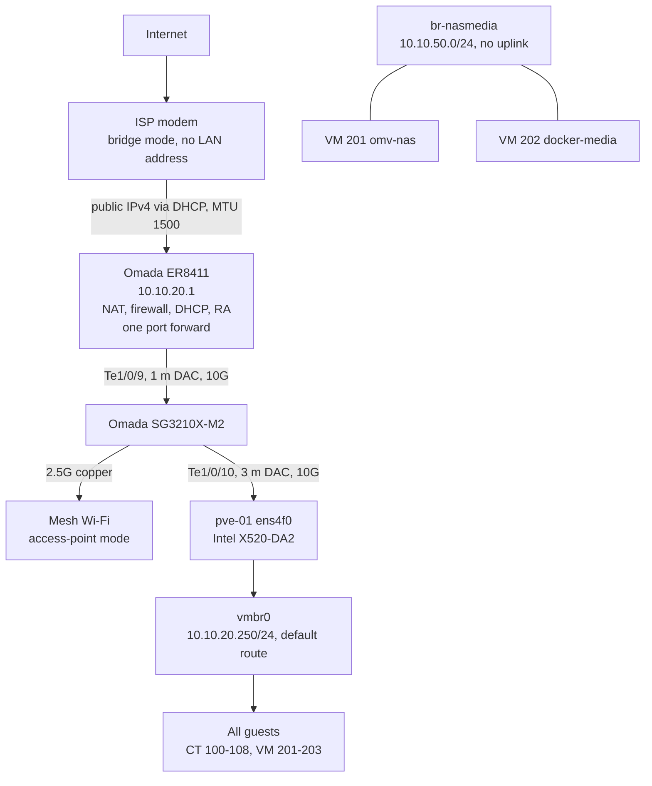

# Network edge: bridged modem, Omada router, 10G uplink

The ISP modem runs in bridge mode, so the Omada ER8411 router is the only NAT, firewall and DHCP server on the network. The router connects to an Omada SG3210X-M2 switch, and the switch connects to the Proxmox host over a 10G DAC. In the same change, the LAN was renumbered into a written addressing plan. Because this was a live change in a shared house, the cutover followed a written list of ordered steps. Each step had its own rollback, and an out-of-band path stayed up the whole time.

## What it does

- **One NAT, owned locally.** The modem only bridges, so there is no double NAT. The router holds the public address itself, so inbound port forwards behave predictably.
- **DHCP and IPv6 Router Advertisements come from the router, not the ISP box.** This is what made network-wide DNS filtering possible. The ISP router used to push its own resolvers over DHCPv4 and over IPv6 RA (RDNSS), and neither could be changed. Any IPv6-capable client used the ISP's DNS and skipped the filter.
- **Every address follows a plan.** Each address belongs to a purpose range, so a new host's address can be looked up, not guessed.
- **The LAN uses an uncommon private range.** It sits away from the common 192.168.x home ranges, so split-tunnel VPN routing still works on hotel and café networks.

## Design decisions

| Decision | Why | Rejected alternative |
|---|---|---|
| Put the ISP modem in bridge mode | Removes double NAT. Puts DHCP options and IPv6 RAs under local control, which network-wide DNS filtering needs | Router behind the modem's NAT: two NAT layers, the ISP's DNS still advertised over IPv6, and the router's WAN range colliding with the LAN |
| Omada ER8411 as the edge, run standalone | 10G ports, IP groups and ACLs, no controller to run | Keep the ISP router: no control over RAs, DNS or forwards |
| Omada SG3210X-M2 switch and 10G DACs | SFP+ to the router and to the host's Intel X520-DA2, 2.5G copper for the access points | The host's 1G onboard ports |
| Renumber the LAN to `10.10.20.0/24`, with a written plan | If a remote network uses the same subnet as home, a split tunnel cannot tell them apart, and that fails while travelling, when it is hardest to fix. The renumber is the expensive moment, so the plan is fixed then | Keep the ISP's default range and allocate ad hoc |
| Plan the VLANs on paper and build flat first | Moving to VLANs later adds networks and leaves the server addresses alone. A second full renumber is avoided | VLANs on day one, which would double the work while the edge was still changing |
| Keep the VPN and DDNS off the router | The access tiers need precise server-side rules, and the router's DDNS client cannot send the requests the DNS provider's API needs | The router's built-in WireGuard server and DDNS client, both disabled |

## Architecture



The WAN is plain DHCP (IPoE) with a 1500-byte MTU, so no MSS clamping is needed. The address is public, not CGNAT, which is what lets the single inbound VPN forward work.

### Addressing plan

| Range | Purpose |
|---|---|
| `.1` | Gateway, the ER8411 |
| `.2`–`.49` | Network infrastructure: switch, access points, a future controller |
| `.50`–`.199` | DHCP pool |
| `.200`–`.209` | Infrastructure containers: Tailscale, DNS, WireGuard, monitoring, proxy, relay |
| `.210`–`.219` | Application VMs: NAS `.210`, media `.211`, game server `.212` |
| `.220`–`.249` | Reserved, deliberately empty |
| `.250`–`.254` | Hypervisor and management |

### VLAN plan (work in progress)

| VLAN | Range | Holds | Status |
|---|---|---|---|
| Management | `10.10.11.0/24` | Hypervisor, router, switch, access points | Planned |
| Servers | `10.10.20.0/24` | Every guest | Built. It is the current flat LAN |
| IoT | `10.10.30.0/24` | Devices that must never reach the servers | Planned |
| Guest | `10.10.40.0/24` | Internet only | Planned |

The ER8411 will route and filter between VLANs. Trunks run only switch-to-switch and switch-to-AP. Clients reach the NAS through a routed firewall rule, not a trunk.

### Bridges on the host

| Bridge | Uplink | Host address | Purpose |
|---|---|---|---|
| `vmbr0` | `ens4f0`, 10G DAC | `10.10.20.250/24` + default route | All guests and all host traffic |
| `br-nasmedia` | none | none | Private L2 link between the NAS (`10.10.50.10`) and media VM (`10.10.50.20`). Bulk NFS traffic never touches the LAN. See [NAS and storage](../nas-storage/) |

## Prerequisites

- An ISP modem with a true bridge mode, and a public IPv4 address. Bridging gains nothing behind CGNAT.
- A router that can be the edge. This build uses the Omada ER8411 in standalone mode.
- A switch with two SFP+ ports, two DAC cables, and an SFP+ NIC in the host.
- A second way in that does not depend on the change: here the Tailscale subnet router, CT 100, from [Tiered WireGuard VPN](../wireguard-tiered-vpn/).
- A maintenance window agreed with the household, because every device goes offline briefly.

## Build it

### 1. Write the plan first

1. Choose the new LAN subnet. It must not overlap common home ranges, the old LAN, or any VPN tunnel subnet.
2. Write the addressing plan, and give every static host its new address.
3. List everything that holds an address statically. DHCP devices pick up the new subnet by themselves. These do not: the hypervisor bridge and every static guest, NFS export ACLs and the matching `fstab` entries, application settings that store an IP, host allowlists such as Glances `webui_allowed_hosts`, every VPN peer's `AllowedIPs` and the server-side tier rules, Prometheus targets, and `/etc/hosts`.
4. Next to each step below, write the action that undoes it, before you start.

### 2. Arm the out-of-band path

During the renumber, guests still on the old subnet lose their gateway, so something must reach both subnets. Give the Tailscale container an address on each, and advertise both:

```bash
# On pve-01: a second NIC for CT 100, on the old range
pct set 100 -net1 name=eth1,bridge=vmbr0,ip=10.10.90.201/24

# Inside CT 100
tailscale up --advertise-routes=10.10.20.0/24,10.10.90.0/24
```

Approve both routes in the Tailscale admin console. A laptop on mobile data can now reach any guest on either subnet. Give the host bridge both addresses for the transition too:

```
# /etc/network/interfaces, on pve-01
auto vmbr0
iface vmbr0 inet static
        address 10.10.20.250/24
        gateway 10.10.20.1
        bridge-ports ens4f0
        bridge-stp off
        bridge-fd 0

iface vmbr0 inet static
        address 10.10.90.250/24

auto br-nasmedia
iface br-nasmedia inet manual
        bridge-ports none
        bridge-stp off
        bridge-fd 0
```

Write the prefix on every `address` line. Keep a known-good copy, regenerated whenever the topology changes:

```bash
# On pve-01
cp /etc/network/interfaces /root/interfaces.known-good
```

### 3. Bridge the modem and bring up the router

| Step | Action | Rollback |
|---|---|---|
| a | Cable modem to ER8411 WAN, router to switch `Te1/0/9` (1 m DAC), switch `Te1/0/10` to the host (3 m DAC) | Re-cable the old path |
| b | On the ER8411, set the LAN to `10.10.20.1/24`, the DHCP pool to `.50`–`.199`, and DHCP DNS to the internal resolver | Restore the previous LAN settings |
| c | Put the modem into bridge mode | Turn bridge mode off. This usually needs the ISP's app or support, so it is the slowest step to undo |
| d | Confirm the router's WAN holds a public address, not a private one | — |

### 4. Renumber, in order

Start with the host, behind a timed automatic rollback:

```bash
# On pve-01: arm the undo first
systemd-run --on-active=10min --unit=net-rollback \
  /bin/sh -c 'cp /root/interfaces.known-good /etc/network/interfaces && ifreload -a'

ifreload -a
ip -br addr show vmbr0 && ip route | grep default

# Log in again over a NEW connection. Only if that works, disarm:
systemctl stop net-rollback.timer
```

```bash
# On pve-01: containers
pct set 103 -net0 name=eth0,bridge=vmbr0,ip=10.10.20.203/24,gw=10.10.20.1
```

For VMs, use `ipconfig0` only if the guest has cloud-init installed. Otherwise edit the guest's netplan or `/etc/network/interfaces` and apply it from inside the guest. Work through the static list from step 1, then search for leftovers:

```bash
# On pve-01 and inside each guest
grep -rn '10\.10\.90\.' /etc /opt 2>/dev/null
```

Watch for hosts whose last octet changes as well as the prefix. A prefix-only search-and-replace points them at an address that does not exist.

### 5. Re-create the port forward and test it from outside

Create the single inbound forward, **UDP 51820 to `10.10.20.203`**, on the WAN interface that actually holds the public address. Test it from outside the house, such as a phone on mobile data or a VPS. A test from inside the LAN proves nothing about a forward.

### 6. Prove the cabling physically

Check which SFP+ cage goes where two ways, instead of trusting old notes:

```bash
# On pve-01: the DAC's part number from the module EEPROM, and the NIC's MAC
ethtool -m ens4f0 | grep -Ei 'vendor (name|pn)|length'
ip -br link show ens4f0
```

Match the part number against the cable at each switch cage. Then check the switch's MAC address table: the host's MAC should be learned on `Te1/0/10` and the router's on `Te1/0/9`.

### 7. Scripting the router

The ER8411 has no SSH and no UPnP. Its web UI calls an HTTP API, and you can script it. The API returns 404 unless the request carries a `Referer` header. The 404 is an anti-CSRF check, not a wrong path:

```bash
# From any LAN machine, with a session token from a UI login
curl -sk -X POST "https://10.10.20.1/cgi-bin/luci/;stok=<stok>/admin/interface_wan?form=status" \
  -H "Referer: https://10.10.20.1/webpages/login.html" \
  --data '<request body as sent by the web UI>'
```

Other useful forms: `?form=wanconfig`, and `/admin/nat?form=vs` for port forwards.

DDNS runs on the host, because the router's DDNS client can only send GET URL templates. See [DNS, reverse proxy and TLS](../dns-proxy-tls/).

## Verify

```bash
# On pve-01
ip -br addr show vmbr0                   # 10.10.20.250/24
ip route | grep default                  # default via 10.10.20.1 dev vmbr0
ethtool ens4f0 | grep -E 'Speed|Link'    # Speed: 10000Mb/s, Link detected: yes
traceroute -I -n -m 3 1.1.1.1            # hop 1 = 10.10.20.1, hop 2 public (e.g. 203.0.113.1)
curl -s https://ifconfig.me              # the WAN address, e.g. 203.0.113.10
dig +short vpn.example.com @1.1.1.1      # the same public address
```

A private second hop means the modem is still doing NAT.

While an outside client connects to the one forwarded service, watch the packets arrive:

```bash
# On pve-01
pct exec 103 -- tcpdump -ni eth0 udp port 51820
```

## Gotchas

| Symptom | Cause | Fix |
|---|---|---|
| The WAN browses fine and answers ping, but every forward is dead | ER8411 port forwards, NAT rules and WAN ACLs bind to one specific WAN interface. Moving the cable to another WAN port leaves them behind | Re-create the forwards on the WAN that holds the public address, then test from outside |
| A forward on a second WAN never works | That WAN sits behind the modem's own NAT, with a private address | Forwards only work on the bridged, public WAN |
| After a live `ifreload -a`, VMs keep their IP but have no connectivity | VM NICs with `firewall=1` get a `fwpr<vmid>p0` port. A live reload of `vmbr0` detaches it, and containers are re-attached but VMs are not | `ip link set fwpr201p0 master vmbr0 && ip link set fwpr201p0 up`, then confirm with `ls /sys/class/net/vmbr0/brif/`. For a lasting fix, set `firewall=0` on the VM NICs |
| `ifquery` says the config is correct, but the host may not come back after a reboot | `ifquery` only proves the file parses | Treat interface changes as unproven until a real reboot, done with console or out-of-band access |
| A guest still shows a global IPv6 address after the modem is bridged | It is left over from the modem's last Router Advertisement, and it expires when its lifetime runs out | Leave it alone, and build nothing on it |
| No "Gateway ACL" page in the ER8411 UI | Controller-mode terminology. Standalone uses `access_control`, `virtual_server`, `dns_override` | Define IP groups (`ipgroup_*`) first, then reference them |
| Turning on the router's own DoH silently stops DNS interception | DNS Override, DoT and DoH are mutually exclusive on the ER8411 | Choose one. See [DNS, reverse proxy and TLS](../dns-proxy-tls/) |

**Habits that apply beyond this build:**

- **Forwards follow the interface, not the address.** A WAN change is also a forward change.
- **Verify from outside, on a new connection.** A LAN test or an already-open SSH session can hide a broken forward or firewall rule.
- **Prove physical facts physically.** Part numbers and MAC learning settle cabling in minutes. Old notes only repeat old mistakes.

## Rollback

Undo in reverse order of the build:

```bash
# On pve-01: host addressing
cp /root/interfaces.known-good /etc/network/interfaces && ifreload -a
# then re-attach any detached VM firewall ports (see Gotchas)

# On pve-01: one guest
pct set <id> -net0 name=eth0,bridge=vmbr0,ip=<previous-ip>/24,gw=<previous-gateway>
```

- **Router:** restore the previous LAN and DHCP settings.
- **Modem:** turn bridge mode off through the ISP. Expect hours, not minutes.
- **CT 100:** keep it dual-homed until every guest is confirmed on the new subnet. It is the way back in if numbering goes wrong.

## What's next

- Build the four VLANs, starting with Management, with inter-VLAN rules as IP groups on the ER8411.
- Reserve the switch and access point addresses inside `.2`–`.49`.
- Rack the hardware and redraw the diagram.

## Rebuild with AI

Copy everything in the block below into an AI assistant.

```text
You are helping me rebuild the network edge of my homelab: ISP modem in bridge
mode, my own router as the only NAT/DHCP/RA source, a 10G SFP+ uplink to a
Proxmox host, and a LAN renumber. Before proposing anything, ask me for these
values and wait for my answers:

1. My ISP connection type, whether I have a public IPv4 or CGNAT, and whether
   my modem supports true bridge mode.
2. My router and switch models and their SFP+ ports.
3. My current LAN subnet and the new one I want. If I have none, suggest a /24
   in 10.0.0.0/8 that avoids common home and hotel ranges and my VPN subnets.
4. Every host with a static IP, and anything that stores an IP in its config
   (NFS exports, fstab, app settings, monitoring targets, VPN rules).
5. What out-of-band access I have (second VPN, console, laptop on the switch).
6. Which ports, if any, I forward inbound.

Then produce:

- A written addressing plan with purpose ranges (gateway, infrastructure, DHCP
  pool, containers, VMs, reserved, hypervisor), plus a VLAN plan on paper that
  can be added later without renumbering the servers.
- An ordered cutover plan where every step has its rollback written beside it,
  noting that ISP-side bridge mode is the slowest step to undo.
- An out-of-band step done first: make my fallback VPN host dual-homed on the
  old and new subnets, advertising both.
- Proxmox /etc/network/interfaces examples with an explicit prefix on every
  address line, keeping the old address on the bridge during the transition.
- A timed automatic rollback (systemd-run) armed before any host network
  change, disarmed only after I log in again over a NEW connection.
- A warning that a live ifreload of vmbr0 can detach VM fwpr* ports, and how
  to re-attach them.
- Verification: default route, 10G link speed, a traceroute whose second hop
  must be public (a private hop means double NAT), and port forwards tested
  from outside my network.
- A reminder that on multi-WAN routers, forwards bind to a specific WAN
  interface and must move when the public address moves.
- Proving SFP+ cabling by DAC part numbers (ethtool -m) and MAC learning.
- A rollback section.

Never invent passwords, tokens, keys or public IPs. Use placeholders, and give
me commands to generate any secrets on my own machine.
```
