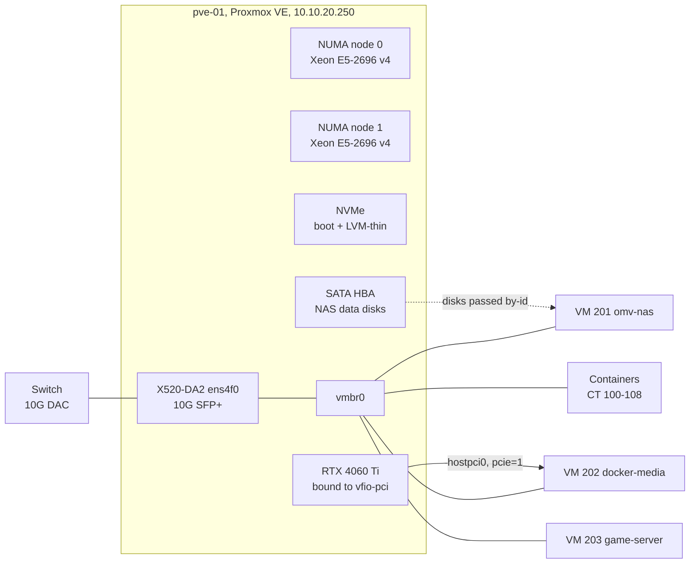

# Proxmox base host: dual-socket node with GPU passthrough

The single Proxmox VE node, `pve-01`, that every other project in this repository runs on. It is a dual-socket Xeon workstation board with 88 threads across two NUMA nodes, 96 GB of ECC memory, a 10G SFP+ uplink and an RTX 4060 Ti that is handed whole to the media VM for hardware transcoding. This page covers the host layer: hardware, CPU and NUMA settings, GPU passthrough that survives reboots and kernel updates, the scheduled jobs that run on the host, and the habits that keep hand-run administration from breaking things.

## What it does

- Runs every guest in the lab on one machine at `10.10.20.250`, on a single 10G uplink.
- Binds the GPU to `vfio-pci` at boot by vendor and device ID, so the host never loads a display driver for it and the media VM gets the whole card.
- Sets `cpu: host` and NUMA awareness on every VM.
- Logs CPU, NVMe, drive, fan and GPU temperatures to a plain CSV every five minutes, independent of the monitoring stack.
- Publishes host health (UPS, SMART, NVMe, pending upgrades) to Prometheus through node_exporter's textfile collector.

## Design decisions

| Decision | Why | Rejected alternative |
|---|---|---|
| One dual-socket node | 88 threads and 96 GB ECC fit every workload in one box. The trade-off is accepted openly: a hardware fault is a full outage, so backups go to separate disks and a UPS shuts the host down cleanly | A multi-node cluster: more machines, more power, more moving parts for a lab of this size |
| `cpu: host` on every guest | Guests see the real instruction set and CPU flags of the host, with no emulated model in between | A generic CPU model such as `x86-64-v2` |
| `numa: 1` on every VM | Two sockets means two NUMA nodes. A guest whose vCPUs and memory stay on one node avoids cross-socket memory traffic | Leaving NUMA off and letting memory land anywhere |
| Bind the GPU to `vfio-pci` by vendor:device ID | The binding follows the card, not its slot. It survived a PCI bus renumbering with no change | Binding by PCI address, which breaks whenever a card is added or moved |
| A PVE resource mapping for the GPU (planned) | It pins the device by ID and reports a mismatch, instead of pointing a VM at an empty bus | A raw `hostpci0` bus address, which is what runs today |
| GRUB with plain `update-initramfs -u` | The host boots via GRUB with the initramfs on `/boot`, so no extra tool is involved | `proxmox-boot-tool`, which is not in use on this host |
| `linux-headers-amd64` metapackage in the GPU guest | Every new guest kernel pulls matching headers, so DKMS rebuilds the NVIDIA module automatically | Version-pinned header packages, which leave the next kernel without a driver |
| A local temperature CSV next to Prometheus | A plain-text record that survives the monitoring stack being rebuilt | Prometheus only |

## Architecture



### Hardware

| Component | Detail |
|---|---|
| Board | Dual-socket X99 E-ATX board, PCIe Gen3 only |
| CPU | 2x Intel Xeon E5-2696 v4, 22 cores and 44 threads each, 88 threads over 2 NUMA nodes |
| Memory | 96 GB ECC RDIMM (two 16 GB and two 32 GB modules, all running at 2133 MT/s), about 94 GiB usable |
| GPU | NVIDIA RTX 4060 Ti, passed through to VM 202 |
| Network | Intel X520-DA2 10GbE SFP+, `ens4f0` is the only uplink of `vmbr0` |
| Boot and guest disks | 1 TB NVMe: Proxmox root plus the `local-lvm` thin pool |
| Extra controller | 6-port SATA HBA (PCIe x2 Gen3) for the NAS data disks |
| Power | UPS with NUT-driven graceful shutdown, see [UPS shutdown](../ups-nut-shutdown/) |

Disks and backups: see [NAS storage](../nas-storage/) and [Backup strategy](../backup-strategy/).

### PCIe layout

Regenerate with `lspci -tv`.

| Root port | Bus | Device |
|---|---|---|
| `00:01.1` | `02` | NVMe boot disk |
| `00:02.0` | `03` | empty |
| `00:02.2` | `04` | SATA HBA |
| `00:03.0` | `05` | RTX 4060 Ti (`05:00.0` VGA, `05:00.1` audio) |

**Bus numbers are not slot numbers.** The firmware numbers buses by walking the root ports, so populating a slot shifts every bus after it. Fitting the SATA HBA moved the GPU from bus `03` to `05`. The ID-based `vfio-pci` binding did not care. The address-based `hostpci0` line did.

`vmbr0` on `ens4f0` carries all guest and host traffic. A second bridge with no uplink, `br-nasmedia`, is a private link between the NAS and media VMs, see [NAS storage](../nas-storage/).

## Prerequisites

- A host with VT-d (Intel) or AMD-Vi enabled in firmware. On this Intel host IOMMU is active with no extra kernel command-line flag.
- Proxmox VE 9 installed on the boot disk, with LVM-thin for guest disks.
- A GPU that sits in its own IOMMU group (check with `find /sys/kernel/iommu_groups/ -type l`).
- Console or out-of-band access the first time you bind the GPU. Once `vfio-pci` owns the only display card, the host has no local video output.

## Build it

### 1. CPU and NUMA settings for every VM

```bash
# On pve-01: inspect the layout first
numactl --hardware            # expect 2 nodes

# On pve-01: apply to each VM (201, 202 and 203 here)
qm set 202 --cpu host --numa 1
```

### 2. Bind the GPU to vfio-pci

Read the IDs of both GPU functions:

```bash
# On pve-01
lspci -nn | grep -i nvidia
# ... VGA compatible controller [0300]: NVIDIA ... [10de:2803]
# ... Audio device [0403]: NVIDIA ... [10de:22bd]
```

```bash
# /etc/modprobe.d/vfio.conf, on pve-01
options vfio-pci ids=10de:2803,10de:22bd
softdep snd_hda_intel pre: vfio-pci
softdep nouveau pre: vfio-pci
softdep nova_core pre: vfio-pci
```

```bash
# /etc/modprobe.d/blacklist-gpu-passthrough.conf, on pve-01
blacklist nouveau
blacklist nova_core
blacklist nvidiafb
```

```bash
# /etc/modules-load.d/vfio.conf, on pve-01
vfio
vfio_iommu_type1
vfio_pci
```

The host boots via GRUB and reads its initramfs from `/boot`, so rebuilding the initramfs is all that is needed:

```bash
# On pve-01
proxmox-boot-tool status     # "/etc/kernel/proxmox-boot-uuids does not exist" means GRUB, not proxmox-boot-tool
update-initramfs -u -k all
reboot
```

After the reboot the card must be owned by `vfio-pci`:

```bash
# On pve-01
lspci -nnk -d 10de:2803      # expect "Kernel driver in use: vfio-pci"
```

### 3. Give the GPU to the VM

The media VM is q35 with OVMF (UEFI). Both functions go over in one line by passing the device without a function number:

```bash
# On pve-01, writes /etc/pve/qemu-server/202.conf
qm set 202 --hostpci0 0000:05:00,pcie=1
```

An Ada-generation card needs no "Error 43" workarounds such as `hidden=1`, and flags like `amd_iommu=on` or `pcie_acs_override` are wrong for this Intel host.

### 4. Make the GPU address durable (recommended)

A PVE resource mapping (Datacenter, Resource Mappings, stored in `/etc/pve/mapping/pci.cfg`) records the device by ID, so Proxmox raises a mismatch instead of pointing a VM at an empty bus. Create it in the GUI, then reference it:

```bash
# On pve-01
qm set 202 --hostpci0 mapping=<mapping-name>,pcie=1
```

### 5. Keep the NVIDIA driver alive across guest kernel updates

Inside VM 202, DKMS builds Debian's `nvidia-driver` module per kernel, and only if that kernel's headers exist. Install the metapackage, not a version-pinned one:

```bash
# Inside VM 202
export DEBIAN_FRONTEND=noninteractive
apt-get install -y linux-headers-amd64 linux-headers-$(uname -r)
dkms status | grep "$(uname -r)"     # the running kernel must be listed
nvidia-smi --query-gpu=name,driver_version --format=csv,noheader
```

The container runtime and Jellyfin side of the GPU are covered in [VPN media stack](../vpn-media-stack/).

### 6. Host temperature logger

A small script reads `sensors -j` and the hwmon symlinks and appends one CSV row every five minutes. Columns:

```
timestamp, cpu0_pkg_c, cpu0_max_c, cpu1_pkg_c, cpu1_max_c, nvme_c,
<one column per drive>, fan1_rpm, fan2_rpm, gpu_c
```

```bash
# root crontab on pve-01 (crontab -e)
*/5 * * * * /usr/local/bin/log-temps
```

Output goes to `/var/log/temps.csv`, rotated after about five weeks. It duplicates Prometheus on purpose: plain text that survives a monitoring rebuild.

### 7. Textfile collectors for node_exporter

Host scripts write `.prom` files that node_exporter reads:

```bash
# /etc/default/prometheus-node-exporter, on pve-01
ARGS="--collector.textfile.directory=/var/lib/prometheus/node-exporter"
```

| Source | File |
|---|---|
| `prometheus-node-exporter-smartmon.timer` | `smartmon.prom` |
| `prometheus-node-exporter-nvme.timer` | `nvme.prom` |
| `prometheus-node-exporter-apt.timer` | `apt.prom` (pending upgrades, reboot required) |
| `ups-prom.service`, every 10 s | `ups.prom` |
| `ups-watchdog.timer`, every 60 s | `ups-watchdog.prom` |

node_exporter runs as user `prometheus`, so every writer must make the file world-readable before its atomic rename:

```bash
# pattern for any script writing a .prom file on pve-01
tmp=$(mktemp /var/lib/prometheus/node-exporter/.example.XXXXXX)
generate_metrics > "$tmp"
chmod 0644 "$tmp"
mv "$tmp" /var/lib/prometheus/node-exporter/example.prom
```

Scraping and alerting live in [Monitoring and alerting](../monitoring-alerting/).

### 8. Scheduled maintenance

| Schedule | Job |
|---|---|
| `lynis.timer`, daily | Security audit, see [Host hardening](../host-hardening/) |
| `dailyaidecheck.timer`, daily | AIDE file-integrity check |
| `/etc/cron.d/zfsutils-linux`, 1st Sunday | ZFS TRIM on the backup pools |
| `/etc/cron.d/zfsutils-linux`, 2nd Sunday | ZFS scrub on the backup pools |
| `fstrim.timer`, weekly | Discard on mounted filesystems |
| `e2scrub_all.timer`, `xfs_scrub_all.timer`, weekly | Online filesystem checks |

## Verify

```bash
# On pve-01
pveversion
lscpu | grep -E '^CPU\(s\)|Socket|NUMA node\(s\)'    # 88 CPUs, 2 sockets, 2 NUMA nodes
lspci -nnk -d 10de:2803                               # Kernel driver in use: vfio-pci
lspci -vv -s 05:00.0 | grep -E 'LnkCap|LnkSta'        # width x8 in both lines
grep hostpci /etc/pve/qemu-server/202.conf            # matches the bus lspci reports
systemctl list-units --state=failed                   # 0 loaded units
systemctl list-timers --all --no-pager                # every schedule above
tail -3 /var/log/temps.csv                            # a row from the last five minutes
ls -la /var/lib/prometheus/node-exporter/             # every .prom file mode 0644

# Inside VM 202
nvidia-smi --query-gpu=name,driver_version --format=csv,noheader
dkms status | grep "$(uname -r)"                      # must list the running kernel
```

**Read link width and speed separately.** The Gen4 x8 card shows `LnkCap: 16GT/s, Width x8` and, in this Gen3 board, `LnkSta: 8GT/s (downgraded), Width x8`. That speed drop is expected and still gives about 63 Gb/s. A **narrower width** (x8 dropping to x4 or x1) is the real warning sign of lane sharing, a riser or a dirty connector.

## Gotchas

| Symptom | Cause | Fix |
|---|---|---|
| VM 202 will not start and the GPU looks dead after adding a card | Bus renumbering moved the GPU, and `hostpci0` points at the old bus | `lspci -nn \| grep -i nvidia`, then `lspci -tv`, then correct `hostpci0`. Move to a resource mapping |
| Guest fails with `nvml error: driver not loaded` | `nouveau` or `nova_core` claimed the card on the host | Check the blacklist and `softdep`, then `update-initramfs -u` and reboot |
| After a guest kernel update, `nvidia-smi` cannot talk to the driver | No headers for the new kernel, so DKMS never built the module | `apt-get install -y linux-headers-amd64 linux-headers-$(uname -r)`, which triggers the DKMS build, then `modprobe nvidia` |
| `pct create` fails with `rootfs: Cannot open: Permission denied` | A hardened `umask 027` makes `/var/lib/lxc/<id>` mode `0750`, which the mapped uid `100000` cannot traverse | `umask 0022 && pct create ...`. Delete the leftover `/var/lib/lxc/<id>` and `/etc/pve/nodes/pve-01/lxc/<id>.conf` before retrying |
| `apt` in a fresh Debian 13 container fails configuring `apparmor` with a `mktemp` error | `libpam-tmpdir` points `TMPDIR` at `/tmp/user/0`, which only exists after a PAM login, and `pct exec` is not one | `pct exec <id> -- sh -c 'mkdir -p /tmp/user/0 && chmod 0700 /tmp/user/0 && dpkg --configure -a'` |
| apt hangs on the dpkg lock, a package sits half-configured | An unattended `apt-get -y` stopped at a debconf dialog: `-y` answers apt, not debconf | Kill the stuck apt and dpkg, then `DEBIAN_FRONTEND=noninteractive dpkg --configure -a` |
| `QEMU guest agent is not running` after a `qm guest exec` | The exec restarted networking or a service and wedged the agent channel | Wait 30 to 60 s, test with `qm agent <id> ping`. Use SSH for such changes |
| A VM keeps its IP but has no connectivity after `ifreload -a` | VM NICs carry `firewall=1`, and a live reload of `vmbr0` detaches their `fwpr<id>p0` ports. Containers are re-added, VMs are not | `ip link set fwpr202p0 master vmbr0 && ip link set fwpr202p0 up`, check `/sys/class/net/vmbr0/brif/`. Durable fix: `firewall=0` on VM NICs if the PVE firewall is unused |
| A host metric disappears from Grafana | The `.prom` file is not world-readable | `chmod 0644` before the `mv` in the writer script |

A few habits prevent most of the table above:

- **Run `pct create` with `umask 0022`.** Hardened login shells inherit `027`, and it bites every hand-run container build.
- **Export `DEBIAN_FRONTEND=noninteractive` for unattended apt work**, on the host and in every guest.
- **Change networking and services over SSH, never through `qm guest exec`.** File reads and short commands through the agent are fine.
- **Check `dkms status` for the running kernel before rebooting the GPU guest** after any kernel upgrade.

## Rollback

Return the GPU to the host:

```bash
# On pve-01
qm stop 202
qm set 202 --delete hostpci0
rm /etc/modprobe.d/vfio.conf /etc/modprobe.d/blacklist-gpu-passthrough.conf /etc/modules-load.d/vfio.conf
update-initramfs -u -k all
reboot
lspci -nnk -d 10de:2803        # no longer vfio-pci
```

Undo the CPU settings with `qm set <id> --delete numa --cpu x86-64-v2-AES`. Remove the temperature logger with `crontab -e`. Deleting a `.prom` file stops that metric.

## What's next

- Replace the raw `hostpci0` bus address with a PVE resource mapping, so the next card change raises a clear mismatch instead of a VM that will not start.
- Move the host's management interface to the planned Management VLAN, `10.10.11.0/24`, once segmentation is built. See [Network edge](../network-edge/).

## Rebuild with AI

Copy everything in the block below into an AI assistant.

```text
You are helping me set up a single Proxmox VE host for a homelab, including GPU
passthrough to one VM. Before writing any config, ask me for these values and
wait for my answers:

1. My hardware: CPU and socket count, RAM, GPU, boot disk, extra PCIe cards.
2. Whether VT-d / AMD-Vi is enabled, and whether I have console access if the
   host loses its display.
3. My subnet, gateway, the host's static IP, and the uplink NIC name.
4. The VM ID and guest OS that should receive the GPU.
5. My node_exporter textfile directory.

Then build it with these rules:

- Detect the boot method first with `proxmox-boot-tool status`. If it reports
  that /etc/kernel/proxmox-boot-uuids does not exist, the host uses GRUB and
  `update-initramfs -u` is sufficient. Only use proxmox-boot-tool if it is
  actually in use.
- Set `cpu: host` and `numa: 1` on every VM of a multi-socket host. Show me
  `numactl --hardware` to confirm the node count.
- Bind the GPU to vfio-pci by vendor:device ID for every function of the card
  (video and audio), never by PCI address. Read the IDs from `lspci -nn`.
- Blacklist the display drivers that could claim the card (nouveau, nova_core,
  nvidiafb for NVIDIA) and add `softdep <driver> pre: vfio-pci` lines for them
  and for the HDMI audio driver. Load vfio, vfio_iommu_type1 and vfio_pci from
  /etc/modules-load.d/.
- Pass the GPU with `hostpci0: <bus address>,pcie=1`, then explain that a bus
  address shifts whenever a PCIe card is added, removed or moved, and set up a
  PVE resource mapping as the durable reference.
- In the GPU guest, install the `linux-headers-<flavour>` metapackage so DKMS
  rebuilds the driver for every new kernel, and tell me to check
  `dkms status` for the running kernel before rebooting after an upgrade.
- Explain LnkCap vs LnkSta: lower speed can be normal, narrower width is not.
- For any script writing node_exporter textfiles, chmod 0644 the temp file
  before an atomic mv, because node_exporter runs as an unprivileged user.
- Remind me to run `pct create` with umask 0022 if my shell is hardened to 027,
  and to export DEBIAN_FRONTEND=noninteractive for unattended apt runs.
- Never invent passwords, tokens or keys. If any are needed, give me the
  commands to generate them locally.
- Give me verification steps: `lspci -nnk` shows vfio-pci, the VM config's
  hostpci matches lspci, the guest's nvidia-smi works, link width is unchanged,
  no failed systemd units.
- Finish with a rollback section that returns the GPU to the host.
```
