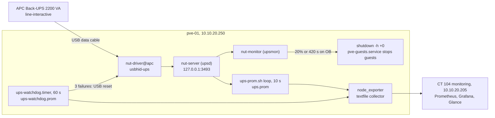

# UPS graceful shutdown with NUT and a self-healing USB link

A consumer line-interactive UPS protects the single Proxmox host, `pve-01`. NUT (Network UPS Tools) reads it over USB and shuts the host down cleanly, guests first, long before the battery runs out. A watchdog recovers the USB data link when the UPS firmware wedges, and every reading, including whether the link is alive at all, reaches Prometheus, where ten alert rules watch both the power and the monitoring path.

## What it does

- Keeps `pve-01` running through short outages, with surge protection and voltage regulation.
- On a long outage, starts a clean shutdown at **20% battery or 7 minutes of runtime left, whichever comes first**. systemd stops every VM and container through `pve-guests.service` before the host powers off.
- Shows live power, battery, runtime, voltage and energy used (kWh) in Grafana and Glance.
- Detects a dead USB data link and fixes the common case, a firmware wedge, by resetting the USB device within about three minutes.
- Pages a human only when self-healing cannot work.

## Design decisions

| Decision | Why | Rejected alternative |
|---|---|---|
| NUT with the `usbhid-ups` driver | Reads this UPS model correctly | `apcupsd`: the packaged version predates this model and reports a permanent false `ONBATT` even on mains |
| `standalone` mode, `upsd` on localhost only | One host, one UPS. Nothing needs `upsd` over the network | Network mode: more attack surface for no benefit |
| Raise the low-battery trip to 20% / 420 s | The factory 1% / 120 s leaves no time to stop guests first | Factory defaults |
| Metrics through the node_exporter textfile collector | node_exporter already runs on the host, and `upsd` can stay on localhost | A separate NUT exporter, or exposing `upsd` |
| A watchdog that resets the USB device | The NUT driver retries forever and never re-enumerates a wedged device | Manual recovery after someone notices |
| Watchdog liveness metrics on every run | A dead link otherwise looks like a steady UPS | Alerting on UPS values alone |

## Architecture



Three NUT services do the work: `nut-driver@apc` talks USB, `nut-server` (`upsd`) serves readings on localhost, and `nut-monitor` (`upsmon`) runs the shutdown. The UPS is line-interactive, not online: on mains the load runs on filtered, voltage-regulated mains, and it switches to battery outside a 176 to 298 V window.

### Metrics

| Metric | Source | Meaning |
|---|---|---|
| `ups_status_on_battery` | `ups-prom.sh` | **1 = mains is down.** Keyed on `OB`, not `DISCHRG` |
| `ups_realpower_watts` | `ups-prom.sh` | Derived draw: load % of the 1320 W rating |
| `ups_status_online`, `ups_battery_charge_percent`, `ups_battery_runtime_seconds`, `ups_load_percent`, `ups_input_voltage`, `ups_battery_voltage` | `ups-prom.sh` | Status, battery, runtime, load and volts |
| `ups_energy_wh_total` | `ups-prom.sh` | Cumulative watt-hours (counter) |
| `ups_link_up` | watchdog | 1 = NUT is talking to the UPS. **The honest liveness flag** |
| `ups_watchdog_heartbeat_seconds` | watchdog | Time of the last check. Stale means the watchdog died |
| `ups_watchdog_exhausted` | watchdog | 1 = resets stopped working. Physical intervention needed |
| `ups_watchdog_consecutive_failures`, `_resets_total`, `_last_reset_seconds` | watchdog | Failure streak and reset history |

## Prerequisites

- A Proxmox VE host (any systemd Debian works) with the UPS on its USB data cable. This build used Debian's NUT 2.8.1.
- `prometheus-node-exporter` on the host, scraped by Prometheus. See [Monitoring and alerting](../monitoring-alerting/).
- `python3` and `usbutils` (`lsusb`) on the host for the watchdog.

## Build it

### 1. Install NUT and remove apcupsd

```bash
# On pve-01
apt install nut
dpkg --purge apcupsd   # never run both: they fight over the USB device
```

### 2. Configure NUT

All files live in `/etc/nut/` on `pve-01`.

```
# /etc/nut/nut.conf
MODE=standalone
```

```
# /etc/nut/ups.conf
[apc]
    driver = usbhid-ups
    port = auto
    desc = "APC Back-UPS BGM2200"
    override.battery.charge.low = 20
    override.battery.runtime.low = 420
```

The two `override.*` lines replace the factory trip points of 1% and 120 s.

```
# /etc/nut/upsd.conf
LISTEN 127.0.0.1 3493
```

Generate the monitor password locally. It is a machine-only secret, never typed by hand:

```bash
# On pve-01
openssl rand -hex 24
```

```
# /etc/nut/upsd.users
[upsmon]
    password = <upsmon-password>
    upsmon primary
```

```
# /etc/nut/upsmon.conf
MONITOR apc@localhost 1 upsmon <upsmon-password> primary
SHUTDOWNCMD "/sbin/shutdown -h +0"
POWERDOWNFLAG "/etc/killpower"
MINSUPPLIES 1
```

The daemons run as user `nut`, so ownership matters:

```bash
# On pve-01, after every edit
chown root:nut /etc/nut/ups.conf /etc/nut/upsd.users /etc/nut/upsmon.conf
chmod 640 /etc/nut/ups.conf /etc/nut/upsd.users /etc/nut/upsmon.conf
systemctl enable --now nut-driver@apc nut-server nut-monitor
```

### 3. The shutdown sequence

No extra configuration is needed:

1. Mains fails. `ups.status` changes from `OL` to `OB`.
2. At 20% charge or 7 minutes of runtime, `upsmon` runs `shutdown -h +0`.
3. systemd stops `pve-guests.service`, which shuts the guests down gracefully, then powers off.

At the normal ~185 W load the UPS gives well over 30 minutes of runtime, so the 7-minute trip leaves a generous margin.

### 4. A live wattage helper

The UPS reports load as a percentage of its 1320 W rating. `/usr/local/bin/upswatt` on `pve-01` prints one refreshing line with watts computed as `ups.load × ups.realpower.nominal / 100`:

```bash
upswatt
# OL DISCHRG | 185 W (14% load) | mains 236.0V | batt 100% | 32.6 min runtime
```

### 5. UPS metrics through the textfile collector

Point node_exporter at a textfile directory:

```bash
# /etc/default/prometheus-node-exporter, on pve-01
ARGS="--collector.textfile.directory=/var/lib/prometheus/node-exporter"
```

`/usr/local/bin/ups-prom.sh` runs as `ups-prom.service` (`Restart=always`), looping every 10 s:

```bash
# /usr/local/bin/ups-prom.sh, on pve-01 (excerpt)
OUT=/var/lib/prometheus/node-exporter/ups.prom
STATE=/var/lib/prometheus/ups-energy.state       # "last_ts accumulated_Wh start_ts"
while true; do
  if data=$(upsc apc 2>/dev/null); then
    get() { awk -F': ' -v k="$1" '$1==k {print $2}' <<<"$data"; }
    ob=0; [[ " $(get ups.status) " == *" OB "* ]] && ob=1   # OB, never DISCHRG
    watts=$(( $(get ups.load) * $(get ups.realpower.nominal) / 100 ))

    now=$(date +%s)
    read -r last wh start < "$STATE" 2>/dev/null || { last=$now; wh=0; start=$now; }
    dt=$(( now - last )); (( dt < 0 )) && dt=0; (( dt > 120 )) && dt=120   # no fake spike after downtime
    wh=$(awk -v e="$wh" -v w="$watts" -v d="$dt" 'BEGIN {printf "%.4f", e + w*d/3600}')
    echo "$now $wh $start" > "$STATE"

    tmp=$(mktemp "$OUT.XXXXXX")
    printf 'ups_status_on_battery{ups="apc"} %s\nups_realpower_watts{ups="apc"} %s\nups_energy_wh_total{ups="apc"} %s\n' \
      "$ob" "$watts" "$wh" > "$tmp"                  # ...plus the other ups_* lines
    chmod 0644 "$tmp" && mv "$tmp" "$OUT"            # mktemp makes 0600; node_exporter could not read it
  fi
  sleep 10
done
```

The energy state survives restarts. It integrates a whole-percent load reading, so treat it as an estimate within a few percent (about 4.4 kWh per day at 185 W).

### 6. The link watchdog

`/usr/local/bin/ups-watchdog.sh` is a oneshot service fired every 60 s by `ups-watchdog.timer`. Its logic, condensed:

```bash
#!/bin/bash
# /usr/local/bin/ups-watchdog.sh, on pve-01 (condensed)
STATE=/var/lib/prometheus/ups-watchdog.state   # fail_count resets_total last_reset_ts attempts exhausted
OUT=/var/lib/prometheus/node-exporter/ups-watchdog.prom
THRESHOLD=3; COOLDOWN=900; MAX_ATTEMPTS=3
read -r fails resets last_reset attempts exhausted < <(cat "$STATE" 2>/dev/null || echo 0 0 0 0 0)
now=$(date +%s)

if upsc apc ups.status >/dev/null 2>&1; then
  link=1; fails=0; attempts=0; exhausted=0              # counters reset the moment the link returns
else
  link=0; fails=$(( fails + 1 ))
  if [ ! -e /etc/nut/.watchdog-disabled ] && (( fails >= THRESHOLD && exhausted == 0 )) \
     && (( now - last_reset >= COOLDOWN )); then
    if (( attempts >= MAX_ATTEMPTS )); then
      exhausted=1                                       # cable-level fault: stop and raise a flag
    else
      # The device number changes on every re-enumeration, so resolve it each time
      read -r bus dev < <(lsusb -d 051d:0002 | awk '{print $2, substr($4,1,3)}')
      systemctl stop nut-driver@apc
      # USBDEVFS_RESET. "No such device" (ENODEV) means it re-enumerated: success
      python3 -c 'import fcntl,os,sys; fcntl.ioctl(os.open(sys.argv[1], os.O_WRONLY), ord("U")<<8|20, 0)' \
        "/dev/bus/usb/$bus/$dev" 2>/dev/null
      systemctl start nut-driver@apc
      resets=$(( resets + 1 )); attempts=$(( attempts + 1 )); last_reset=$now
    fi
  fi
fi
echo "$fails $resets $last_reset $attempts $exhausted" > "$STATE"

tmp=$(mktemp "$OUT.XXXXXX")
printf 'ups_link_up %s\nups_watchdog_heartbeat_seconds %s\nups_watchdog_exhausted %s\n' \
  "$link" "$now" "$exhausted" > "$tmp"                  # ...plus the failure and reset metrics
chmod 0644 "$tmp" && mv "$tmp" "$OUT"                    # written on EVERY run, including failures
```

```ini
# /etc/systemd/system/ups-watchdog.timer, on pve-01
# (ups-watchdog.service is Type=oneshot with ExecStart=/usr/local/bin/ups-watchdog.sh)
[Timer]
OnBootSec=60
OnUnitActiveSec=60

[Install]
WantedBy=timers.target
```

```bash
# On pve-01
systemctl daemon-reload
systemctl enable --now ups-prom.service ups-watchdog.timer
```

| Guardrail | Value | Why |
|---|---|---|
| Failure threshold | 3 consecutive checks | Rides out a blip or a deliberate driver restart |
| Cooldown | 15 minutes between resets | Avoids a reset loop |
| Attempt cap | 3 failed resets, then set `exhausted` and stop | Resets cannot fix a cable fault |

For maintenance, `touch /etc/nut/.watchdog-disabled` makes the watchdog report without intervening.

**Why the watchdog publishes its own metrics.** `ups-prom.sh` writes only when it can read the UPS. When the link dies, Prometheus keeps scraping the last good values forever, which looks exactly like a steady UPS. The watchdog runs regardless, so its file turns silence into a signal.

### 7. Alerts

Ten rules live in Prometheus on CT 104; see [Monitoring and alerting](../monitoring-alerting/).

| Alert | Fires when | Meaning |
|---|---|---|
| `UPSOnBattery` | `ups_status_on_battery == 1` for 1 min | Mains is actually gone |
| `UPSBatteryCritical` | On battery and charge ≤ 30% or runtime ≤ 10 min | Shutdown is imminent |
| `UPSBatteryUnhealthy` | On mains for 2 h but charge < 90% | The battery is ageing |
| `UPSLinkDown` | `ups_link_up == 0` for 5 min | Graceful shutdown is not armed |
| `UPSWatchdogExhausted` | `ups_watchdog_exhausted == 1` | Go and reseat the USB cable |
| `UPSLinkFlapping` | 3 or more resets in 6 h | The link is degrading |
| `UPSWatchdogNotRunning` | Heartbeat older than 5 min | Nothing is auto-recovering |
| `UPSMonitoringAbsent` | `ups_link_up` missing entirely | The whole metrics path is down |
| `UPSDataPathStalled` | Link up but energy counter flat for 15 min | `ups-prom.service` died |
| `NodeTextfileScrapeError` | `node_textfile_scrape_error == 1` | node_exporter cannot read a `.prom` file |

The first three form the `ups-power` group, the rest `ups-link`. A successful self-heal is deliberately silent: recovery takes about three minutes and `UPSLinkDown` waits five. `UPSLinkFlapping` catches repeated recoveries, the early warning of a cable heading for the fault resets cannot fix.

## Verify

```bash
# On pve-01
systemctl is-active nut-driver@apc nut-server nut-monitor   # active active active
systemctl is-active ups-watchdog.timer ups-prom             # active active
upsc apc ups.status                                         # OL (DISCHRG alongside it is benign)
upsc apc battery.runtime.low                                # 420 (charge.low: 20)
journalctl -u nut-monitor | grep 'apc@localhost'            # "UPS: apc@localhost (primary)", no "connect failed"
curl -s localhost:9100/metrics | grep -E '^(ups_link_up|node_textfile_scrape_error)'   # 1 and 0
```

**The pull-the-plug test (planned).** Pull the UPS mains plug and run `watch -n2 upsc apc ups.status`: it must flip `OL` to `OB`, and `UPSOnBattery` must fire after a minute. Plug back in well before the trip. To exercise the full shutdown, temporarily change the trip points so they fire early. That really powers the host off, so schedule it.

## Gotchas

| Symptom | Cause | Fix |
|---|---|---|
| `ups.status: OL DISCHRG` on mains | This model always sets `DISCHRG`. Charge stays at 100% | Nothing. Key on `OB`, which a real outage shows |
| "OL+DISCHRG... calibrating?" warning every poll | The same spurious bit | Cosmetic. `onlinedischarge_log_throttle_sec` does not exist in NUT 2.8.1, and adding it stops the driver |
| `Can't open /etc/nut/ups.conf: Permission denied` | An editor rewrote the file as `root:root` | Restore `root:nut` 640, then `systemctl reset-failed nut-server` |
| `ups_*` metrics never appear | `mktemp` creates mode `0600` files; node_exporter runs as `prometheus` | `chmod 0644` before the atomic `mv` |
| Power reading stuck on one value | `ups.load` is a whole percent | Normal. Trust `ups_link_up` |
| `upsc` says `Error: Data stale` | The USB data link failed, not the UPS. Battery and AVR still work, but `upsmon` cannot see `OB` | Diagnose at the USB layer (below) |
| `insufficient permissions on everything` | Misleading: running the driver as root gives the same message | Ignore it, like `device->Product is NULL` |
| `nut_libusb_get_report: Input/Output Error` in the driver journal | Early warning of a firmware wedge | Watch the link; the watchdog handles a full wedge |

**Telling the two `Data stale` faults apart** happens at the USB layer:

```bash
# On pve-01. Find the device's bus-port path with: lsusb -t
cat /sys/bus/usb/devices/<bus-port>/bConfigurationValue   # empty = never configured
ls -d /sys/bus/usb/devices/<bus-port>:*                   # missing = no interfaces
dmesg | grep "can't set config"                           # the deciding line
/lib/nut/usbhid-ups -DD -a apc                            # what the driver sees
```

| | Cable-level fault | Firmware wedge |
|---|---|---|
| `dmesg` | `can't set config #1, error -71` (`EPROTO`) | Nothing, or a corrupted model string |
| `bConfigurationValue` | Empty | `1` |
| Interfaces | Absent | Present, but `Unable to get HID descriptor` |
| Fix | Reseat the cable at both ends, use a different USB port. No software reset helps | USB reset, now automatic |

Two habits:

- **Anything that only writes on success cannot tell you it stopped.**
- **The same symptom can have a different cause the second time.** Re-diagnose before applying last time's fix.

## Rollback

```bash
# On pve-01
touch /etc/nut/.watchdog-disabled                        # pause self-healing only
systemctl disable --now ups-watchdog.timer ups-prom      # remove the watchdog and metrics
rm -f /var/lib/prometheus/node-exporter/ups*.prom        # so stale values are not scraped
systemctl disable --now nut-monitor nut-server nut-driver@apc   # no more graceful shutdown
```

Disabling `nut-monitor` disarms the shutdown: the UPS still provides battery and AVR, but a long outage will drop the host abruptly. Remove the UPS alert rules on CT 104 too, or `UPSMonitoringAbsent` fires.

## What's next

- Run the pull-the-plug test, then a full shutdown test, in a scheduled window.
- Add an inline power meter (such as an energy-monitoring smart plug) for a more accurate energy figure.
- Related: [Proxmox base host](../proxmox-base-host/) and [Backup strategy](../backup-strategy/).

## Rebuild with AI

Copy everything in the block below into an AI assistant.

```text
Help me set up graceful UPS shutdown for a homelab hypervisor with NUT, plus
Prometheus metrics and a self-healing USB link. Before writing any config, ask
me for these values and wait for my answers:

1. My hypervisor, OS and packaged NUT version.
2. My UPS model, its watt rating and its USB vendor:product ID from `lsusb`.
3. How long my host needs to stop all guests.
4. My node_exporter textfile directory, and the host, IP and rules file of my
   Prometheus server.
5. A short NUT name for the UPS.

Then build it with these rules:

- NUT in standalone mode, upsd listening on 127.0.0.1 only. If apcupsd is
  installed, purge it: two daemons fight over the USB device, and older apcupsd
  versions misread some newer models as permanently on battery.
- Raise override.battery.charge.low and override.battery.runtime.low above the
  factory values so the host has time to stop guests. SHUTDOWNCMD is a normal OS
  shutdown, so systemd stops the guests first.
- NUT config and password files are root:nut mode 640; remind me after edits.
- Never invent the upsd password or any secret. Give me a local command such as
  `openssl rand -hex 24` and use placeholders in configs.
- A metrics loop writes a .prom file via mktemp, chmod 0644, atomic mv. The
  on-battery flag keys on OB, never DISCHRG. Integrate a persistent energy
  counter from load %, clamping elapsed time per tick.
- A watchdog on a 60 s systemd timer: after 3 failed checks, stop the driver,
  send USBDEVFS_RESET to the device node (resolved from lsusb each time; ENODEV
  means success), start the driver. Guardrails: 15-minute cooldown, max 3 failed
  resets then an "exhausted" flag, counters cleared on recovery, a disable file.
- The watchdog writes its own .prom file on every run (link up, heartbeat,
  resets, exhausted), because a frozen metrics file looks like a steady UPS.
- Alert rules: on battery, battery critical, link down longer than the
  self-heal time, watchdog exhausted, link flapping, watchdog not running,
  metrics absent, and textfile scrape errors.
- Explain how to tell a cable fault (dmesg "can't set config") from a firmware
  wedge, and that "insufficient permissions" from the driver is misleading.
- Include verification steps (including a scheduled pull-the-plug test) and a
  rollback section that says what protection is lost.
```
