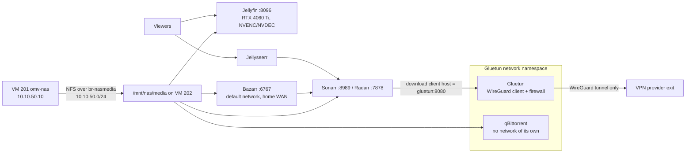

# VPN-routed media stack

A self-hosted media management stack on one Docker VM. Jellyfin transcodes on a passed-through RTX 4060 Ti. Jellyseerr, Sonarr, Radarr and Bazarr manage the library, and qBittorrent, the download client, has no network of its own: it lives inside Gluetun's WireGuard namespace, so a dead tunnel means no traffic. The library arrives from the NAS over a private storage bridge.

## What it does

- Jellyfin transcodes on the GPU (NVENC/NVDEC) when a client cannot direct-play.
- Jellyseerr takes requests; Sonarr and Radarr hand jobs to the download client and file the results.
- The download client can only reach the internet through the VPN provider's WireGuard tunnel. If the tunnel goes down, it has no route anywhere, not even DNS.
- Bazarr fetches text subtitles so clients can direct-play instead of burning in image-based subtitles.
- Completed downloads are hardlinked into the library: two names, stored once, on the [NAS](../nas-storage/).

## Design decisions

| Decision | Why | Rejected alternative |
|---|---|---|
| qBittorrent joins Gluetun's namespace with `network_mode: service:gluetun` | The killswitch is structural: the client has no interface except the tunnel | Firewall-rule killswitches, which can fail open after an edit |
| Only the download client is behind the VPN | Only the download client needs the tunnel, and subtitle sources block or throttle VPN exits, so tunnelling Bazarr would break it | Everything behind Gluetun |
| One filesystem for downloads and library | Hardlinks only work within one filesystem, so imports are instant and free | Separate shares, which force a copy per import |
| GPU passed through whole to the VM | NVENC/NVDEC at full speed, and the host stays free of display drivers. Host side is in [Proxmox base host](../proxmox-base-host/) | CPU transcoding: too slow for 4K HDR |
| NFS over a private bridge | Bulk traffic stays off the LAN, and the NAS keeps owning the array and its SMB share | Disks in the media VM, making the most-rebooted guest the storage host |
| VPN secrets in `.env`, mode 600 | The compose file can be read, diffed and shared without leaking keys | Keys inline in `docker-compose.yml` |
| Pin image tags | An unattended `docker compose pull` can move every service at once and break playback with no obvious culprit | Floating `:latest` or pre-release tags |

## Architecture



### The VM

| Setting | Value |
|---|---|
| Guest | VM 202 `docker-media` on `pve-01` |
| LAN | `vmbr0`, `10.10.20.211/24`, Proxmox firewall on |
| Storage bridge | `br-nasmedia`, `ens19` = `10.10.50.20/24`. The NAS is `10.10.50.10` |
| Build | Debian 13, 16 `host` vCPUs, 16 GB RAM, 64 GB boot disk |

### Containers

| Container | Network | Media mount | Role |
|---|---|---|---|
| `gluetun` | Own namespace, publishes `8080` | none | WireGuard client and firewall |
| `qbittorrent` | `service:gluetun` | `/mnt/nas/media/downloads` → `/data/downloads` | Download client |
| `sonarr`, `radarr` | Default compose network | `/mnt/nas/media` → `/data` | Library management |
| `bazarr` | Default compose network | `/mnt/nas/media` → `/data` | Subtitles |
| `jellyseerr` | Default compose network | none | Requests |
| `jellyfin` | Default compose network, GPU reserved | library folders under `/data` | Streaming and transcoding |
| `node-exporter` | Not on the VPN | none | Feeds [monitoring](../monitoring-alerting/) |

### Library layout

```
/mnt/nas/media          (one NFS export, one filesystem on the NAS)
├── downloads/          qBittorrent writes here
├── movies/             Radarr hardlinks completed files here
└── tv/                 Sonarr hardlinks completed files here
```

The *arr apps see all three folders as one mount, so an import is a hardlink, not a copy. qBittorrent sees only `/data/downloads`, the same path the *arr apps use, so no remote path mapping is needed.

## Prerequisites

- A Proxmox VE host with the GPU bound to `vfio-pci`. See [Proxmox base host](../proxmox-base-host/).
- A NAS exporting one media filesystem over NFS to the storage bridge. See [NAS storage](../nas-storage/).
- A VPN provider supported by Gluetun, with a WireGuard config and a forwarded port.
- Optional: internal names like `media.example.com` through [DNS, proxy and TLS](../dns-proxy-tls/).

## Build it

### 1. Attach the GPU and the storage bridge

```
# /etc/pve/qemu-server/202.conf, on pve-01 (excerpt)
machine: q35
bios: ovmf
cpu: host
numa: 1
balloon: 0
hostpci0: 0000:05:00,pcie=1
net0: virtio=<auto>,bridge=vmbr0,firewall=1
net1: virtio=<auto>,bridge=br-nasmedia
```

`hostpci0` without a function number passes both GPU functions. Find your address with `lspci -nn | grep -i nvidia` on the host.

### 2. NVIDIA driver and container toolkit

```bash
# On VM 202
apt install -y linux-headers-amd64      # the metapackage: every future kernel gets matching headers
apt install -y nvidia-driver            # Debian's packaged driver, built by DKMS
# add NVIDIA's container toolkit repository, then:
apt install -y nvidia-container-toolkit
nvidia-ctk runtime configure --runtime=docker
systemctl restart docker
nvidia-smi --query-gpu=name,driver_version --format=csv,noheader
```

The headers metapackage matters most: DKMS can only build the module for a kernel whose headers are installed.

Make Docker wait for the driver at boot, so Jellyfin's GPU reservation does not lose a race:

```ini
# /etc/systemd/system/docker.service.d/wait-nvidia.conf, on VM 202
[Unit]
After=nvidia-persistenced.service
Wants=nvidia-persistenced.service
```

### 3. Mount the library over the storage bridge

```
# /etc/fstab, on VM 202
10.10.50.10:/export/media  /mnt/nas/media  nfs  defaults,_netdev,soft,timeo=150  0  0
```

The NAS export must allow `10.10.50.0/24`. If an address changes, fix both the export ACL and this line.

### 4. Secrets

Extract the keys from the provider's config into a root-only env file:

```bash
# On VM 202
cd /root/mediaserver
umask 077
{
  printf 'WIREGUARD_PRIVATE_KEY=%s\n'   "$(sed -nE 's/^PrivateKey[[:space:]]*=[[:space:]]*//p'   /root/vpn-provider.conf | tr -d '\r')"
  printf 'WIREGUARD_PRESHARED_KEY=%s\n' "$(sed -nE 's/^PresharedKey[[:space:]]*=[[:space:]]*//p' /root/vpn-provider.conf | tr -d '\r')"
} > .env
chmod 600 .env
```

Use `sed`, not `awk -F' *= *'`, which eats the trailing `=` padding of the base64 key.

### 5. The compose file

```yaml
# /root/mediaserver/docker-compose.yml, on VM 202
services:
  gluetun:
    image: qmcgaw/gluetun:<pinned-version>
    container_name: gluetun
    cap_add: [NET_ADMIN]
    devices: ["/dev/net/tun:/dev/net/tun"]
    environment:
      - VPN_SERVICE_PROVIDER=<your-provider>
      - VPN_TYPE=wireguard
      - SERVER_COUNTRIES=<country>
      - WIREGUARD_ADDRESSES=10.10.99.2/32        # the Address line from the provider config, not secret
      - WIREGUARD_MTU=1320
      - FIREWALL_VPN_INPUT_PORTS=40000            # the forwarded port
      - WIREGUARD_PRIVATE_KEY=${WIREGUARD_PRIVATE_KEY}
      - WIREGUARD_PRESHARED_KEY=${WIREGUARD_PRESHARED_KEY}
      - TZ=Etc/UTC
    ports:
      - "8080:8080"          # qBittorrent's WebUI is published on gluetun
    restart: unless-stopped

  qbittorrent:
    image: lscr.io/linuxserver/qbittorrent:<pinned-version>
    container_name: qbittorrent
    network_mode: service:gluetun    # no network stack of its own, and no ports:
    depends_on:
      gluetun:
        condition: service_healthy
    environment: [PUID=1000, PGID=1000, TZ=Etc/UTC]
    volumes:
      - ./config/qbittorrent:/config
      - /mnt/nas/media/downloads:/data/downloads
    restart: unless-stopped

  sonarr:
    image: lscr.io/linuxserver/sonarr:<pinned-version>
    container_name: sonarr
    environment: [PUID=1000, PGID=1000, TZ=Etc/UTC]
    ports: ["8989:8989"]
    volumes: [./config/sonarr:/config, /mnt/nas/media:/data]
    restart: unless-stopped

  # radarr (port 7878) and bazarr (port 6767) are identical to sonarr:
  # same PUID/PGID, ./config/<app>:/config and /mnt/nas/media:/data

  jellyfin:
    image: jellyfin/jellyfin:<pinned-version>
    container_name: jellyfin
    ports: ["8096:8096"]
    volumes:
      - ./config/jellyfin/config:/config
      - /mnt/nas/media/movies:/data/movies
      - /mnt/nas/media/tv:/data/tv
    deploy:
      resources:
        reservations:
          devices:
            - driver: nvidia
              count: all
              capabilities: [gpu, compute, video, utility]
    restart: unless-stopped

  # jellyseerr and node-exporter follow the same pattern
```

Three details carry the design:

- **`network_mode: service:gluetun`** is the killswitch. `depends_on` only orders the first start, not later Gluetun restarts.
- **`video` in the GPU capabilities is mandatory.** Without it `nvidia-smi` works in the container, but the NVENC/NVDEC nodes are missing and transcoding silently fails.
- **PUID/PGID 1000** must own the library folders, or Bazarr cannot write subtitles next to the media.

Validate, then start:

```bash
cd /root/mediaserver
docker compose config >/dev/null && echo "compose OK"
docker compose up -d
```

### 6. Match the forwarded port in three places

Inbound connections fail silently unless the same port, `40000` here, is set in all three:

1. The VPN provider's control panel.
2. `FIREWALL_VPN_INPUT_PORTS` on Gluetun.
3. qBittorrent's config:

```ini
# /root/mediaserver/config/qbittorrent/qBittorrent/qBittorrent.conf, on VM 202
# (excerpt: change these keys where they already sit in the file)
Session\Port=40000
Connection\PortRangeMin=40000
WebUI\LocalHostAuth=false
```

### 7. Wire the apps together

- **Sonarr and Radarr → download client:** host **`gluetun`**, port `8080`, not `qbittorrent`. Inside Gluetun's namespace the client has no hostname of its own.
- **Bazarr → Sonarr and Radarr:** `sonarr:8989` and `radarr:7878`, by container name, so a LAN renumber cannot break it. Bazarr leaves through the home connection on purpose.
- **Bazarr language profiles live in its database, not in `config.yaml`.** Create them in the web UI or the settings API. A YAML-only edit gives a working connection with no profile, and Bazarr silently does nothing.
- **Ignore image-based (PGS) subtitles in Bazarr.** Otherwise it counts them as "language present" and fetches nothing, while many clients cannot overlay PGS, so Jellyfin burns them in with a full 4K HDR transcode. Text `.srt` files direct-play.

### 8. Jellyfin transcoding

In Dashboard → Playback → Transcoding: NVENC; hardware decoding for H264, HEVC, HEVC 10-bit (needed for 4K HDR), VP9 and AV1; hardware encoding; tone mapping with BT.2390. Decode settings only apply to fresh streams. Set `PublishedServerUrl` to `10.10.20.211` and re-check it after any renumber.

**Capacity: NVDEC is the bottleneck, not the CPU.** One 4K HDR to 1080p transcode uses about 83% of the card's single decode unit but only about 40% of encode. Two at once stutter, and adding vCPUs does not help. 1080p sources cost about 15–20% of decode each, so three or four fit. Remote viewers are capped with the internet streaming bitrate limit, because Jellyfin has no per-user resolution cap.

## Verify

```bash
# On VM 202
docker ps --format '{{.Names}}\t{{.Status}}\t{{.Image}}'   # gluetun (healthy), all others Up
nvidia-smi --query-gpu=name,driver_version --format=csv,noheader
dkms status | grep "$(uname -r)"          # MUST list the running kernel
mountpoint /mnt/nas/media                 # NFS over the storage bridge
curl -s http://10.10.20.211:8096/System/Info/Public   # Jellyfin answers
```

The exit address must differ from the home WAN. Test the forwarded port against the *current* exit, because providers rotate servers and a hard-coded address eventually tests nothing:

```bash
EXIT=$(docker exec gluetun wget -qO- -T8 https://ipinfo.io/ip); echo "$EXIT"   # e.g. 198.51.100.30
curl -s https://ifconfig.me                                                   # home WAN, e.g. 203.0.113.10
nc -zv "$EXIT" 40000
```

Prove the killswitch, then restore it:

```bash
docker stop gluetun
docker exec qbittorrent wget -qO- -T5 https://ipinfo.io/ip   # MUST fail: no route, not even DNS
docker start gluetun
docker compose up -d --force-recreate qbittorrent
```

Also check:

- `docker exec bazarr wget -qO- https://api.ipify.org` prints the home WAN: Bazarr is deliberately off the VPN.
- `find /mnt/nas/media/movies/<folder> -type f -printf "links=%n inode=%i %p\n"` shows `links=2`: the library file is a hardlink.
- While transcoding, `nvidia-smi dmon -s u -c 10` shows both `dec` and `enc` above zero. Encode alone means the CPU is decoding.

## Gotchas

| Symptom | Cause | Fix |
|---|---|---|
| After a Gluetun restart, qBittorrent has no egress and DNS fails with `bad address` | A restart rotates the namespace. A plain `docker start qbittorrent` reattaches to the stale one | `docker compose up -d --force-recreate qbittorrent` after every Gluetun restart or recreate |
| Gluetun rejects the key as `illegal base64` | The key was extracted with an `awk` separator that ate the trailing `=` | Extract with the `sed` line in step 4. Trust Gluetun's health check, not a character count |
| Inbound connections never arrive | The forwarded port differs in one of the three places | Match the provider panel, `FIREWALL_VPN_INPUT_PORTS` and `qBittorrent.conf` |
| Sonarr or Radarr cannot reach the download client | Host set to `qbittorrent` | Use `gluetun:8080` |
| After a kernel upgrade, Jellyfin exits 128 with `nvml error: driver not loaded` | No headers for the new kernel, so DKMS never built the module | `apt install -y linux-headers-amd64 linux-headers-$(uname -r)`, then `modprobe nvidia`. Check `dkms status` before rebooting |
| `nvidia-smi` works in the container, transcoding fails | `video` missing from the GPU capabilities | Use `[gpu, compute, video, utility]` |
| After a reboot the library lists files but playback fails | Containers started before NFS mounted and bound an empty directory | Check `mountpoint /mnt/nas/media`, then restart the containers |
| "Media is duplicated across `downloads/` and the library" | They are hardlinks: one inode, two names | Do not delete `downloads/` to free space. It frees almost nothing and breaks the client's completed jobs |
| `du` shows `downloads/` as tiny | One `du` call across several directories counts each shared inode once, under whichever it walks first | Run a separate `du` per directory, or use `--count-links` |
| A bind-mounted Jellyfin theme add-on vanishes after an update | It targets a web chunk file whose name hash changes every release | `docker exec jellyfin ls /jellyfin/jellyfin-web/ \| grep home-html`, then re-point the mount. Pin theme CSS to a `<commit>` |
| Playback dies during a NAS RAID rebuild: the websocket closes about 30 s after the request, no ffmpeg start, no error | A raised `dev.raid.speed_limit_min` let the rebuild starve reads | Keep the floor at the kernel default `1000`. A rebuilding RAID5 serves media fine |

**Habit:** copy `docker-compose.yml` and run `docker compose config` before every edit, and upgrade pinned images one service at a time.

## Rollback

```bash
# On VM 202
cd /root/mediaserver
cp docker-compose.yml.bak docker-compose.yml        # restore the copy taken before the edit
docker compose up -d                                 # back to the previous state
docker compose up -d --force-recreate qbittorrent   # if gluetun was touched

docker compose down                                  # stop everything, keep config and media
```

The library lives on the NAS and app state under `/root/mediaserver/config/`, so tearing down the VM loses neither. To return the GPU, delete `hostpci0` from `202.conf` on `pve-01`.

## What's next

- Make Docker wait for the NFS mount as well as the driver, closing the empty-bind race.
- Pin every image to a known-good version, Jellyfin first.
- Move the VM onto the planned Servers VLAN once the [network edge](../network-edge/) segmentation is built.

## Rebuild with AI

Copy everything in the block below into an AI assistant.

```text
You are helping me build a self-hosted media management stack on one Docker VM:
Jellyfin with NVIDIA transcoding, Jellyseerr, Sonarr, Radarr, Bazarr, and
qBittorrent as the download client inside a Gluetun WireGuard tunnel. Before
writing any config, ask me for these values and wait for my answers:

1. Hypervisor, VM ID, the VM's LAN address/subnet/gateway, and the GPU model and
   PCI address (is it already bound to vfio-pci on the host?).
2. NAS address and NFS export path, and the subnet of a private NAS-to-VM bridge
   if I have or want one.
3. VPN provider (must be Gluetun-supported), server country, the WireGuard
   Address from its config, and the forwarded port.
4. The UID/GID that owns my media folders, my time zone, and any internal DNS
   names for the web UIs.

Then build it with these rules:

- qBittorrent uses network_mode: service:gluetun and publishes no ports; its
  WebUI port is published on gluetun. Explain this is the killswitch, and that
  depends_on only orders the first start: after any gluetun restart, recreate
  qBittorrent with docker compose up -d --force-recreate.
- Only the download client is behind the VPN. Bazarr and the *arr apps stay on
  the default network and address each other by container name. Sonarr/Radarr
  use "gluetun" as the download-client host.
- The forwarded port must match in three places: the provider panel, Gluetun's
  FIREWALL_VPN_INPUT_PORTS, and qBittorrent's Session\Port and
  Connection\PortRangeMin.
- Downloads and library share ONE filesystem: the *arr apps mount the media root
  at /data, the client mounts only downloads at /data/downloads, so imports are
  hardlinks. Warn that deleting downloads frees almost nothing and that copies
  need rsync -H.
- Mount media over NFS (preferably a private bridge) and warn that containers
  started before the mount bind an empty directory.
- Install the distro NVIDIA driver, the kernel headers METAPACKAGE (so DKMS
  rebuilds on kernel upgrades) and nvidia-container-toolkit. Reserve the GPU with
  capabilities [gpu, compute, video, utility] and explain why "video" is
  required. Make docker.service start After=/Wants= nvidia-persistenced.service.
- Bazarr ignores PGS subtitles so it fetches text subtitles that direct-play.
- VPN keys go in a mode-600 .env referenced as ${VAR}. Never invent keys, tokens
  or passwords: show me how to extract them locally with sed (not awk, which can
  strip the trailing "=").
- Pin every image version; back up and validate the compose file before edits.
- Verification: container health, nvidia-smi, dkms status for the running
  kernel, mountpoint, VPN exit IP differs from my home WAN, a port test against
  the CURRENT exit IP, and a killswitch test (stop gluetun, the client must have
  no egress at all).
- Finish with a gotchas table and a rollback section.
```
