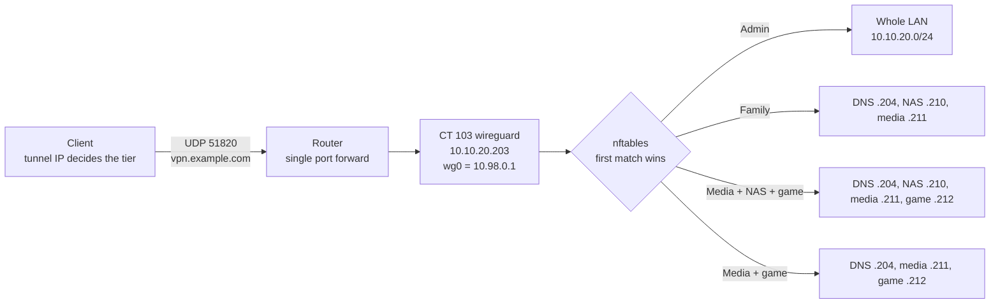

# Tiered WireGuard VPN

Remote access for about twenty people, where each person reaches only the services they are meant to. In-kernel WireGuard runs in an unprivileged LXC container, and four access tiers are enforced server-side with nftables. A Tailscale subnet router runs alongside as an independent fallback.

## What it does

- One UDP port forward on the router gives household members, family and the admin a tunnel into the lab.
- The tunnel address a peer receives decides what it can reach. Picking the address range is the whole access decision, and no per-peer firewall rules are ever written.
- Clients resolve internal names such as `jellyfin.example.com` through the lab's DNS, exactly as they do at home.
- Only the traffic a peer is allowed to send goes through the tunnel. General internet traffic stays on the client's own connection.
- If a WireGuard change ever locks the admin out, Tailscale is still there as a second way in.

## Design decisions

| Decision | Why | Rejected alternative |
|---|---|---|
| Raw in-kernel WireGuard, no management UI | Every moving part is visible in two files: `wg0.conf` and an nftables ruleset | wg-easy, wg-portal: convenient, but they hide the access model behind a web UI |
| Run it in an unprivileged LXC container | In-kernel WireGuard needs no TUN device and no extra capabilities, only the module loaded on the host. That is less privilege than a userspace VPN | A full VM: more resources for no gain. The router's built-in server: see the next row |
| Enforce tiers with nftables on the server | Precise, ordered, observable through rule counters, and impossible for a user to edit | Router ACLs: whether the router filters VPN-sourced traffic the same way as LAN traffic could not be confirmed, so its built-in WireGuard server was disabled |
| Tier by tunnel address range | Adding a peer means choosing an address. The rules already cover every range | Per-peer rules: grow without bound and drift |
| Split tunnel only | The house is not anyone's internet exit, and upload bandwidth stays free | Full tunnel `0.0.0.0/0` |
| DNS name as the endpoint | The home IP is dynamic. A DDNS record means an address change never breaks every config at once | Bare IP in every client config |
| Per-peer preshared keys | An extra symmetric layer on top of the key exchange, for almost no cost | Public keys only |
| Keep Tailscale running alongside | A lockout during a WireGuard change is recoverable without physical access | One remote-access path |

## Architecture



### The four tiers

| Tier | Tunnel range | May reach |
|---|---|---|
| Admin | `10.98.0.0/25` | The whole LAN, `10.10.20.0/24` |
| Family | `10.98.0.128/25` | DNS `10.10.20.204`, NAS `.210`, media `.211` |
| Media + NAS + game | `10.98.0.160/27` | DNS `.204`, NAS `.210`, media `.211`, game `.212` |
| Media + game | `10.98.0.192/26` | DNS `.204`, media `.211`, game `.212`. No NAS |

The `/27` and `/26` sit inside the Family `/25`. That overlap is deliberate, and it is why rule order matters.

## Prerequisites

- A Proxmox VE host. Any Linux host with nftables works the same way.
- A router that can forward one UDP port to the container.
- A DNS name that follows your public IP. See [DNS, reverse proxy and TLS](../dns-proxy-tls/) for the DDNS script used here.
- An internal DNS server for the `DNS =` line. This lab uses AdGuard at `10.10.20.204`.
- `qrencode` and `zbar-tools` if you hand out configs to phones.

## Build it

### 1. Load the module on the host

The container uses the host kernel, so the module must be loaded there and persist across reboots.

```bash
# On the Proxmox host
modprobe wireguard
echo wireguard > /etc/modules-load.d/wireguard.conf
```

### 2. Create the container

An unprivileged Debian 13 container with nesting enabled.

```bash
# On the Proxmox host. umask 0022 matters: a hardened umask 027 makes
# unprivileged container creation fail with "Permission denied" on the rootfs.
umask 0022
pct create 103 local:vztmpl/debian-13-standard_amd64.tar.zst \
  --hostname wireguard --unprivileged 1 --features nesting=1 \
  --cores 1 --memory 256 --rootfs local-lvm:2 \
  --net0 name=eth0,bridge=vmbr0,ip=10.10.20.203/24,gw=10.10.20.1 \
  --onboot 1
pct start 103 && pct enter 103
```

Inside the container, confirm the kernel module is usable without any extra privileges:

```bash
apt install -y wireguard-tools nftables qrencode zbar-tools
ip link add wgtest type wireguard && ip link del wgtest && echo "in-kernel WireGuard OK"
```

### 3. Enable forwarding

```bash
# /etc/sysctl.d/99-wireguard.conf, inside CT 103
net.ipv4.ip_forward = 1
```

```bash
sysctl --system
```

### 4. Server keys and interface

```bash
mkdir -p /etc/wireguard/keys && cd /etc/wireguard/keys
umask 077                                   # keys must never be world-readable
wg genkey | tee server.key | wg pubkey > server.pub
```

```ini
# /etc/wireguard/wg0.conf, inside CT 103
[Interface]
Address    = 10.98.0.1/24
ListenPort = 51820
PrivateKey = <contents of server.key>
MTU        = 1420
PostUp     = nft -f /etc/wireguard/wg0-nat.nft
PostDown   = nft delete table inet wg
```

### 5. The tier ruleset

This is the security core. The more specific ranges come first, because the first matching rule wins.

```
# /etc/wireguard/wg0-nat.nft, inside CT 103
table inet wg {
  chain forward {
    type filter hook forward priority 0; policy accept;

    # Media + game: /26, inside the family /25, so it MUST come first
    iifname "wg0" ip saddr 10.98.0.192/26 ip daddr { 10.10.20.204, 10.10.20.211, 10.10.20.212 } counter accept
    iifname "wg0" ip saddr 10.98.0.192/26 counter drop

    # Media + NAS + game: /27, also inside the family /25
    iifname "wg0" ip saddr 10.98.0.160/27 ip daddr { 10.10.20.204, 10.10.20.210, 10.10.20.211, 10.10.20.212 } counter accept
    iifname "wg0" ip saddr 10.98.0.160/27 counter drop

    # Family: the catch-all /25, always last
    iifname "wg0" ip saddr 10.98.0.128/25 ip daddr { 10.10.20.204, 10.10.20.210, 10.10.20.211 } counter accept
    iifname "wg0" ip saddr 10.98.0.128/25 counter drop

    # Admin (10.98.0.0/25) has no rule: it falls through to policy accept
  }
  chain postrouting {
    type nat hook postrouting priority srcnat; policy accept;
    # LAN hosts reply to the container instead of needing a route back into the tunnel
    ip saddr 10.98.0.0/24 oifname "eth0" masquerade
  }
}
```

Two things to notice:

- **The admin tier has no rule.** It falls through to `policy accept`. Adding a blanket `drop` at the bottom of the chain would lock out admin peers too.
- **DNS `10.10.20.204` is in every tier.** Clients are told to use it as their resolver. A tier without it resolves nothing at all, and users report that "everything is broken" rather than "DNS is broken".

Start the tunnel and enable it at boot:

```bash
systemctl enable --now wg-quick@wg0
wg show wg0
```

### 6. The router forward

Forward **UDP 51820 to `10.10.20.203`**. It is the only port forward this design needs.

On routers with several WAN ports, a forward is bound to one specific WAN interface. It must sit on the WAN that actually holds the public address.

### 7. Add a peer

Pick the tier first: the tunnel address you assign is the access decision. Then generate keys inside CT 103:

```bash
cd /etc/wireguard/keys
umask 077
wg genkey | tee example.key | wg pubkey > example.pub
wg genpsk > example.psk
```

Append the peer to the server config. `AllowedIPs` on the server is a filter: exactly one `/32`, never wider.

```ini
# appended to /etc/wireguard/wg0.conf
[Peer]
# example, family tier
PublicKey    = <contents of example.pub>
PresharedKey = <contents of example.psk>
AllowedIPs   = 10.98.0.141/32
```

Apply it without dropping existing tunnels:

```bash
wg syncconf wg0 <(wg-quick strip wg0)
wg show wg0            # the new peer is listed
```

Build the client config. The client's `AllowedIPs` lists only what that tier may reach:

```ini
# example.conf, handed to the user
[Interface]
PrivateKey = <contents of example.key>
Address    = 10.98.0.141/32
DNS        = 10.10.20.204
MTU        = 1420

[Peer]
PublicKey           = <contents of server.pub>
PresharedKey        = <contents of example.psk>
Endpoint            = vpn.example.com:51820
AllowedIPs          = 10.10.20.204/32, 10.10.20.210/32, 10.10.20.211/32
PersistentKeepalive = 25
```

| Tier | Client `AllowedIPs` |
|---|---|
| Admin | `10.10.20.0/24` |
| Family | `10.10.20.204/32, 10.10.20.210/32, 10.10.20.211/32` |
| Media + NAS + game | `10.10.20.204/32, 10.10.20.210/32, 10.10.20.211/32, 10.10.20.212/32` |
| Media + game | `10.10.20.204/32, 10.10.20.211/32, 10.10.20.212/32` |

Computers get the `.conf` file. Phones get a QR code, checked byte for byte before handing it over:

```bash
qrencode -t png -o example-phone.png < example.conf
zbarimg --raw -q example-phone.png | diff - example.conf && echo "QR matches"
```

To remove a peer, delete its `[Peer]` block from `wg0.conf` and run the same `syncconf` line.

### 8. Tailscale as the fallback

A second container, CT 100, runs Tailscale as a subnet router that advertises `10.10.20.0/24`. Unlike CT 103 it uses userspace WireGuard, so it needs the TUN device:

```
# /etc/pve/lxc/100.conf, on the host
lxc.cgroup2.devices.allow: c 10:200 rwm
lxc.mount.entry: /dev/net/tun dev/net/tun none bind,create=file
```

```bash
# Inside CT 100
tailscale up --advertise-routes=10.10.20.0/24
```

Approve the route once in the Tailscale admin console. Then scope anyone who is not the admin to the services they need, because a default allow-all rule gives them the whole LAN:

```json
{
  "acls": [
    { "action": "accept", "src": ["example_user@example.com"], "dst": ["10.10.20.210:445", "10.10.20.210:2283"] }
  ]
}
```

## Verify

```bash
# Inside CT 103
wg show wg0                                   # recent handshakes, non-zero transfer
nft list table inet wg                        # rules in evaluation order, with counters
sh -c 'wg show wg0 peers | wc -l; grep -c "^\[Peer\]" /etc/wireguard/wg0.conf'   # the two numbers must match

# From anywhere
dig +short vpn.example.com                    # must be the public address, never an internal one
```

From a connected family-tier client:

```bash
ping 10.10.20.210            # works: the NAS is in the tier
ping 10.10.20.250            # FAILS: the hypervisor is not
nslookup jellyfin.example.com   # answers: proves DNS is reachable
```

Test the port forward from a network outside your own, such as a phone on mobile data. A test from inside the LAN proves nothing about the forward.

## Gotchas

| Symptom | Cause | Fix |
|---|---|---|
| Ping works, large transfers stall | MTU | Set `MTU = 1420` on the client |
| Handshake completes, no name resolves | The tier's accept set lacks the DNS server | Add `10.10.20.204` to that tier |
| A restricted peer reaches the NAS | A `/25` rule moved above a `/27` or `/26` | Restore the order: longest prefix first |
| A peer vanishes after a reboot | It was added with `syncconf` but never written to `wg0.conf` | Always edit the file, then `syncconf` |
| A peer can reach a backend by IP but not by name | Names resolve to the reverse proxy, which is not in the tier | Add the proxy address to the tier, or give the service a direct DNS name |
| Nobody can connect after a WAN change | The forward is bound to a WAN port that no longer holds the public IP | Re-create it on the correct WAN and test from outside |
| Every peer fails at once | The endpoint name resolves internally | Never add an internal DNS rewrite for `vpn.example.com`, and keep it DNS-only (not proxied) at the DNS provider, because a proxy does not carry UDP |
| Tailscale client reaches IPs but not names | A subnet router advertises routes, not DNS | Set the tailnet nameserver to `10.10.20.204` |
| Tailscale client reaches nothing | The client ignores advertised routes by default | `tailscale up --accept-routes`, or the "Use Tailscale subnets" toggle on mobile |

Two habits matter more than any single fix:

- **Read access from the server, never from a client config.** The client's `AllowedIPs` is routing. Widening it grants nothing, because the server-side rules still drop the traffic.
- **Treat client configs as secrets.** Each one contains a private key. Deliver them privately, and keep the archive readable by admins only.

## Rollback

```bash
pct exec 103 -- systemctl stop wg-quick@wg0      # take the tunnel down, keep everything
pct exec 103 -- systemctl start wg-quick@wg0     # bring it back
pct stop 103 && pct destroy 103                  # full teardown, then delete the router forward
```

Tailscale on CT 100 is independent of all of this and stays up throughout.

## What's next

- Move the tiers onto the planned VLANs, so the tier sets name networks instead of single hosts.
- Add a WireGuard handshake exporter, so a peer that stops connecting shows up in [monitoring](../monitoring-alerting/).

## Rebuild with AI

Copy everything in the block below into an AI assistant.

```text
You are helping me build a tiered WireGuard VPN for my homelab. Before writing
any config, ask me for these values and wait for my answers:

1. My hypervisor (Proxmox VE, plain Debian, or other) and whether I want the VPN
   in an unprivileged LXC container, a VM, or on bare metal.
2. My LAN subnet, gateway, and the container's static IP.
3. The tunnel subnet I want (suggest a /24 that does not collide with my LAN or
   with the 192.168.x ranges that most home and hotel networks use).
4. My access tiers: for each tier, a name and the exact LAN hosts it may reach.
5. My internal DNS server's IP, and the DNS name that points at my public IP.
6. The UDP port I will forward on my router.

Then build it with these rules:

- Use in-kernel WireGuard (wireguard-tools), no web UI. If the target is an
  unprivileged LXC, load the wireguard module on the host and persist it in
  /etc/modules-load.d/; do not pass through /dev/net/tun.
- Assign each tier a sub-range of the tunnel subnet. Enforce tiers server-side
  in one nftables table: per tier, an accept rule for its allowed destinations
  followed by a drop rule. Order rules from the longest prefix to the shortest,
  and explain why order matters if any ranges overlap.
- Put my internal DNS server in every tier's accept set.
- Leave the unrestricted admin tier without rules and explain that a final
  blanket drop would lock it out.
- Add a masquerade rule for tunnel traffic leaving the LAN interface and enable
  net.ipv4.ip_forward.
- Server-side AllowedIPs per peer must be exactly one /32.
- Client configs: split tunnel only (never 0.0.0.0/0), DNS = my internal DNS,
  MTU = 1420, PersistentKeepalive = 25, Endpoint = my DNS name and port, and a
  per-peer PresharedKey.
- Never invent keys. Give me the commands to generate them on my machine with
  umask 077.
- Show how to add a peer with `wg syncconf` without dropping other tunnels, and
  remind me the peer must also be written to wg0.conf.
- Give me verification steps: wg show, nft counters, a ping that must succeed
  and one that must fail for a restricted tier, and a reminder to test the port
  forward from outside my network.
- Finish with a rollback section.

Optionally, add a Tailscale subnet router in a separate container as a fallback,
with a scoped ACL example for a non-admin user.
```
